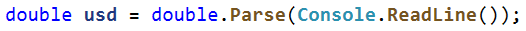
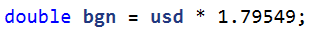
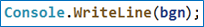
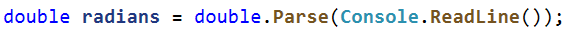
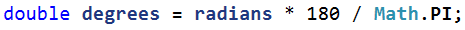
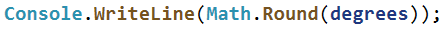

Първи стъпки в програмирането

Задачи за упражнение в клас и за домашно към курса ["Основи на програмирането"
\@ СофтУни](https://softuni.bg/courses/programming-basics).

Тествайте задачите си в Judge системата:
[https://judge.softuni.bg/Contests/Index/2375](https://judge.softuni.bg/Contests/Compete/Index/2375).

## Конзолен конвертор: USD към BGN

Напишете програма за **конвертиране на щатски долари** (USD) **в български
лева** (BGN). Използвайте фиксиран **курс** между долар и лев: **1 USD** =
**1.79549 BGN**.

### Примерен вход и изход

| **вход** | **изход** |   | **вход** | **изход** |   | **вход** | **изход** |
|----------|-----------|---|----------|-----------|---|----------|-----------|
| 22       | 39.50078  |   | 100      | 179.549   |   | 12.5     | 22.443625 |

### Насоки

1.  Създайте променливата **usd**, която приема като вход от конзолата реално
    число.

    

2.  Изчислете конвертирането на щатските долари към българските лева и
    закръглете резултата до втория знак след десетичната запетая.

    

3.  Принтирайте получените български лева, като **форматирате** резултата **до 2
    цифри** след десетичната запетая (**:F2**).

    

## Конзолен конвертор: от радиани в градуси

Напишете програма, която чете **ъгъл в**
[радиани](https://bg.wikipedia.org/wiki/%D0%A0%D0%B0%D0%B4%D0%B8%D0%B0%D0%BD)
(rad) и го преобразува в
[градуси](https://bg.wikipedia.org/wiki/%D0%93%D1%80%D0%B0%D0%B4%D1%83%D1%81_(%D1%8A%D0%B3%D1%8A%D0%BB))
(deg). Използвайте формулата: **градус = радиан \* 180 / π**.Числото **π** в C\#
програми е достъпно чрез **Math**.**PI**. Закръглете резултата до най-близкото
цяло число използвайки **Math.Round()**.

### Примерен вход и изход

| **вход** | **изход** |   | **вход** | **изход** |   | **вход** | **изход** |   | **вход** | **Изход** |
|----------|-----------|---|----------|-----------|---|----------|-----------|---|----------|-----------|
| 3.1416   | 180       |   | 6.2832   | 360       |   | 0.7854   | 45        |   | 0.5236   | 30        |

### Насоки

1.  Прочетете входните данни от конзолата (**радианите**):  
    

    

2.  Създайте **нова променлива**, в която ще направите конвертирането от радиани
    към градуси, като знаете **формулата за изчисление**:  
    

    

3.  Принтирайте получените градуси, като **закръглите** резултата **цяло число**  
    **(използвайте метода Math.Round()):**

    

## Калкулатор депозити

Напишете програма, която изчислява каква **сума** ще получите в края на
**депозитния период** при определен **лихвен процент**. Използвайте следната
формула:

**сума = депозирана сума + срок на депозита \* ((депозирана сума \* годишен
лихвен процент ) / 12)**

### Вход

От конзолата се четат **3 реда**:

1.  **Депозирана сума – реално число в интервала [100.00 … 10000.00];**

2.  **Срок на депозита(в месеци) – цяло число в интервала [1…12];**

3.  **Годишен лихвен процент – реално число в интервала [0.00 …100.00];**

### Изход

Да се отпечата на конзолата сумата в края на срока.

| **Вход**  | **Изход** | **Обяснения**                                                                                                                                                                            |
|-----------|-----------|------------------------------------------------------------------------------------------------------------------------------------------------------------------------------------------|
| 200 3 5.7 | 202.85    | 1. изчисляваме натрупаната лихва: 200 \* 5.7% = 11.4лв. 2. изчисляваме лихвата за 1 месец: 11.4лв./12 месеца = 0.95лв 3. общата сума е 200лв депозит + (3 (срок на депозита) \* 0.95 лв) |
| **Вход**  | **Изход** |                                                                                                                                                                                          |
| 2350 6 7  | 2432.25   |                                                                                                                                                                                          |

## Задължителна литература

За лятната ваканция в спикъка със задължителна литература на Жоро има определен
брой книги, но Жоро предпочита да играе с приятели навън. Вашата задача е да
помогнете на Жоро да изчисли колко **часа на ден** трябва да отделя, за да
прочете необходимата литература, но и да прекарва максимално време навън.

### Вход

От конзолата се четат **3 реда**:

1.  **Брой страници** в текущата книга **– цяло число в интервала [1…1000];**

2.  **Страници,** които може да прочита за 1 час **– реално число в интервала
    [1.00…1000.00];**

3.  **Броя на дните,** за които трябва да прочете книгата – **цяло число в
    интервала [1…1000];**

### Изход

Да се отпечата на конзолата **броят часове**, които Жоро трябва да отделя за
четене всеки ден.

| **Вход** | **Изход** | **Обяснения**                                                                                                                                                                                 |
|----------|-----------|-----------------------------------------------------------------------------------------------------------------------------------------------------------------------------------------------|
| 212 20 2 | 5.3       | 1. изчисляваме общото време за четене на книгата: 212 / 20 = 10.6 часа 2. получения резултат делим на броя дни, за да получим необходимите часове на ден: 10.6 часа / 2 дни = 5.3 часа на ден |
| **Вход** | **Изход** |                                                                                                                                                                                               |
| 432 15 4 | 7.2       |                                                                                                                                                                                               |

# Примерни изпитни задачи

## Рожден ден

За рожденният ден на дъщеря си Людмила е решила да организира парти, на което да
покани всичките ѝ съученици. За целта е решила да наеме развлекателна **зала**
за деца, чийто наем ще получите като **вход от конзолата**.

Напишете програма, с която да помогнете на Людмила да изчисли какъв бюджет ще ѝ
бъде необходим, като имате следната информация за допълнителните неща,
необходими за тържеството:

-   **Торта – цената ѝ е 20% от наема на залата**

-   **Напитки – цената им е 45% по-малко от тази на тортата**

-   **Аниматор – цената му е 1/3 от цената за наема на залата**

### Вход

От конзолата се четe **1 ред**:

-   **Наем за залата – реално число в интервала [100.00..10000.00]**

### Изход

Да се отпечата на конзолата **какъв бюджет ще бъде необходим** за организиране
на тържеството**.**

### Примерен вход и изход

| **Вход** | **Изход** | **Обяснения**                                                                                                                                                                      |
|----------|-----------|------------------------------------------------------------------------------------------------------------------------------------------------------------------------------------|
| 2250     | 3697.5    | наем за залата: 2250 цена за тортата: 2250 \* 20% = 450 цена за напитки: 450 – 45% = 247.5 цена за аниматор: 1 / 3 от 2250 = 750 необходима сума: 2250 + 450 + 247.5 +750 = 3697.5 |
| 3720     | 6113.2    |                                                                                                                                                                                    |

## \* Благотворителна кампания

В сладкарница се провежда благотворителна кампания за събиране на средства, в
която могат да се включат сладкари от цялата страна. **Първоначално прочитаме от
конзолата броя на дните, в които тече кампанията и броя на сладкарите, които ще
се включат. След това на отделни редове получаваме количеството на тортите,
гофретите и палачинките, които ще бъдат приготвени от един сладкар за един
ден.** Трябва да се има предвид следния ценоразпис:

-   **Торта - 45 лв.**

-   **Гофрета - 5.80 лв.**

-   **Палачинка – 3.20 лв.**

**1/8 от крайната сума ще бъде използвана за покриване на разходите за
продуктите по време на кампанията. Да се напише програма, която изчислява
сумата, която е събрана в края на кампанията.**

### Вход

От конзолата се четат **5 реда**:

1.  **Броят на дните, в които тече кампанията – цяло число в интервала [0 …
    365]**

2.  **Броят на сладкарите – цяло число в интервала [0 … 1000]**

3.  **Броят на тортите – цяло число в интервала [0… 2000]**

4.  **Броят на гофретите – цяло число в интервала [0 … 2000]**

5.  **Броят на палачинките – цяло число в интервала [0 … 2000]**

### Изход

Да се отпечата на конзолата **едно число**:

-   **парите, които са събрани**.

### Примерен вход и изход

| **Вход**      | **Изход** | **Обяснения**                                                                                                                                                                                                                                                                                                                                                                                                                                             |
|---------------|-----------|-----------------------------------------------------------------------------------------------------------------------------------------------------------------------------------------------------------------------------------------------------------------------------------------------------------------------------------------------------------------------------------------------------------------------------------------------------------|
| 23 8 14 30 16 | 137687.2  | Изчисляваме **сумата**, която се изкарва **на ден** за всеки **един от продуктите**, направени **от 1 сладкар**: **Торти**: 14 \* 45 = **630 лв**.;  **Гофрети**: 30 \* 5.80 = **174 лв.**;  **Палачинки:** 16 \* 3.20 = **51.20 лв. Обща сума за един ден:** (630 + 174 + 51.20) \* 8 = **6841.60 лв. Сума събрана от цялата кампания:** 6841.60 \* 23 = **157356.8лв. Сума след покриване на разходите:** 157356.8 - 1/8 от 157356.8 = **137687.2 лв.** |
| **Вход**      | **Изход** |                                                                                                                                                                                                                                                                                                                                                                                                                                                           |
| 131 5 9 33 46 | 426175.75 |                                                                                                                                                                                                                                                                                                                                                                                                                                                           |

## \* Пазар за плодове

Мария решава да мине на диета и отива до близкия пазар, за да купи ягоди,
банани, портокали и малини. **На конзолата се въвежда цената на ягодите в
лв./кг. и количеството на бананите, портокалите, малините и ягодите**, **които
трябва да закупи**. **Да се напише програма, която пресмята колко пари са ѝ
необходими за да плати сметката**, като знаете, че:

-   **цената на малините** е **на половина по-ниска от тази на ягодите**;

-   **цената на портокалите** е с **40% по-ниска от цената на малините**;

-   **цената на бананите** е с **80% по-ниска от цената на малините**.

### Вход

От конзолата се четат **5 реда**:

1.  **Цена на ягодите в лева – реално число в интервала [0.00 … 10000.00]**

2.  **Количество на бананите в килограми – реално число в интервала [0.00 … 1
    0000.00]**

3.  **Количество на портокалите в килограми – реално число в интервала [0.00 …
    10000.00]**

4.  **Количество на малините в килограми – реално число в интервала [0.00 …
    10000.00]**

5.  **Количество на ягодите в килограми – реално число в интервала [0.00 …
    10000.00]**

### Изход

Да се отпечата на конзолата **едно число**:

-   **парите, които са необходими** на Мария.

### Резултатът да се форматира до вторта цифра след десетичната запетая.

### Примерен вход и изход

| **Вход**                | **Изход** | **Обяснения**                                                                                                                                                                                                                                                                                                                                                                                                                           |
|-------------------------|-----------|-----------------------------------------------------------------------------------------------------------------------------------------------------------------------------------------------------------------------------------------------------------------------------------------------------------------------------------------------------------------------------------------------------------------------------------------|
| 48 10 3.3 6.5 1.7       | 333.12    | **Цена на малините** за килограм: **24** лв. **Цена на портокалите** за килограм: 24 – (0.4 \* 24) = **14.4** лв. **Цена на бананите** за килограм: 24 – (0.8 \* 24) = **4.8** лв. **Сума за малините**: 6.5 \* 24 = **156** лв. **Сума за портокалите**: 3.3 \* 14.4 = **47.52** лв. **Сума за бананите**:4.8 \* 10 = **48** лв. **Сума за ягодите**: 1.7 \* 48 = **81.6** лв. **Обща сума**: 156 + 47.52 + 48 + 81.6 = **333.12** лв. |
| **Вход**                | **Изход** |                                                                                                                                                                                                                                                                                                                                                                                                                                         |
| 63.5 3.57 6.35 8.15 2.5 | 561.15    |                                                                                                                                                                                                                                                                                                                                                                                                                                         |

## \* Аквариум

За рождения си ден Любомир получил аквариум с формата на паралелепипед.
**Първоначално прочитаме от конзолата на отделни редове размерите му – дължина,
широчина и височина в сантиметри.** Трябва да се пресметне колко литра вода ще
събира аквариума, ако се знае, че определен процент от вместимостта му е заета
от пясък, растения, нагревател и помпа.

Един литър вода се равнява на един кубичен дециметър/ 1л=1 дм3/.

**Да се напише програма, която изчислява литрите вода, която са необходими за
напълването на аквариума.**

### Вход

От конзолата се четат **4 реда**:

1.  **Дължина в см – цяло число в интервала [10 … 500]**

2.  **Широчина в см – цяло число в интервала [10 … 300]**

3.  **Височина в см – цяло число в интервала [10… 200]**

4.  **Процент**  **– реално число в интервала [0.000 … 100.000]**

### Изход

Да се отпечата на конзолата **едно число**:

-   **литрите вода, които ще събира аквариума**.

### Примерен вход и изход

| **Вход**       | **Изход** | **Обяснения**                                                                                                                                                                                                                                                  |
|----------------|-----------|----------------------------------------------------------------------------------------------------------------------------------------------------------------------------------------------------------------------------------------------------------------|
| 85 75 47 17    | 248.68875 | Изчисляваме **обем на аквариум**: **обем на аквариум**= 85\*75\*47=**299625** см3 **общо литри, които ще събере:** 299625 \* 0.001=**299.625** литра **процент:** 17\*0.01=**0.17 литрите, които реално ще трябват :** 299.625\*(1-0.17) = **248.68875 литра** |
| **Вход**       | **Изход** |                                                                                                                                                                                                                                                                |
| 105 77 89 18.5 | 586.44547 |                                                                                                                                                                                                                                                                |
