# Първи стъпки в програмирането

Задачи за упражнение в клас и за домашно към курса ["Основи на програмирането"
\@ СофтУни](https://softuni.bg/courses/programming-basics).

Тествайте решенията си в **judge системата**:
<https://judge.softuni.bg/Contests/2339/First-Steps-In-Coding-Lab>

## Конзолна програма "Hello SoftUni"

Напишете **конзолна C\# програма**, която отпечатва текста "**Hello SoftUni**".

1.  Стартирайте Visual Studio.

2.  Създайте нов конзолен проект: [Create a new project].

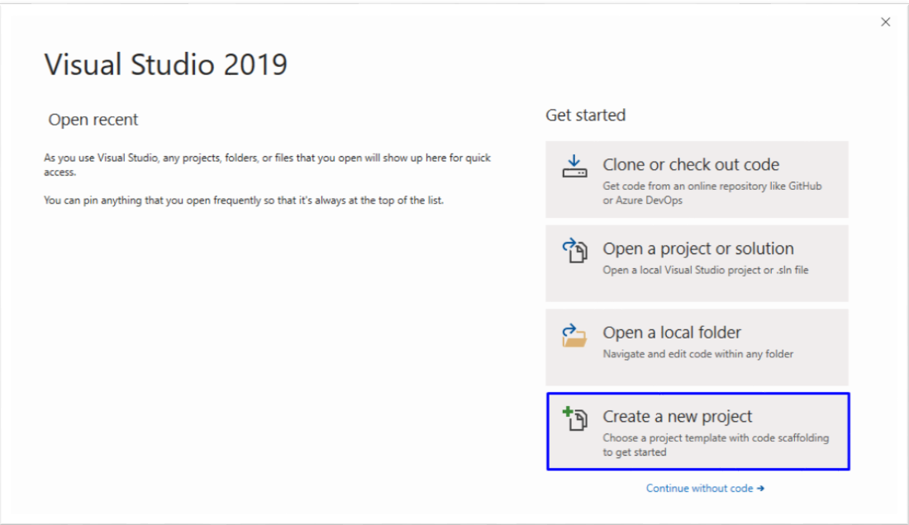

1.  Изберете [Console App (.NET Core)

    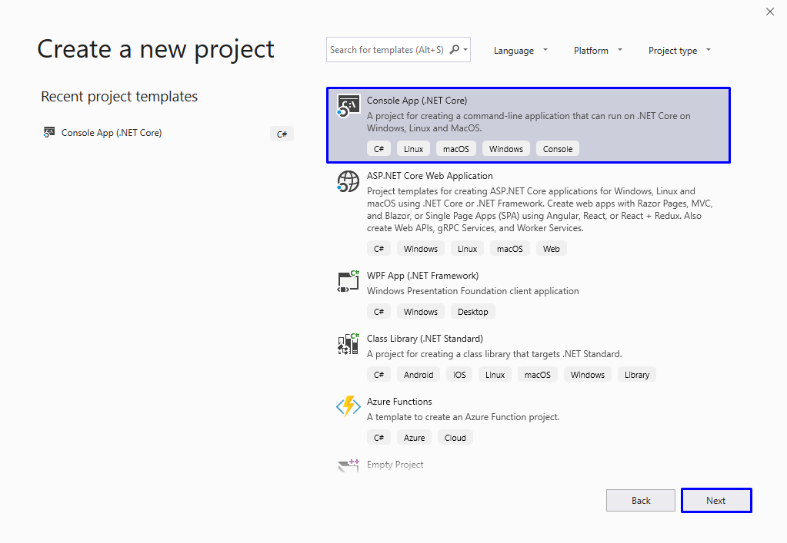

2.  Дайте подходящо име на проекта, например "**HelloSoftUni**":

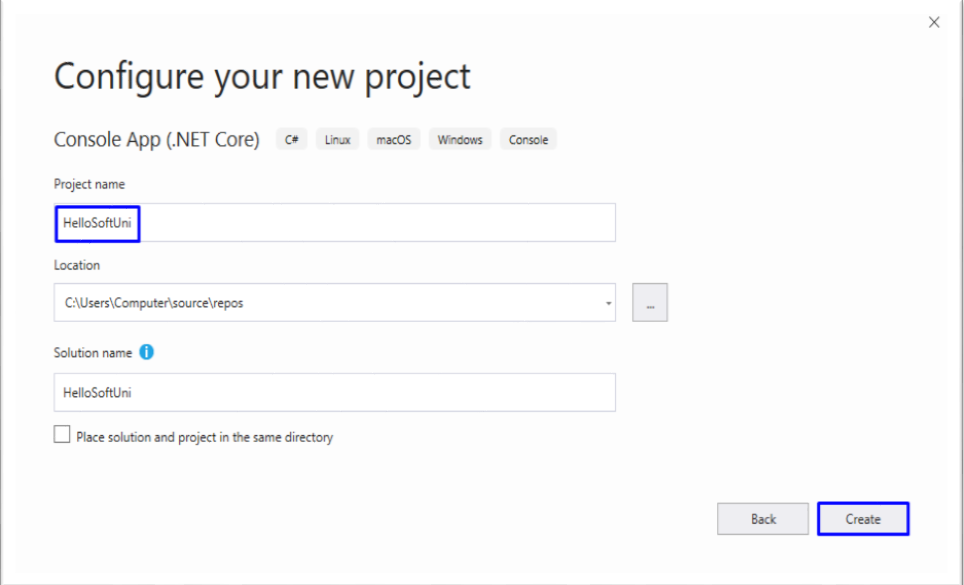

1.  Намерете секцията **Main(string[] args)**. В нея се пише програмен код
    (команди) на езика C\#.

2.  Придвижете курсора между отварящата и затварящата скоба **{ }**.

3.  Натиснете **[Enter]** след отварящата скоба **{**.

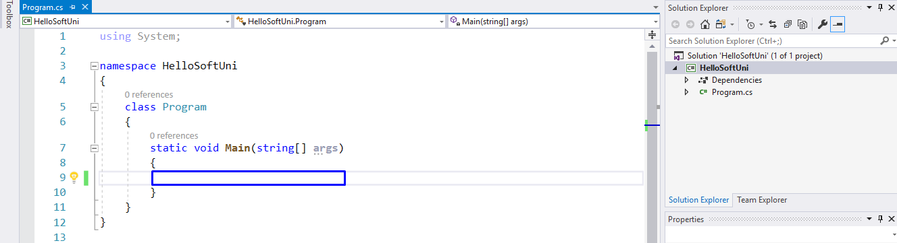

1.  Напишете следния програмен код (команда за печатане на текста **"Hello
    SoftUni"**):

| Console.WriteLine("Hello SoftUni"); |
|-------------------------------------|

Кодът на програмата се пише отместен навътре с една табулация спрямо отварящата
скоба **{**.

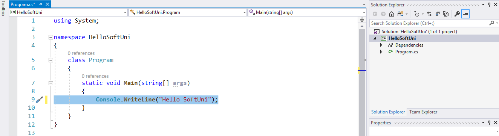

1.  **Стартирайте** програмата с натискане на **[Ctrl+F5]**. Трябва да получите
    следния резултат:

    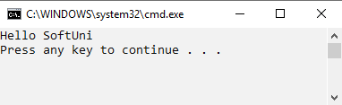

2.  **Тествайте** решението на тази задача в онлайн judge системата на СофтУни.
    За целта първо отворете
    <https://judge.softuni.bg/Contests/Compete/Index/2339#0>. Влезте с вашето
    потребителско име в СофтУни. Ще се появи прозорец за изпращане на решения за
    задача "**Hello SoftUni**". Копирайте сорс кода от Visual Studio и го
    поставете в полето за изпращане на решения:

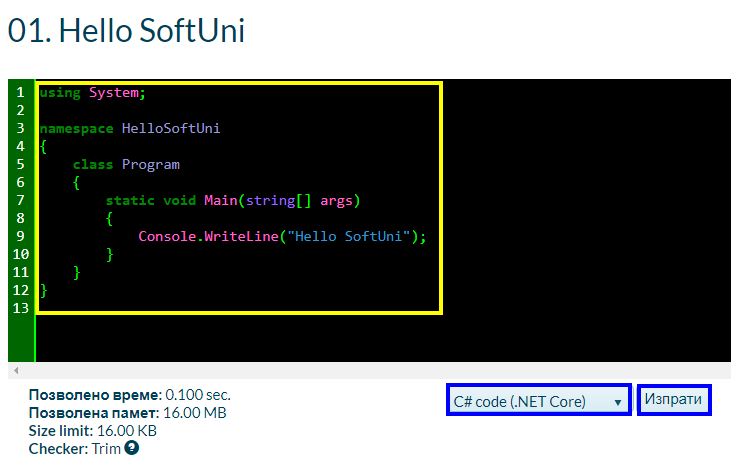

1.  **Изпратете решението** за оценяване с бутона [Submit]. Ще получите
    резултата след няколко секунди в таблицата с изпратени решения в judge
    системата:

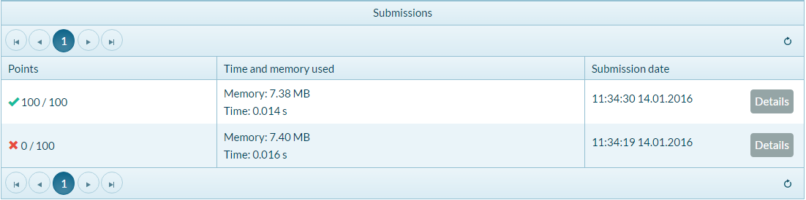

## Числата от 1 до 10

Напишете C\# конзолна програма, която **отпечатва числата от 1 до 10** на
отделни редове на конзолата.

1.  Създайте конзолно C\# приложение с име "**Nums1To10**":

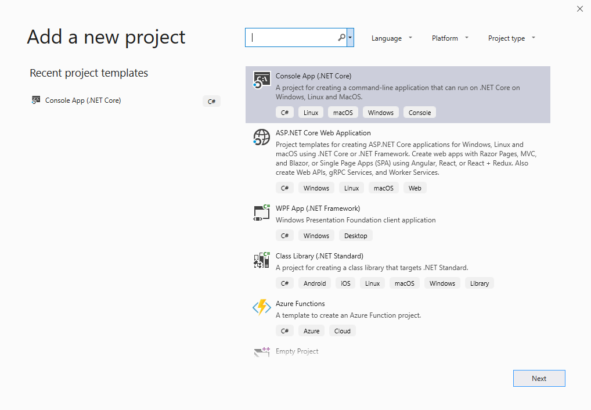

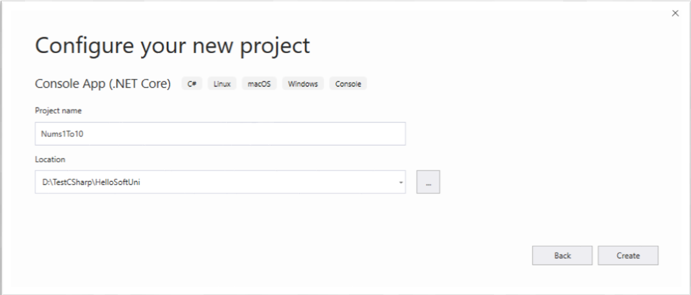

1.  Напишете 10 команди **Console.WriteLine()**, една след друга, за да
    отпечатате числата от 1 до 10.

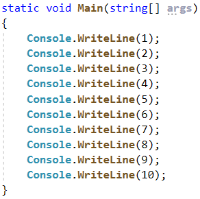

1.  **Тествайте** вашето решение на задачата в judge системата.

2.  Можете ли да напишете програмата по **по-умен начин**, така че да не
    повтаряте 10 пъти една и съща команда? Потърсете в Интернет информация за
    "[for loop C\#](https://www.google.com/search?q=for+loop+C%23)".

## Пресмятане на лице на квадрат

Да се напише **конзолна програма**, която **въвежда цяло число** '**a'** и
**пресмята лицето на квадрат със страна** '**a'**.

### Примерен вход и изход

| **вход** | **изход** |
|----------|-----------|
| 5        | 25        |

### Насоки

1.  **Инициализирайте** променлива **side** и в нея запишете стойността въведена
    от конзолата:

      
    

    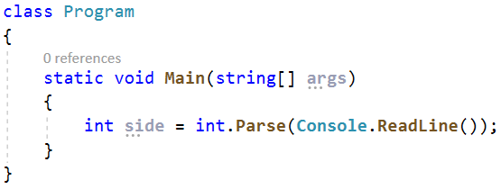

2.  **Инициализирайте втора променлива area**, в която да запишете стойността за
    лицето на правоъгълника, получена по формулата **side \* side**. Принтирайте
    получения резултат:

      
    

    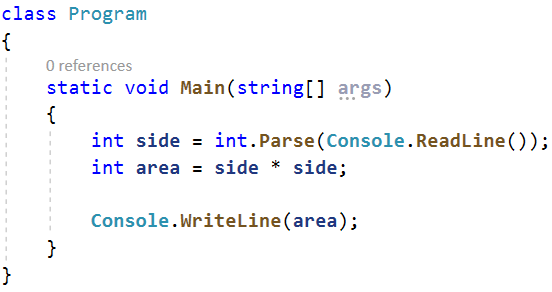

## От инчове към сантиметри

Да се напише програма, която **чете от конзолата число** (реално число) и
преобразува числото **от инчове в сантиметри**. За целта **умножава инчовете по
2.54** (защото 1 инч = 2.54 сантиметра).

### Примерен вход и изход

| **вход** | **изход** |
|----------|-----------|
| 5        | 12.7      |

**Внимание:** в зависимост от регионалните настройки на операционната система, е
възможно вместо **десетична точка** (US настройки) да се използва **десетична
запетая** (BG настройки). Ако програмата очаква десетична точка и бъде въведено
число с десетична запетая или на обратно (бъде въведена десетична точка когато
се очаква десетична запетая), ще се получи следната грешка:  

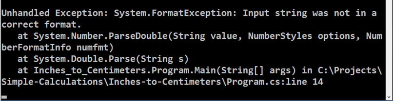

Препоръчително е **да промените настройките на компютъра си**, така че да се
използва **десетична точка**:

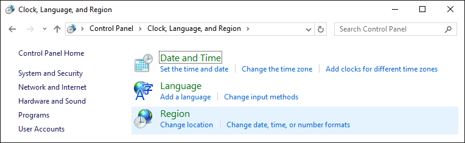

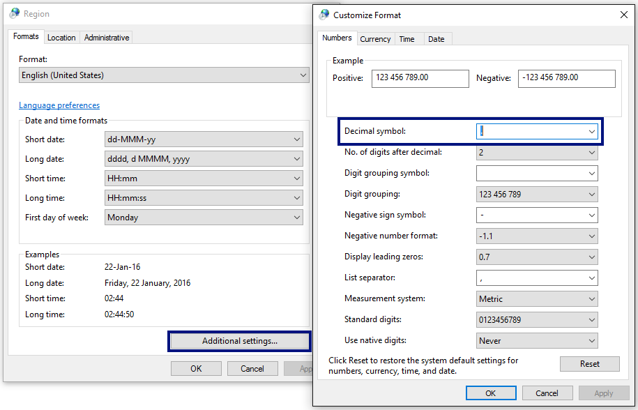

## Поздрав по име

Напишете програма, която **чете от конзолата име на човек** и отпечатва
"**Hello, \<name\>!**", където **\<name\>** е въведеното име от конзолата.

1.  Първо създайте **нов C\# конзолен проект** с име "**Greeting**" в нов проект
    с име "**SimpleCalculations**", като изберем от горният ляв ъгъл **File -\>
    New -\> Project...**

    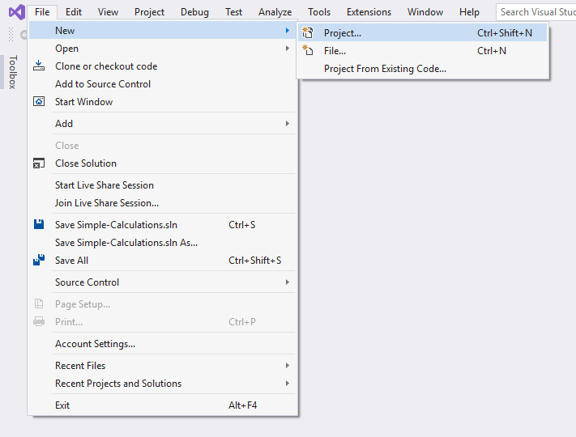

    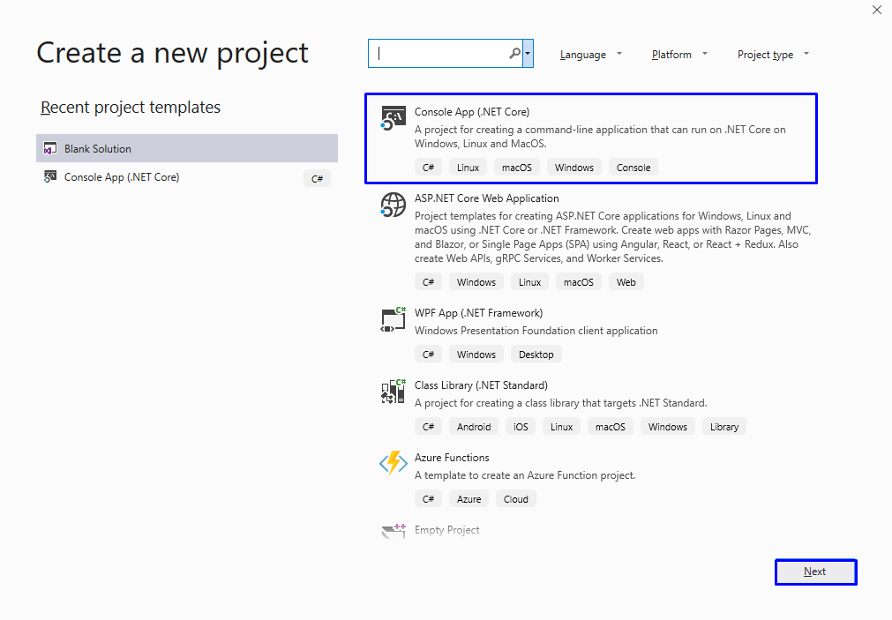

    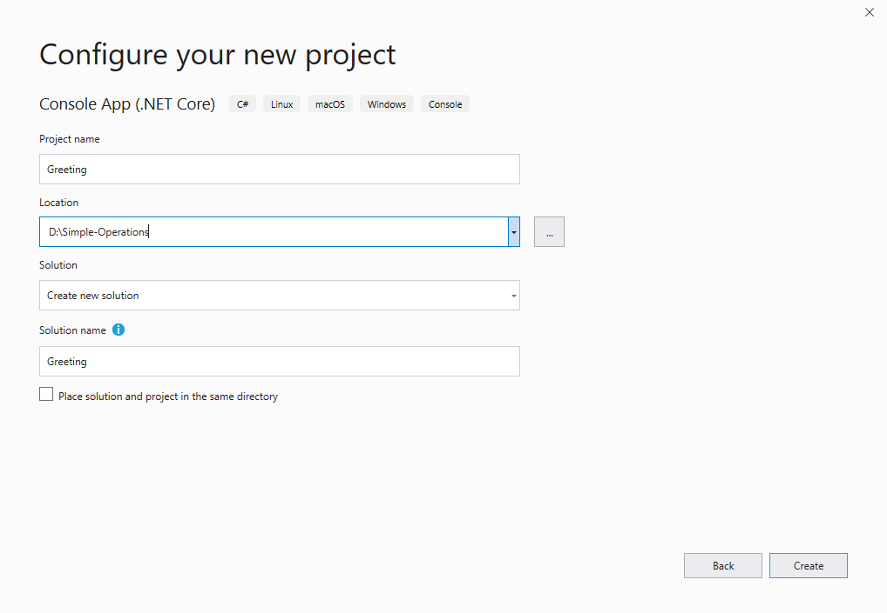

2.  Създайте променливата **name** от тип **string** и запазете в нея името,
    което получавате от конзолата

    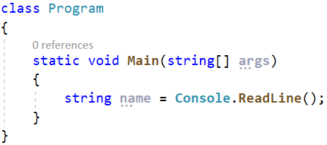

3.  Изведете изхода на конзолата като използвате следния шаблон:

    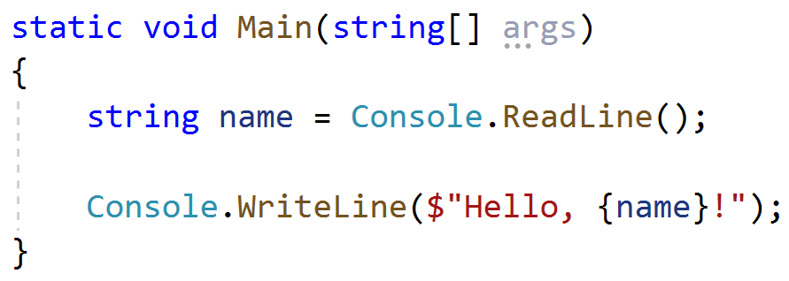

    Как работи примерът? Методът **Console.WriteLine** ни позволява в кръглите
    скоби да записваме поредица от символи, които дефинират място за текстова
    стойност в крайния текст, който ще бъде принтиран на конзолата. В нашия
    случай тази стойност ще бъде стойността на променливата **name**, която сме
    подали в къдравите скоби в текста за принтиране.

    Можете да прочетете повече за разновидностите от шаблони, които ни предлага
    езика **C\#**,
    [тук](https://docs.microsoft.com/en-us/dotnet/api/system.string.format?view=netcore-2.2).

    Можем да постигнем същия ефект и с метода на **конкатенация** (долепяне) на
    **string** стойности и метода **Console.WriteLine**:

    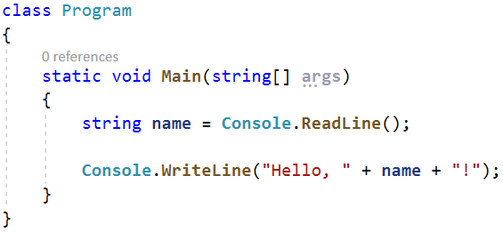

4.  Стартирайте програмата с **Ctrl + F5** и тествайте с различни входни
    примери.

    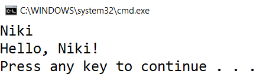

## Съединяване на текст и числа

Напишете програма, която прочита от конзолата име, фамилия, възраст и град и
печата съобщение от следния вид: "**You are \<firstName\> \<lastName\>, a
\<age\>-years old person from \<town\>.**"

1.  Добавете към текущото Visual Studio решение още един **конзолен проект** с
    име "**ConcatenateData**", като изберем с десен бутон върху проекта **Add
    -\> New Project...**

    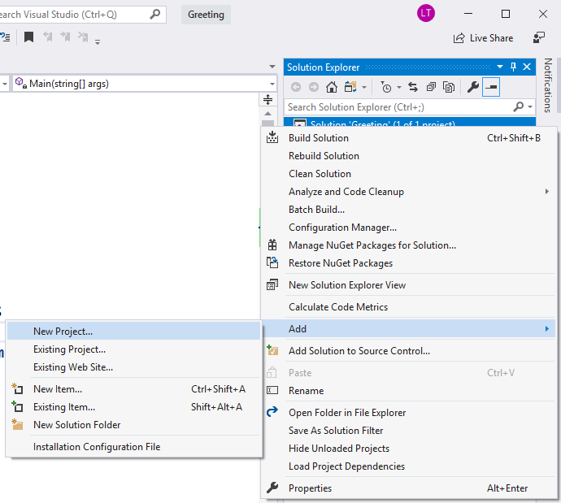

2.  Въведете входните данни и ги запишете в променливи с подходящ тип данни:  
    

    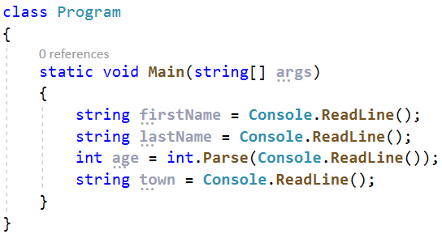

3.  Изведете на конзолата форматирания изход:  
    

    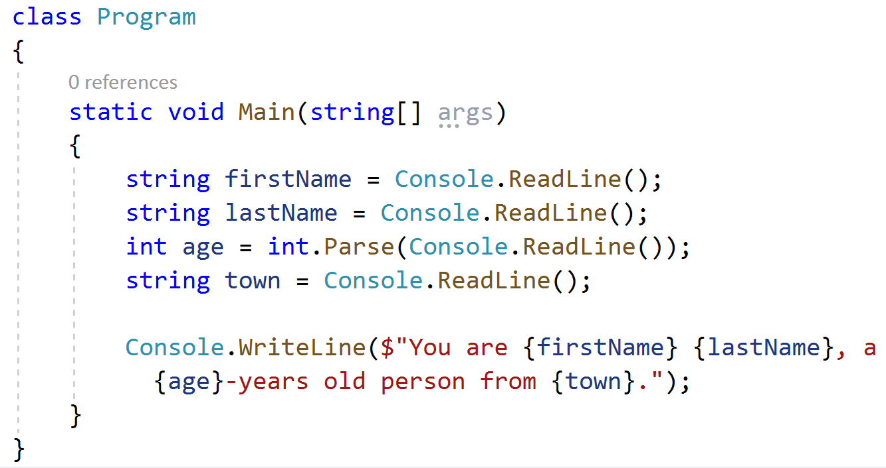

4.  Стартирайте програмата с **Ctrl + F5** и тествайте с различни входни
    примери.

    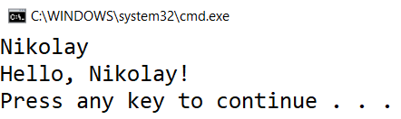

5.  **Ако все още получавате резултата от миналата задача, това се получава,
    защото не сте сменили стартовия проект. Как да се справите с проблема?**

6.  Както виждате **Greeting** проекта е с удебелени черни букви – това
    означава, че това е вашият стартов проект. За да смените стартовия проект,
    изберете с десен бутон върху желания проект **Set as StartUp Project**.

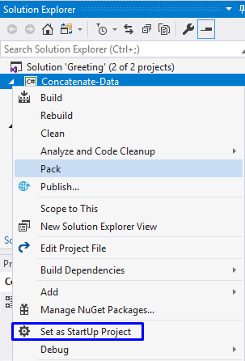

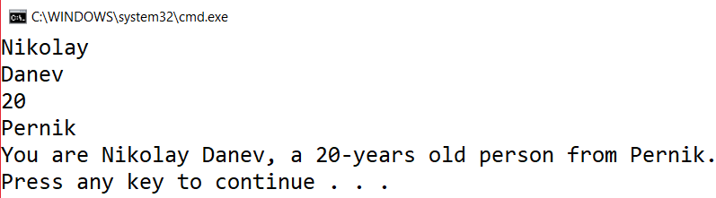

## Изготвяне на проекти

Напишете програма, която **изчислява колко часове** ще са необходими на един
архитект, за да **изготви проектите** на няколко строителни обекта. Изготвянето
на един проект отнема **три часа**.

**Вход**

От конзолата се четат **2 реда**:

1.  **Името на архитекта - текст**

2.  **Брой на проектите - цяло число в интервала [0… 100]**

**Изход**

На конзолата се отпечатва:

-   **"The architect {името на архитекта} will need {необходими часове} hours to
    complete {брой на проектите} project/s."**

**Примерен вход и изход**

| **вход** | **изход**                                                        |   | **вход** | **изход**                                                       |
|----------|------------------------------------------------------------------|---|----------|-----------------------------------------------------------------|
| George 4 | The architect George will need 12 hours to complete 4 project/s. |   | Sanya 9  | The architect Sanya will need 27 hours to complete 9 project/s. |

## Зоомагазин

Напишете програма, която **пресмята нужните разходи** за закупуването на храна
за кучета. Храната се пазарува **основно за кучета**, от зоомагазин, но понякога
стопанинът им купува и за **животните на съседа му**. Една опаковка храна за
**кучета е на цена 2.50лв.**, а всяка друга, която **не е** за тях **струва
4лв**.

**Вход**

От конзолата се четат **2 реда**:

1.  **Броят на кучетата – цяло число в интервала [0… 100]**

2.  **Броят на останалите животни - цяло число в интервала [0… 100]**

**Изход**

На конзолата се отпечатва:

**"{крайната сума} lv."**

**Примерен вход и изход**

| **вход** | **изход** |   | **вход** | **изход** |
|----------|-----------|---|----------|-----------|
| 5 4      | 28.5 lv.  |   | 13 9     | 68.5 lv.  |

## Озеленяване на дворове

Божидара разполага с **няколко къщи** на Черноморието и **желае да озелени
дворовете на някои от тях,** като по този начин създаде **уютна обстановка и
комфорт на гостите си**, като за целта е наела фирма.

Напишете програма, която **изчислява необходимите средства**, които Божидара ще
трябва да заплати на фирмата изпълнител на проекта. Цената на **един кв. м. е
7.61лв със ДДС**. Тъй като нейният двор е **доста голям**, фирмата изпълнител
предлага **18% отстъпка от крайната цена**.

**Вход**

От конзолата се прочита само **един ред**:

1.  **Кв. метри, които ще бъдат озеленени – реално число в интервала [0.00…
    10000.00]**

**Изход**

На конзолата се отпечатват **два реда**:

-   **"The final price is: {крайна цена на услугата} lv."**

-   **"The discount is: {отстъпка} lv."**

**Примерен вход и изход**

| **Вход** | **Изход**                                                   | **Обяснения**                                                                                                                                                                                                |
|----------|-------------------------------------------------------------|--------------------------------------------------------------------------------------------------------------------------------------------------------------------------------------------------------------|
| 550      | The final price is: 3432.11 lv. The discount is: 753.39 lv. | Пресмятаме цената за озеленяване на целия двор: 550 \* 7.61 = 4185.5 лв. Приспадаме отстъпката от общата сума: 0.18 \* 4185.5 = 753.39 лв. Калкулираме крайната цена на услугата: 4185.5– 753.39 3432.11 лв. |
| 150      | The final price is: 936.03 lv. The discount is: 205.47 lv.  |                                                                                                                                                                                                              |
