# Упражнение: Условни конструкции

Задачи за упражнение към курса ["Основи на програмирането" \@
СофтУни](https://softuni.bg/courses/programming-basics).

Тествайте решенията си в **judge системата**:
<https://judge.softuni.bg/Contests/2376>

## Сумиране на секунди 

Трима спортни състезатели финишират за някакъв **брой секунди** (между **1** и
**50**). Да се напише програма, която чете времената на състезателите в секунди,
въведени от потребителя и пресмята **сумарното им време** във формат
"**минути:секунди**". Секундите да се изведат с **водеща нула** (2 "02", 7 "07",
35 "35").

| **вход** | **изход** |   | **вход** | **изход** |   | **вход** | **изход** |   | **вход** | **изход** |
|----------|-----------|---|----------|-----------|---|----------|-----------|---|----------|-----------|
| 35 45 44 | 2:04      |   | 22 7 34  | 1:03      |   | 50 50 49 | 2:29      |   | 14 12 10 | 0:36      |

### Насоки:

1.  Прочетете входните данни (**секундите на състезателите**):

    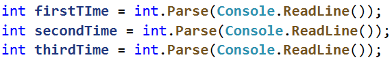

2.  Създайте **нова променлива**, в която да съхранявате **сбора от секундите на
    тримата състезатели**:

    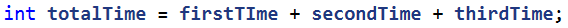

3.  След като сте намерили **сбора от секундите** трябва да ги **превърнете в
    минути и секунди** (например, ако сборът е **85 секунди това са 1 минута и
    25 секунди, защото 1 минута има 60 секунди**). Създайте си **две нови
    променливи**. В първата изчислете, **колко минути е сбора от секунди**, като
    **разделите сбора на 60**. Във втората променлива **изчислете секундите с
    помощта на деление с остатък (%)**. Използвайте **деление с остатък (%)**,
    за да вземете **остатъка при деление с 60**, което са останалите секунди.
    Например имате общ сбор от 134 секунди (2 минути и 14 секунди) **след
    целочисленото деление (/) на 60 ще получим 2, а след делението с остатък (%)
    ще получим оставащите секунди(14).**

    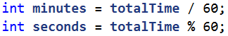

4.  След като вече знаете **колко минути и секунди** е общия сбор, трябва да ги
    принтираме в правилния формат **(минути : секунди**), като ако секундите са
    **по-малки от 10** трябва да отпечатаме **0 преди секундите**, в противен
    случай просто си отпечатваме **резултата в дадения формат**. За целта
    **направете проверка** (if). За принтирането може да използвате **шаблон**.

    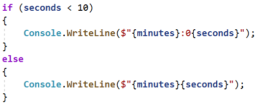

## Бонус точки

Дадено е **цяло число** – начален брой точки. Върху него се начисляват **бонус
точки** по правилата, описани по-долу. Да се напише програма, която пресмята
**бонус точките, които получава числото** и **общия брой точки** (числото +
бонуса).

-   Ако числото е **до 100** включително, бонус точките са **5**.

-   Ако числото е **по-голямо от 100**, бонус точките са **20%** от числото.

-   Ако числото е **по-голямо от 1000**, бонус точките са **10%** от числото.

-   Допълнителни бонус точки (начисляват се отделно от предходните):

    -   За **четно** число + 1 т.

    -   За число, което **завършва на 5** + 2 т.

### Примерен вход и изход

| **вход** | **изход** |   | **вход** | **изход** |   | **вход** | **изход**    |   | **вход** | **изход**      |
|----------|-----------|---|----------|-----------|---|----------|--------------|---|----------|----------------|
| 20       | 6 26      |   | 175      | 37 212    |   | 2703     | 270.3 2973.3 |   | 15875    | 1589.5 17464.5 |

### Насоки:

1.  Прочетете входните данни (**числото**):

    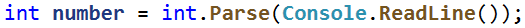

2.  Създайте си **нова променлива от тип double**, в която ще си изчислявате
    **натрупаните бонус точки**, като и дадете **начална стойност 0.0**.

    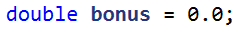

3.  Направете **if-else-if конструкция** за първите **три проверки**, за да
    проверите големината числото и да изчислите бонуса.

    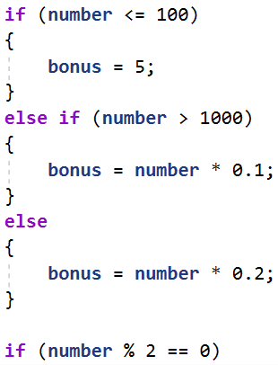

4.  Направете **нова if-else-if конструкция**, за да извършите проверките и
    **изчислите допълнителния бонус**.

    -   aко числото **е четно към до момента натрупания бонус добавете 1**

    -   ако **завършва на 5 към бонуса добавете 2**

        За да проверите дали едно число **е четно трябва да го разделите на 2 и
        ако получавате остатък при делението 0**, то значи числото е **четно**,
        но ако **получите остатък 1**, това означава, че числото е **нечетно**.
        Например числото 34 е четно, защото 34 / 2 = 17 и остатъкът е 0, а
        числото 35 е нечетно, защото 35 / 2 = 17 с остатък 1.

        За да проверите дали едно число завършва на 5 трябва **да разделите
        числото на 10** и ако **получите остатък при делението 5**, то значи
        числото завършва на 5. Например числото 245 / 10 = 24 с остатък 5.

        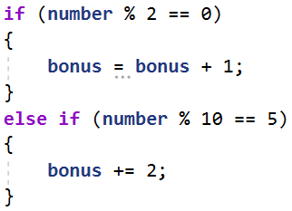

5.  Принтирайте **на два реда** резултатите. На първия ред **натрупания бонус**,
    а на втория **крайното число**, което ще намерите като **съберете началния
    брой точки и бонуса**.

    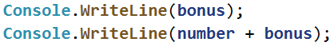

## Информация за скоростта

Да се напише програма, която **чете скорост (реално число)**, въведена от
потребителя и отпечатва **информация за скоростта**. При скорост **до 10**
(включително) отпечатайте “**slow**”. При скорост **над 10** и **до 50**
отпечатайте “**average**”. При скорост **над 50** и **до 150** отпечатайте
“**fast**”. При скорост **над 150** и **до 1000** отпечатайте “**ultra fast**”.
При по-висока скорост отпечатайте “**extremely fast**”. Примери:

| **вход** | **изход** |   | **вход** | **изход** |   | **вход** | **изход** |   | **вход** | **изход**  |   | **вход** | **изход**      |
|----------|-----------|---|----------|-----------|---|----------|-----------|---|----------|------------|---|----------|----------------|
| 8        | slow      |   | 49.5     | average   |   | 126      | fast      |   | 160      | ultra fast |   | 3500     | extremely fast |

### Насоки:

1.  Прочетете входните данни (**скоростта**):

    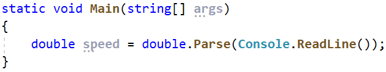

2.  Използвайте **if**-**else**-**if** конструкция, за да проверите
    **стойностите за скоростта**.

    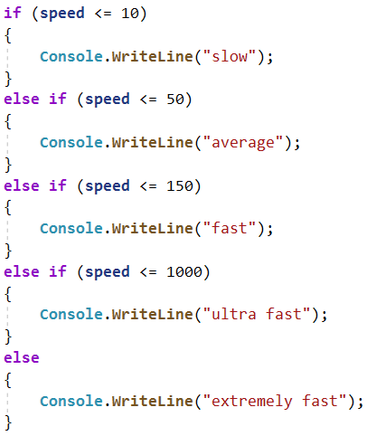

## Конвертор за мерни единици

Да се напише програма, която **преобразува разстояние** между следните **3 мерни
единици**: **mm**, **cm, m**. Използвайте съответствията от таблицата по-долу:

| **входна единица**  | **изходна единица**           |
|---------------------|-------------------------------|
| **1** meter (**m**) | **1000** millimeters (**mm**) |
| **1** meter (**m**) | **100** centimeters (**cm**)  |

Входните данни се състоят от три реда, въведени от потребителя:

-   **Първи ред:** число за преобразуване - **реално число**

-   **Втори ред:** входна мерна единица - **текст**

-   **Трети ред:** изходна мерна единица (за резултата) - **текст**

На конзолата да се отпечата **резултатът от преобразуването** на мерните единици
**форматиран** до **третия знак след десетичната запетая**.

| **вход** | **изход** |   | **вход** | **изход** |   | **вход** | **изход** |
|----------|-----------|---|----------|-----------|---|----------|-----------|
| 12 mm m  | 0.012     |   | 150 m cm | 15000.000 |   | 45 cm mm | 450.000   |

## Време + 15 минути

Да се напише програма, която **чете час и минути** от 24-часово денонощие,
въведени от потребителя и изчислява колко ще е **часът след 15 минути**.
Резултатът да се отпечата във формат **часове:минути**. Часовете винаги са между
0 и 23, а минутите винаги са между 0 и 59. Часовете се изписват с една или две
цифри. Минутите се изписват винаги с по две цифри, с **водеща нула,** когато е
необходимо.

### Примерен вход и изход

| **вход** | **изход** |   | **вход** | **изход** |   | **вход** | **изход** |   | **вход** | **изход** |   | **вход** | **изход** |
|----------|-----------|---|----------|-----------|---|----------|-----------|---|----------|-----------|---|----------|-----------|
| 1 46     | 2:01      |   | 0 01     | 0:16      |   | 23 59    | 0:14      |   | 11 08    | 11:23     |   | 12 49    | 13:04     |

# Примерни изпитни задачи

## Годзила срещу Конг

Снимките за дългоочаквания филм "Годзила срещу Конг" започват. Сценаристът Адам
Уингард ви моли да **напишете програма**, която да изчисли, **дали предвидените
средства са достатъчни** за снимането на филма. За снимките ще бъдат нужни
**определен брой статисти, облекло** за всеки един статист и **декор.**

Известно е, че:

-   Декорът за филма е **на стойност 10% от бюджета.**

    -   При **повече от 150 статиста, има отстъпка за облеклото на стойност
        10%.**

### Вход

От конзолата се четат **3 реда**:

1.  **Бюджет за филма – реално число в интервала [1.00 … 1000000.00]**

2.  **Брой на статистите – цяло число в интервала [1 … 500]**

3.  **Цена за облекло на един статист – реално число в интервала [1.00 …
    1000.00]**

### Изход

На конзолата трябва да се отпечатат **два реда**:

-   Ако парите за декора и дрехите **са повече от бюджета**:

    -   **"Not enough money!"**

    -   **"Wingard needs {парите недостигащи за филма} leva more."**

-   Ако парите за декора и дрехите са **по малко или равни на бюджета**:

    -   **"Action!"**

    -   **"Wingard starts filming with {останалите пари} leva left."**

**Резултатът трябва да е форматиран до втория знак** след десетичната запетая.

### Примерен вход и изход

| **Вход**           | **Изход**                                               | **Обяснения**                                                                                                                                                                                                                                                                                                                                |
|--------------------|---------------------------------------------------------|----------------------------------------------------------------------------------------------------------------------------------------------------------------------------------------------------------------------------------------------------------------------------------------------------------------------------------------------|
| 20000  120 55.5    | Action! Wingard starts filming with 11340.00 leva left. | Сума за декор: 10% от 20000 = 2000 лв. Сума за облекло: 120 \* 55.5 = 6660 лв. Обща сума за филма: 2000 + 6660 = 8660 лв. 20000 – 8660 = 11340 лева остават.                                                                                                                                                                                 |
| 15437.62 186 57.99 | Action! Wingard starts filming with 4186.33 leva left.  | Сума за декор: 10% от 15437.62 = 1543.762 лв. Сума за облекло: 186 \* 57.99 = 10786.14 лв. Статистите са повече от 150 следователно има 10% отстъпка на облеклото. 10% от 10786.14 е 1078.614 10786.14 – 1078.614 = 9707.526 лв. за облекло Обща сума за филма: 1543.762 + 9707.526 = 11251.288 15437.62 – 11251.288 = 4186.331 лева остават |
| 9587.88 222 55.68  | Not enough money! Wingard needs 2495.77 leva more.      | Сума за декор: 10% от 9587.88 = 958.788 лв. Сума за облекло: 11124.864 лв. Обща сума за филма: 958.788 + 11124.864 = 12083.652 9587.88 – 12083.652 = 2495.77 лева не достигат                                                                                                                                                                |

## Световен рекорд по плуване

Иван решава да подобри Световния рекорд по плуване на дълги разстояния. **На
конзолата се въвежда рекордът в секунди, който Иван трябва да подобри,
разстоянието в метри, което трябва да преплува и времето в секунди, за което
плува разстояние от 1 м.** Да се напише програма, която изчислява дали се е
справил със задачата, като се има предвид, че: **съпротивлението на водата го
забавя на всеки 15 м. с 12.5 секунди.** Когато се изчислява колко пъти Иванчо ще
се забави, в резултат на съпротивлението на водата, **резултатът трябва да се
закръгли надолу до най-близкото цяло число.**

**Да се изчисли времето в секунди, за което Иванчо ще преплува разстоянието и
разликата спрямо Световния рекорд.**

### Вход

От конзолата се четат **3 реда**:

1.  **Рекордът в секунди – реално число в интервала [0.00 … 100000.00]**

2.  **Разстоянието в метри – реално число в интервала [0.00 … 100000.00]**

3.  **Времето в секунди, за което плува разстояние от 1 м. - реално число в
    интервала [0.00 … 1000.00]**

### Изход

Отпечатването на конзолата зависи от резултата:

-   Ако **Иван е подобрил Световния рекорд** отпечатваме:

    -   **" Yes, he succeeded! The new world record is {времето на Иван}
        seconds."**

-   Ако **НЕ е подобрил рекорда** отпечатваме:

    -   **"No, he failed! He was {недостигащите секунди} seconds slower."**

**Резултатът трябва да се форматира до втория знак след десетичната запетая**.

### Примерен вход и изход

| **Вход**           | **Изход**                                                    | **Обяснения**                                                                                                                                                                                                                                                                                         |
|--------------------|--------------------------------------------------------------|-------------------------------------------------------------------------------------------------------------------------------------------------------------------------------------------------------------------------------------------------------------------------------------------------------|
| 10464 1500 20      | No, he failed! He was 20786.00 seconds slower.               | **Иван трябва да преплува 1500 м.: 1500 \* 20 = 30000 сек. На всеки 15 м. към времето му се добавят 12.5 сек.:**  **1500 / 15 = 100 \* 12.5 = 1250 сек. Общо време: 30000 + 1250 = 31250 сек. 10464 \< 31250 Времето, което не му е стигнало за да подобри рекорда:**  **31250 – 10464 = 20786 сек.** |
| **Вход**           | **Изход**                                                    | **Обяснения**                                                                                                                                                                                                                                                                                         |
| 55555.67 3017 5.03 | Yes, he succeeded! The new world record is 17688.01 seconds. | **Иван трябва да преплува 3017 м.: 3017 \* 5.03 = 15175.51 сек. На всеки 15 м. към времето му се добавят 12.5 сек.:**  **3017/ 15 = 201 \* 12.5 = 2512.50 сек. Общо време: 15175.51 + 2512.50 = 17688.01 сек. Рекордът е подобрен: 55555.67 \> 17688.01**                                             |

## \*Стипендии

Учениците могат да кандидатстват за **социална стипендия** или за **стипендия за
отличен успех**. Изискване за социална стипендия - **доход на член от
семейството по-малък от минималната работна заплата и успех над 4.5**. Размер на
социалната стипендия - **35% от минималната работна заплата**. Изискване за
стипендия за отличен успех - **успех над 5.5, включително**. Размер на
стипендията за отличен успех - **успехът на ученика, умножен по коефициент 25**.

Напишете програма, която при въведени **доход**, **успех** и **минимална работна
заплата**, дава информация дали ученик има право да получава стипендия, и
стойността на стипендията, която **е по-висока** за него.

### Вход

Потребителят въвежда **3 числа**, по едно на ред:

1.  **Доход в лева - реално число в интервала [0.00..6000.00]**

2.  **Среден успех -**  **реално число в интервала [2.00...6.00]**

3.  **Минимална работна заплата - реално число в интервала [0.00..1000.00]**

### Изход

-   Ако ученикът **няма право да получава стипендия**, се извежда:

    **"You cannot get a scholarship!"**

-   Ако ученикът има право да получава **само** социална стипендия:  
    **"You get a Social scholarship {стойност на стипендия} BGN"**

-   Ако ученикът **има право да получава само стипендия за отличен успех**:

    **"You get a scholarship for excellent results {стойност на стипендията}
    BGN"**

-   **Ако ученикът има право да получава и двата типа стипендии, ще получи
    по-голямата по сума, а ако са равни ще получи тази за отличен успех.**

**Резултатът се закръгля до по-малкото цяло число.**

### Примерен вход и изход

| **Вход**           | **Изход**                            | **Обяснения**                                                                                                                                                                                                                                                               |
|--------------------|--------------------------------------|-----------------------------------------------------------------------------------------------------------------------------------------------------------------------------------------------------------------------------------------------------------------------------|
| 480.00 4.60 450.00 | You cannot get a scholarship!        | Доходът от 480 лв. е по-висок от минималната работна заплата 450 лв. → ученикът не може да получава социална стипендия. Успех 4.60 \< 5.50 → ученикът не може да получава стипендия за отличен успех.                                                                       |
| 300.00 5.65 420.00 | You get a Social scholarship 147 BGN | 300 лв. \< 420 лв. и 5.65 \>4.50 → ученикът може да получава социална стипендия 35% \* 420 лв. = 147 лв. Успех 5.65 \> 5.50 → ученикът може да получава стипендия за отличен успех 5.65 \* 25 = 141.25 лв. 147 лв. \> 141.25 лв. → ученикът ще получава социална стипендия. |
