# Лаб: Условни конструкции

Задачи за упражнение в клас и за домашно към курса ["Основи на програмирането"
\@ СофтУни](https://softuni.bg/courses/programming-basics).

Тествайте решенията си в **Judge** системата:
<https://judge.softuni.bg/Contests/2369>

## Празно Visual Studio решение (Blank Project)

Създайте празно решение (**Blank Solution**) във Visual Studio. Решенията
(solutions) във Visual Studio обединяват **група проекти**. Тази възможност е
изключително удобна, когато искаме да работим по няколко проекта и бързо да
превключваме между тях или искаме да обединим логически няколко взаимосвързани
проекта.

В настоящото практическо занимание ще използваме **Blank Solution с няколко
проекта,** за да организираме решенията на задачите от упражненията – всяка
задача в отделен проект и всички проекти в общ solution.

1.  Стартирайте Visual Studio.

2.  Създайте нов проект: [Create a new project].

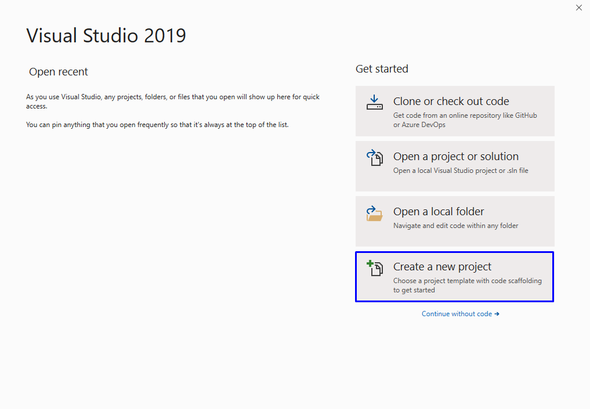

1.  Изберете [Black solution], ако не го виждате, в търсачката изпишете ["Blank
    solution"].

    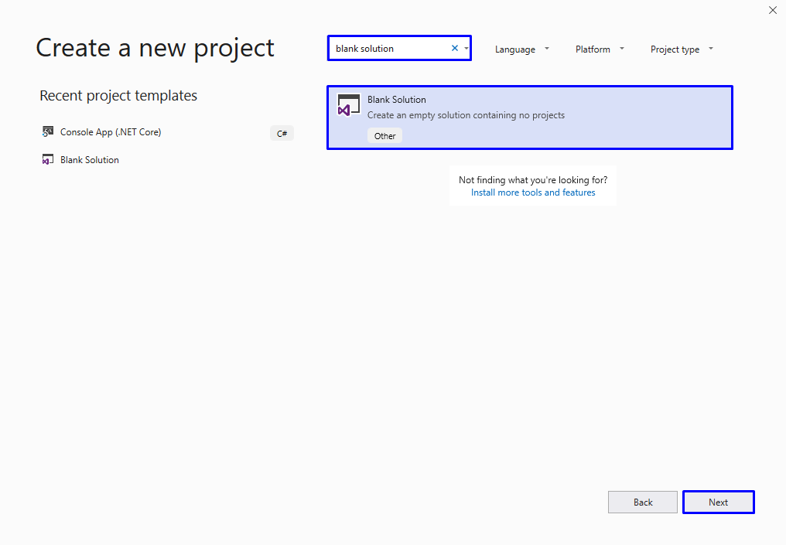

2.  Задайте подходящо име на проекта, например "**Conditional-Statements**":

    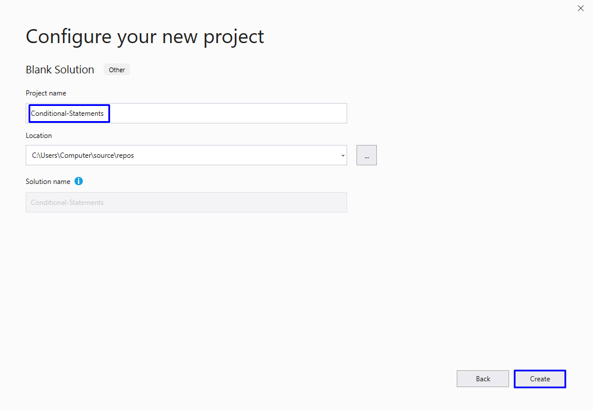

Сега имате създаден **празен Visual Studio Solution** (с 0 проекта в него):

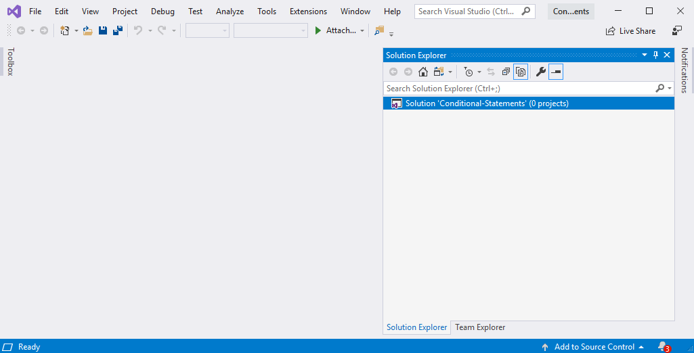

Целта на този blank solution e да добавяте в него **по един проект за всяка
задача** от упражненията.

## Проверка за отлична оценка

Първата задача от тази тема е да се напише **конзолна програма**, която **чете
оценка** (десетично число), въведена от потребителя и отпечатва
"**Excellent!",** ако оценката е **5.50** или по-висока.

| **вход** | **изход**  |   | **вход** | **изход**      |   | **вход** | **изход**  |   | **вход** | **изход**      |
|----------|------------|---|----------|----------------|---|----------|------------|---|----------|----------------|
| 6        | Excellent! |   | 5        | *(няма изход)* |   | 5.50     | Excellent! |   | 5.49     | *(няма изход)* |

### Насоки:

1.  Създайте **нов C\# конзолен проект** с име "**ExcellentResult**" в **Blanc
    Project** с име " **Conditional-Statements** ", като натиснем с десен бутон
    на мишката в/у **Solution Condition-Statements-\>**  **add -\> New
    Project...**:

    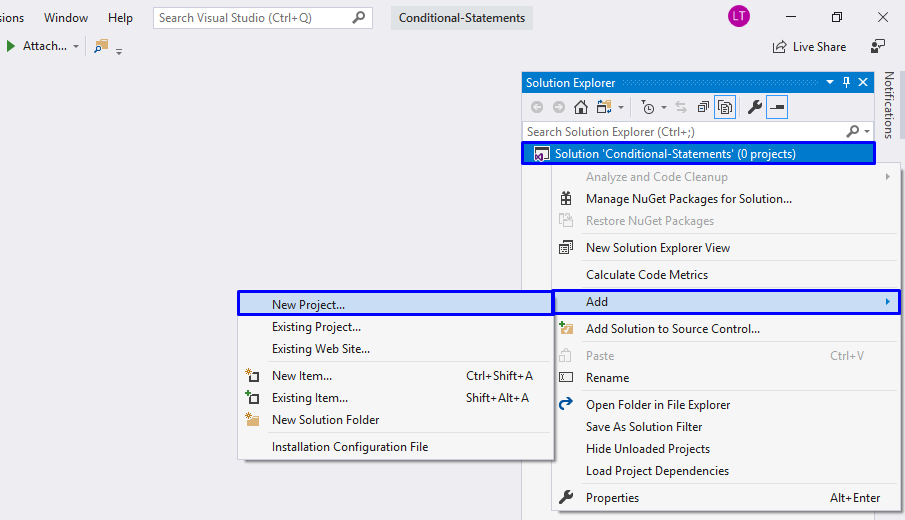

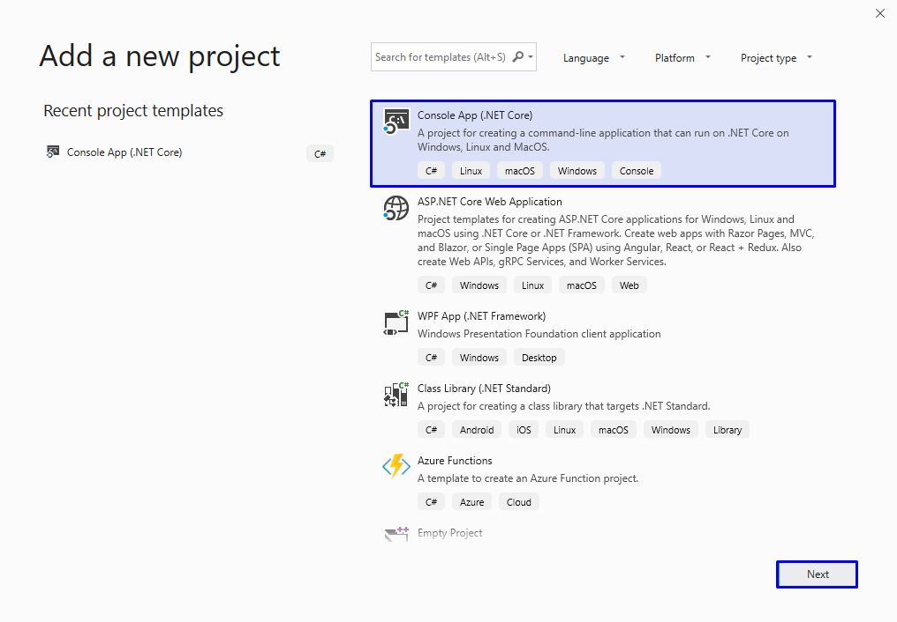

>   A screenshot of a cell phone Description automatically generated

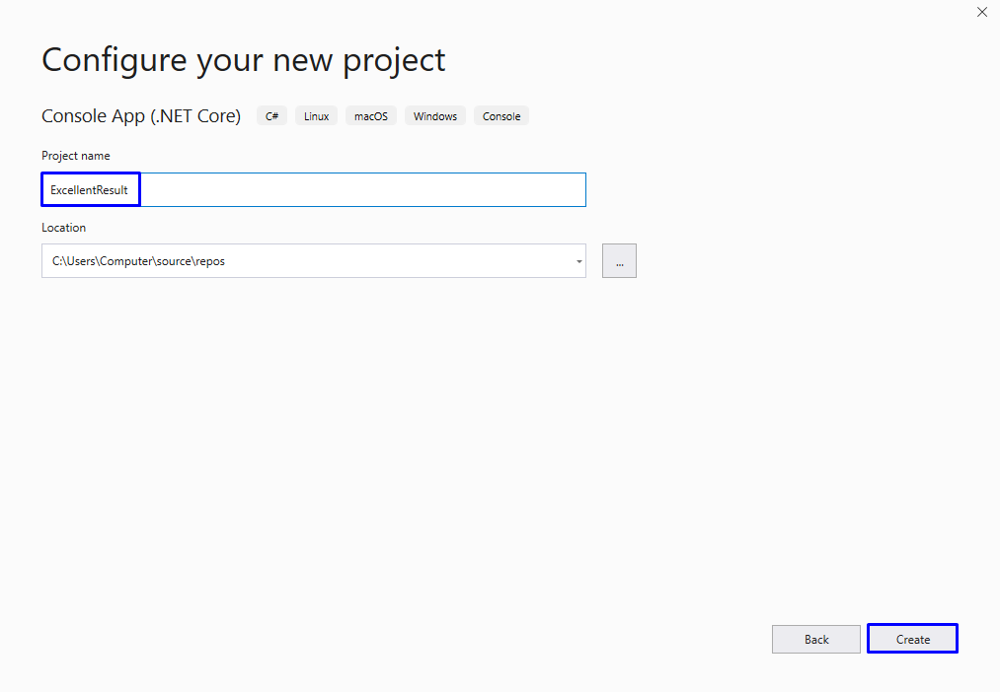

>   A screenshot of a cell phone Description automatically generated

1.  Вече имате създаден клас със **Main метод**

    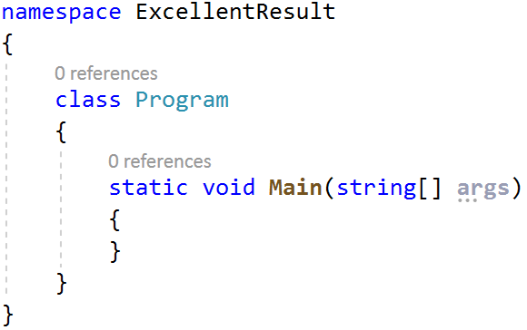

2.  Отидете в тялото на метода **Main(string[] args)** (между къдравите скоби).
    Създайте една променлива, в която да запазите **реално число** – оценката,
    което ще прочетете от конзолата:

    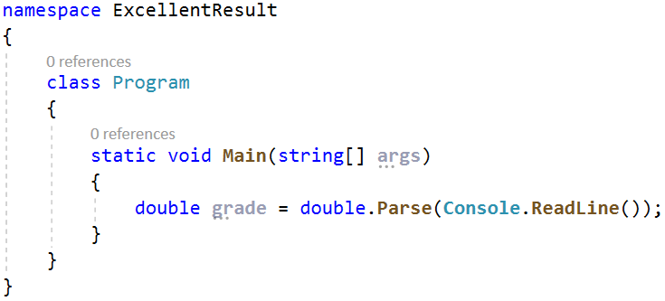

3.  Направете проверка за стойността на оценката. Ако тя е по-голяма или равна
    на 5.50 отпечатайте изхода по условие:

    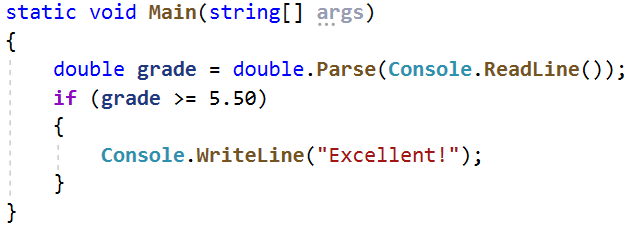

4.  Стартирайте програмата с **Ctrl + F5** и я **тествайте** с различни входни
    стойности:

    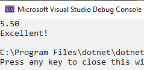

    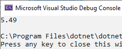

## Намиране на по-голямото число

Да се напише програма, която чете **две цели числа** въведени от потребителя и
отпечатва **по-голямото от двете**.

### Примерен вход и изход

| **вход** | **изход** |   | **вход** | **изход** |   | **вход** | **изход** |   | **вход** | **изход** |
|----------|-----------|---|----------|-----------|---|----------|-----------|---|----------|-----------|
| 5 3      | 5         |   | 3 5      | 5         |   | 10 10    | 10        |   | \-5 5    | 5         |

### Насоки:

1.  Прочетете две цели числа от конзолата:

    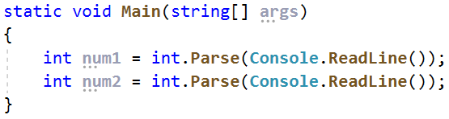

2.  Сравнете, дали първото число **num1** e по-голямо от второто **num2**.
    Отпечатайте по-голямото число.

    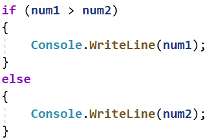

## Четно или нечетно

Да се напише програма, която чете **цяло число** въведено от потребителя и
отпечатва на конзолата, дали е **четно** или **нечетно**.

### Примерен вход и изход

| **вход** | **изход** |   | **вход** | **изход** |   | **вход** | **изход** |   | **вход** | **изход** |
|----------|-----------|---|----------|-----------|---|----------|-----------|---|----------|-----------|
| 2        | even      |   | 3        | odd       |   | 25       | odd       |   | 1024     | even      |

### Насоки:

1.  Първо добавете **нов конзолен проект** към съществуващия проект

2.  Прочетете eдно цяло число от конзолата:

    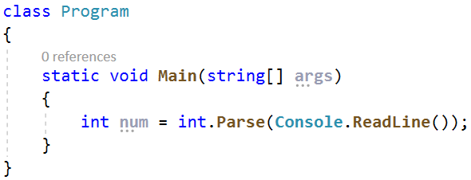

3.  Проверете, дали числото е четно, като използвате модуло оператора с 2 и
    проверите, дали има остатък от целочисленото деление. Отпечатайте изхода по
    условие – текста "**even**":

    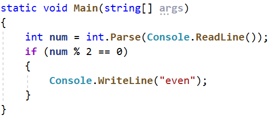

4.  В противен случай отпечатайте "**odd**":

    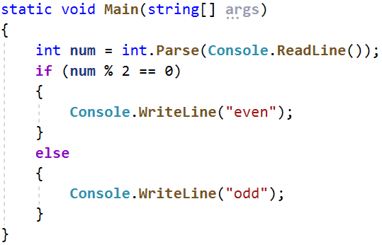

## Число от 100 до 200

Да се напише програма, която **чете цяло число**, въведено от потребителя и
проверява, дали е **под 100**, **между 100 и 200** или **над 200**. Да се
отпечатат съответно съобщения, като в примерите по-долу:

### Примерен вход и изход

| **вход** | **изход**     |   | **вход** | **изход**           |   | **вход** | **изход**        |
|----------|---------------|---|----------|---------------------|---|----------|------------------|
| 95       | Less than 100 |   | 120      | Between 100 and 200 |   | 210      | Greater than 200 |

## Познай паролата

Да се напише програма, която **чете парола** (един ред с произволен текст),
въведена от потребителя и проверява, дали въведеното **съвпада** с фразата
"**s3cr3t!P\@ssw0rd**". При съвпадение да се изведе "**Welcome**". При
несъвпадение да се изведе "**Wrong password!**".

### Примерен вход и изход

| **вход** | **изход**       |   | **вход**         | **изход** |   | **вход**     | **изход**       |
|----------|-----------------|---|------------------|-----------|---|--------------|-----------------|
| qwerty   | Wrong password! |   | s3cr3t!P\@ssw0rd | Welcome   |   | s3cr3t!p\@ss | Wrong password! |

## Лица на фигури

Да се напише програма, в която потребителят **въвежда вида и размерите на
геометрична** фигура и пресмята лицето й. Фигурите са четири вида: квадрат
(**square**), правоъгълник (**rectangle**), кръг (**circle**) и триъгълник
(**triangle**). На първия ред на входа се чете вида на фигурата (**square**,
**rectangle**, **circle** или **triangle**).

-   Ако фигурата е **квадрат**, на следващия ред се чете едно число - дължина на
    страната му.

-   Ако фигурата е **правоъгълник**, на следващите два реда четат две числа -
    дължините на страните му.

-   Ако фигурата е **кръг**, на следващия ред чете едно число - радиусът на
    кръга.

-   Ако фигурата е **триъгълник**, на следващите два реда четат две числа -
    дължината на страната му и дължината на височината към нея.

Резултатът да се закръгли до **3 цифри след десетичната точка**.

### Примерен вход и изход

| **вход** | **изход** |   | **вход**        | **изход** |   | **вход** | **изход** |   | **вход**        | **изход** |
|----------|-----------|---|-----------------|-----------|---|----------|-----------|---|-----------------|-----------|
| square 5 | 25.000    |   | rectangle 7 2.5 | 17.500    |   | circle 6 | 113.097   |   | triangle 4.5 20 | 45.000    |

# Примерна изпитна задача

## Магазин за детски играчки

Петя има магазин за детски играчки. Тя получава голяма поръчка, която трябва да
изпълни. С парите, които ще спечели иска да отиде на екскурзия. Да се напише
програма, която пресмята печалбата от поръчката.

**Цени на играчките:**

-   **Пъзел - 2.60 лв.**

-   **Говореща кукла - 3 лв.**

-   **Плюшено мече - 4.10 лв.**

-   **Миньон - 8.20 лв.**

-   **Камионче - 2 лв.**

Ако поръчаните играчки са **50 или повече** магазинът прави **отстъпка 25% от
общата цена**. От спечелените пари Петя трябва да даде **10% за наема** на
магазина. Да се пресметне дали парите ще ѝ стигнат да отиде на екскурзия.

От конзолата се четат **6 реда**:

1.  **Цена на екскурзията - реално число в интервала [1.00 … 10000.00]**

2.  **Брой пъзели - цяло число в интервала [0… 1000]**

3.  **Брой говорещи кукли - цяло число в интервала [0 … 1000]**

4.  **Брой плюшени мечета - цяло число в интервала [0 … 1000]**

5.  **Брой миньони - цяло число в интервала [0 … 1000]**

6.  **Брой камиончета - цяло число в интервала [0 … 1000]**

На конзолата се отпечатва:

-   Ако **парите са достатъчни** се отпечатва:

    -   **"Yes! {оставащите пари} lv left."**

-   Ако **парите НЕ са достатъчни** се отпечатва:

    -   **"Not enough money! {недостигащите пари} lv needed."**

**Резултатът трябва да се форматира до втория знак след десетичната запетая**.

### Примерен вход и изход

| **Вход**            | **Изход**                           | **Обяснения**                                                                                                                                                                                                                                                                                                                                                                      |
|---------------------|-------------------------------------|------------------------------------------------------------------------------------------------------------------------------------------------------------------------------------------------------------------------------------------------------------------------------------------------------------------------------------------------------------------------------------|
| 40.8 20 25 30 50 10 | Yes! 418.20 lv left.                | **Сума**: 20 \* 2.60 + 25 \* 3 + 30 \* 4.10 + 50 \* 8.20 + 10 \* 2 = **680** лв. **Брой на играчките**: 20 + 25 + 30 + 50 + 10 = **135 135 \> 50 =\> 25% отстъпка**; 25% от 680 = **170 лв. отстъпка Крайна цена**: 680 – 170 = **510** лв. **Наем**: 10% от 510 лв. = **51** лв. **Печалба**: 510 – 51 = **459** лв.  **459 \> 40.8** =\> 459 – 40.8 = **418.20** лв. **остават** |
| **Вход**            | **Изход**                           | **Обяснения**                                                                                                                                                                                                                                                                                                                                                                      |
| 320 8 2 5 5 1       | Not enough money! 238.73 lv needed. | **Сума**: **90.3** лв. **Брой на играчките**: **21 21 \< 50 =\> няма отстъпка**  **Наем**: 10% от 90.3 = **9.03** лв. **Печалба**: 90.3 – 9.03 = **81.27** лв. **81.27 \< 320** =\> 320 – 81.27 = **238.73** лв. **не достигат**                                                                                                                                                   |
