# Лаб: Вложени условни конструкции

Задачи за упражнение в клас и за домашно към курса ["Основи на програмирането"
\@ СофтУни](https://softuni.bg/courses/programming-basics).

**Тествайте** решението си в **judge системата**:
<https://judge.softuni.bg/Contests/2377>

## Ден от седмицата

Напишете програма, която чете **цяло число**, въведено от потребителя, и
отпечатва **ден от седмицата** (на английски език), в граници [1...7] или
отпечатва "**Error**" в случай, че въведеното число е **невалидно**.

### Примерен вход и изход

| **Вход** | **Изход** |
|----------|-----------|
| 1        | Monday    |
| 2        | Tuesday   |
| 3        | Wednesday |
| 4        | Thursday  |
| 5        | Friday    |
| 6        | Saturday  |
| 7        | Sunday    |
| \-1      | Error     |

### Насоки

1.  Създайте **нов проект** в съществуващото Visual Studio решение. В Solution
    Explorer кликнете с десен бутон на мишката върху **Solution** реда и
    изберете [Add] [New Project…]:

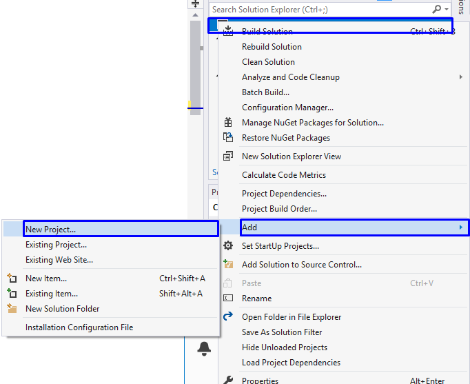

1.  Ще се отвори диалогов прозорец за избор на тип проект за създаване. Изберете
    **C\# конзолно приложение** и задайте подходящо име, например
    "**DayOfWeek**":

    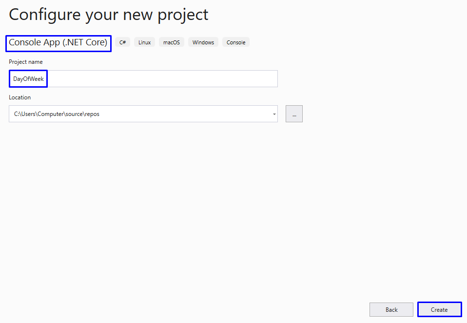

Вече имате solution с едно конзолно приложение в него. Остава да напишете кода
за решаване на задачата.

1.  Прочетете едно цяло число от конзолата:

    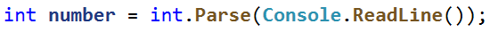

2.  Отпечатайте денят от седмицата според въведеното число. Ако то е невалидно,
    отпечатайте "**Error**".

    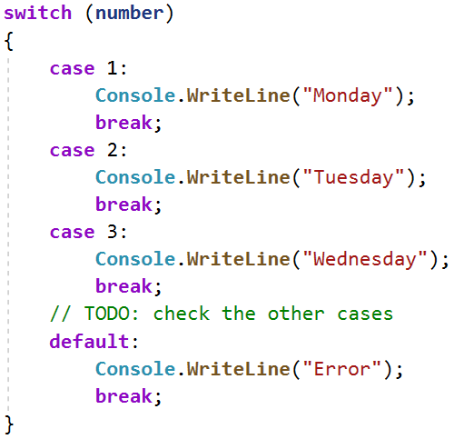

## Почивен или работен ден

Напишете програма която, чете ден от седмицата (**текст**), на английски език -
въведен от потребителя.Ако денят е работен отпечатва на конзолата - "**Working
day**", ако е почивен - "**Weekend**". Ако се въведе текст различен от ден от
седмицата да се отпечата - "**Error**".

### Примерен вход и изход

| **Вход** | **Изход**   |
|----------|-------------|
| Monday   | Working day |
| **Вход** | **Изход**   |
| Sunday   | Weekend     |
| **Вход** | **Изход**   |
| April    | Error       |

### Насоки

1.  Прочетете ден от седмицата(**текст**) от конзолата:

    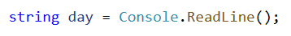

2.  Отпечатайте работен или почивен ден,според въведения ден, ако денят е
    невалиден отпечатайте "**Error**":

    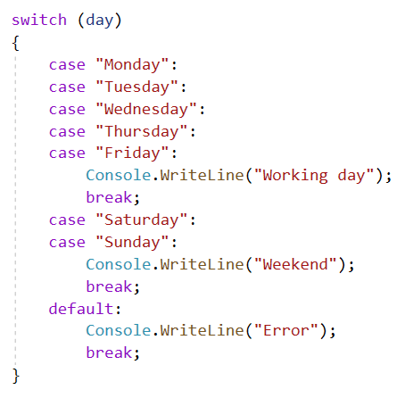

## Клас животно

Напишете програма, която отпечатва класа на животното според неговото име,
въведено от потребителя.

1.  **dog -\> mammal**

2.  **crocodile, tortoise, snake -\> reptile**

3.  **others -\> unknown**

### Примерен вход и изход

| **Вход** | **Изход** |
|----------|-----------|
| dog      | mammal    |
| snake    | reptile   |
| cat      | unknown   |

### Насоки

1.  Прочетете входните данни:

    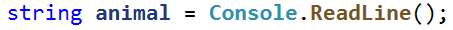

2.  Проверете от какъв вид е животното. Ако то е невалидно, отпечатайте
    "**unknown**".

    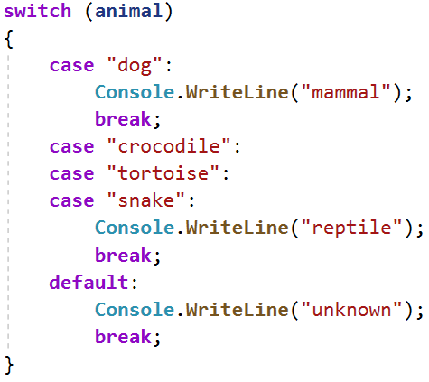

## Обръщение според възраст и пол

Да се напише **конзолна програма**, която **прочита възраст** (реално число) и
**пол** ('**m**' или '**f**'), въведени от потребителя, и отпечатва
**обръщение** измежду следните:

-   "**Mr.**" – мъж (пол '**m**') на 16 или повече години

-   "**Master**" – момче (пол '**m**') под 16 години

-   "**Ms.**" – жена (пол '**f**') на 16 или повече години

-   "**Miss**" – момиче (пол '**f**') под 16 години

### Примерен вход и изход

| **вход** | **изход** |   | **вход** | **изход** |   | **вход** | **изход** |   | **вход** | **изход** |
|----------|-----------|---|----------|-----------|---|----------|-----------|---|----------|-----------|
| 12 f     | Miss      |   | 17 m     | Mr.       |   | 25 f     | Ms.       |   | 13.5 m   | Master    |

### Насоки

1.  Отидете в тялото на метода **Main(string[] args)** и напишете решението на
    задачата. Можете да си помогнете с кода от картинките по-долу:

    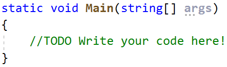

2.  Прочетете **реално число** от конзолата "**age**", на следващия ред
    прочетете **string / текст** за "**gender**".

    

3.  Направете проверка за пола, и ако върне резултат **true,** направете
    проверка за годините. В тялото на проверките за възраст принтирайте желаното
    обръщение.

    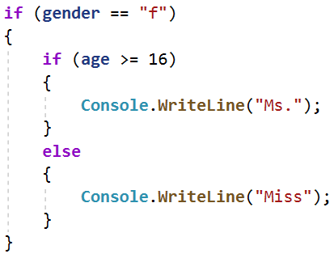

    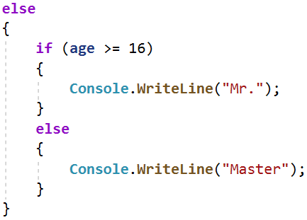

4.  **Стартирайте** програмата с [Ctrl+F5] и я **тествайте** с различни входни
    стойности:

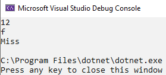

Трябва да получите **100 точки** (напълно коректно решение):

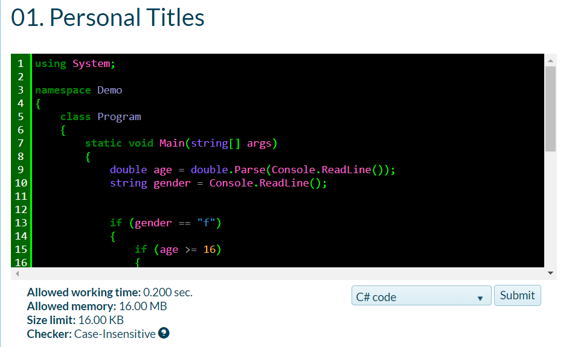

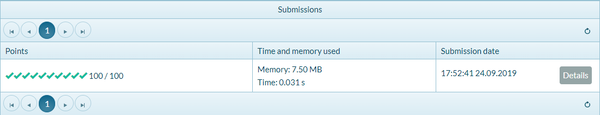

## Квартално магазинче

Предприемчив българин отваря **квартални магазинчета** в **няколко града** и
продава на **различни цени според града**:

| град / продукт | **coffee** | **water** | **beer** | **sweets** | **peanuts** |
|----------------|------------|-----------|----------|------------|-------------|
| **Sofia**      | 0.50       | 0.80      | 1.20     | 1.45       | 1.60        |
| **Plovdiv**    | 0.40       | 0.70      | 1.15     | 1.30       | 1.50        |
| **Varna**      | 0.45       | 0.70      | 1.10     | 1.35       | 1.55        |

Напишете програма, която чете **продукт** (низ), **град** (низ) и **количество**
(десетично число), въведени от потребителя, и пресмята и отпечатва **колко
струва** съответното количество от избрания продукт в посочения град.

### Примерен вход и изход

| **вход**       | **изход** |   | **вход**          | **изход** |   | **вход**     | **изход** |   | **вход**        | **изход** |   | **вход**          | **изход** |
|----------------|-----------|---|-------------------|-----------|---|--------------|-----------|---|-----------------|-----------|---|-------------------|-----------|
| coffee Varna 2 | 0.9       |   | peanuts Plovdiv 1 | 1.5       |   | beer Sofia 6 | 7.2       |   | water Plovdiv 3 | 2.1       |   | sweets Sofia 2.23 | 3.2335    |

## Число в интервалa

Да се напише програма, която проверява дали въведеното от потребителя число е в
интервала [-100, 100] и е различно от 0 и извежда "**Yes**", ако отговаря на
условията, или "**No**" ако е извън тях.

### Примерен вход и изход

| **вход** | **изход** |   | **вход** | **изход** |   | **вход** | **изход** |
|----------|-----------|---|----------|-----------|---|----------|-----------|
| \-25     | Yes       |   | 0        | No        |   | 25       | Yes       |

## Работно време

Да се напише програма, която чете час от денонощието(**цяло число**) и ден от
седмицата(**текст**) - въведени от потребителя и проверява дали офисът на фирма
е отворен, като работното време на офисът е от **10-18** часа, от **понеделник**
до **събота** включително

### Примерен вход и изход

| **вход**  | **изход** |   | **вход**  | **изход** |   | **вход**  | **изход** |
|-----------|-----------|---|-----------|-----------|---|-----------|-----------|
| 11 Monday | open      |   | 19 Friday | closed    |   | 11 Sunday | closed    |

## Билет за кино

Да се напише програма която чете ден от седмицата (текст) – въведен от
потребителя и принтира на конзолата цената на билет за кино според деня от
седмицата:

| **Monday** | **Tuesday** | **Wednesday** | **Thursday** | **Friday** | **Saturday** | **Sunday** |
|------------|-------------|---------------|--------------|------------|--------------|------------|
| 12         | 12          | 14            | 14           | 12         | 16           | 16         |

### Примерен вход и изход

| **вход** | **изход** |   | **вход** | **изход** |   | **вход** | **изход** |
|----------|-----------|---|----------|-----------|---|----------|-----------|
| Monday   | 12        |   | Friday   | 12        |   | Sunday   | 16        |

## Плод или зеленчук

Да се напише програма, която **чете име на продукт**, въведено от потребителя, и
проверява дали е **плод** или **зеленчук**.

-   Плодовете "**fruit**" имат следните възможни стойности: **banana**,
    **apple**, **kiwi**, **cherry**, **lemon** и **grapes**

-   Зеленчуците "**vegetable**" имат следните възможни стойности: **tomato**,
    **cucumber**, **pepper** и **carrot**

-   Всички останали са "**unknown**"

Да се изведе "**fruit**”, "**vegetable**" или "**unknown**" според въведения
продукт.

### Примерен вход и изход

| **вход** | **изход** |   | **вход** | **изход** |   | **вход** | **изход** |   | **вход** | **изход** |
|----------|-----------|---|----------|-----------|---|----------|-----------|---|----------|-----------|
| banana   | fruit     |   | apple    | fruit     |   | tomato   | vegetable |   | water    | unknown   |

## Невалидно число

Дадено **число е валидно**, ако е в диапазона [**100**…**200**] или е **0**. Да
се напише програма, която **чете цяло число**, въведено от потребителя, и печата
"**invalid**" ако въведеното число **не е валидно**.

### Примерен вход и изход

| **вход** | **изход** |   | **вход** | **изход**      |   | **вход** | **изход**      |   | **вход** | **изход**      |
|----------|-----------|---|----------|----------------|---|----------|----------------|---|----------|----------------|
| 75       | invalid   |   | 150      | *(няма изход)* |   | 220      | invalid        |   | 199      | *(няма изход)* |
| **вход** | **изход** |   | **вход** | **изход**      |   | **вход** | **изход**      |   | **вход** | **изход**      |
| \-1      | invalid   |   | 100      | *(няма изход)* |   | 200      | *(няма изход)* |   | 0        | *(няма изход)* |

## Магазин за плодове

Магазин за плодове през **работните дни** работи на следните **цени**:

| **плод** | **banana** | **apple** | **orange** | **grapefruit** | **kiwi** | **pineapple** | **grapes** |
|----------|------------|-----------|------------|----------------|----------|---------------|------------|
| **цена** | 2.50       | 1.20      | 0.85       | 1.45           | 2.70     | 5.50          | 3.85       |

**Събота** и **неделя** магазинът работи на **по-високи цени**:

| **плод** | **banana** | **apple** | **orange** | **grapefruit** | **kiwi** | **pineapple** | **grapes** |
|----------|------------|-----------|------------|----------------|----------|---------------|------------|
| **цена** | 2.70       | 1.25      | 0.90       | 1.60           | 3.00     | 5.60          | 4.20       |

Напишете програма, която чете от конзолата **плод** (banana / apple / orange /
grapefruit / kiwi / pineapple / grapes), **ден от седмицата** (Monday / Tuesday
/ Wednesday / Thursday / Friday / Saturday / Sunday) и **количество** (реално
число) , въведени от потребителя, и пресмята **цената** според цените от
таблиците по-горе. Резултатът да се отпечата **закръглен с 2 цифри** след
десетичната точка. При невалиден ден от седмицата или невалидно име на плод да
се отпечата "**error**".

### Примерен вход и изход

| **вход**        | **изход** |   | **вход**        | **изход** |   | **вход**        | **изход** |   | **вход**            | **изход** |   | **вход**          | **изход** |
|-----------------|-----------|---|-----------------|-----------|---|-----------------|-----------|---|---------------------|-----------|---|-------------------|-----------|
| apple Tuesday 2 | 2.40      |   | orange Sunday 3 | 2.70      |   | kiwi Monday 2.5 | 6.75      |   | grapes Saturday 0.5 | 2.10      |   | tomato Monday 0.5 | error     |

## Търговски комисионни

Фирма дава следните **комисионни** на търговците си според **града**, в който
работят и обема на **продажбите**:

| **Град** | **0 ≤ s ≤ 500** | **500 \< s ≤ 1 000** | **1 000 \< s ≤ 10 000** | **s \> 10 000** |
|----------|-----------------|----------------------|-------------------------|-----------------|
| Sofia    | 5%              | 7%                   | 8%                      | 12%             |
| Varna    | 4.5%            | 7.5%                 | 10%                     | 13%             |
| Plovdiv  | 5.5%            | 8%                   | 12%                     | 14.5%           |

Напишете **конзолна програма**, която чете име на **град** (стринг) и обем на
**продажби** (реално число) , въведени от потребителя, и изчислява и извежда
размера на търговската **комисионна** според горната таблица. Резултатът да се
изведе форматиран до **2 цифри след десетичната точка**. При **невалиден** град
или обем на продажбите (отрицателно число) да се отпечата "**error**".

### Примерен вход и изход

| **вход**   | **изход** |   | **вход**       | **изход** |   | **вход**      | **изход** |   | **вход**      | **изход** |
|------------|-----------|---|----------------|-----------|---|---------------|-----------|---|---------------|-----------|
| Sofia 1500 | 120.00    |   | Plovdiv 499.99 | 27.50     |   | Varna 3874.50 | 387.45    |   | Kaspichan -50 | error     |

# Примерна изпитна задача

## \*Ски почивка

Атанас решава да прекара отпуската си в Банско и да кара ски. Преди да отиде
обаче, трябва да резервира хотел и да изчисли **колко ще му струва престоя**.
Съществуват следните видове помещения, със следните цени за престой:

-   **"room for one person" – 18.00 лв за нощувка**

    -   "**apartment**" – **25.00 лв за нощувка**

        -   **"president apartment**" – **35.00 лв за нощувка**

Според **броят на дните**, в които ще остане в хотела (**пример: 11 дни = 10
нощувки**) и **видът на помещението**, което ще избере, той може да ползва
различно **намаление**. Намаленията са както следва:

| **вид помещение**       | **по-малко от 10 дни**   | **между 10 и 15 дни**    | **повече от 15 дни**     |
|-------------------------|--------------------------|--------------------------|--------------------------|
| **room for one person** | не ползва намаление      | не ползва намаление      | не ползва намаление      |
| **apartment**           | **30%** от крайната цена | **35%** от крайната цена | **50%** от крайната цена |
| **president apartment** | **10%** от крайната цена | **15%** от крайната цена | **20%** от крайната цена |

След престоя, оценката на Атанас за услугите на хотела може да е **позитивна
(positive)** или **негативна (negative)** . Ако оценката му е **позитивна**, към
цената **с вече приспаднатото намаление** Атанас добавя **25%** от нея. Ако
оценката му е **негативна** приспада от цената **10%**.

### Вход

Входът се чете от конзолата и се състои от **три реда**:

-   **Първи ред** - **дни за престой** - **цяло число** в интервала
    **[0...365]**

-   **Втори ред** - **вид помещение -** "**room for one person**",
    "**apartment**" или "**president apartment**"

-   **Трети ред** - **оценка** - "**positive**" или "**negative**"

### Изход

На конзолата трябва да се отпечата **един ред**:

-   **Цената за престоят му в хотела, форматирана до втория знак след
    десетичната запетая.**

### Примерен вход и изход

| **Вход**                        | **Изход** | **Обяснения**                                                                                                                                                           |           |                      |           |
|---------------------------------|-----------|-------------------------------------------------------------------------------------------------------------------------------------------------------------------------|-----------|----------------------|-----------|
| 14 apartment positive           | 264.06    | **14 дни =\> 13 нощувки** =\> 13 \* 25.00 = 325 лв. **10 \< 13 дни \< 15** =\> 325 – 35%= 211.25 лв. **Оценката е positive** =\> 211.25 + 25% = 264.0625 -\> 264.06 лв. |           |                      |           |
| **Вход**                        | **Изход** | **Вход**                                                                                                                                                                | **Изход** | **Вход**             | **Изход** |
| 30 president apartment negative | 730.80    | 12 room for one person positive                                                                                                                                         | 247.50    | 2 apartment positive | 21.88     |
