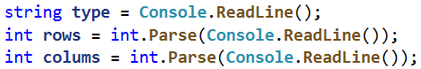
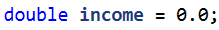
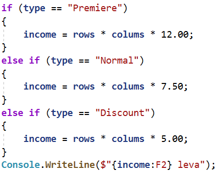
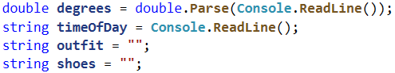
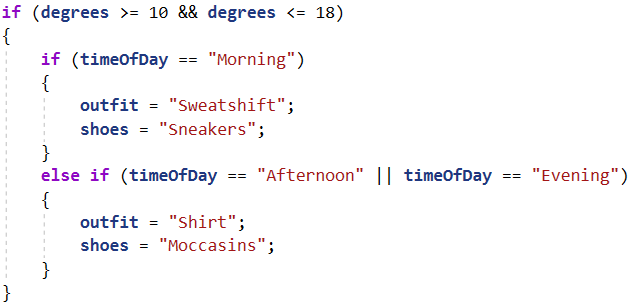
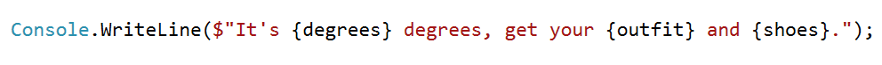

# Упражнения: Вложени условни конструкции

Задачи за упражнение в клас и за домашно към курса ["Основи на програмирането"
\@ СофтУни](https://softuni.bg/courses/programming-basics).

**Тествайте** решението си в **judge системата**:
<https://judge.softuni.bg/Contests/2379>

## Кино

В една кинозала столовете са наредени в правоъгълна форма в **r** реда и **c**
колони. Има три вида прожекции с билети на различни цени:

-   **Premiere** – премиерна прожекция, на цена **12.00** лева.

-   **Normal** – стандартна прожекция, на цена **7.50** лева.

-   **Discount** – прожекция за деца, ученици и студенти на намалена цена от
    **5.00** лева.

Напишете програма, която чете **тип прожекция** (стринг), брой **редове** и брой
**колони** в залата (цели числа), въведени от потребителя, и изчислява общите
приходи от билети при пълна зала. Резултатът да се отпечата във формат като в
примерите по-долу, с 2 знака след десетичната точка.

### Примерен вход и изход

| **вход**       | **изход**    |   | **вход**     | **изход**    |   | **вход**       | **изход**    |
|----------------|--------------|---|--------------|--------------|---|----------------|--------------|
| Premiere 10 12 | 1440.00 leva |   | Normal 21 13 | 2047.50 leva |   | Discount 12 30 | 1800.00 leva |

\* **Подсказка**: използвайте прости проверки и елементарни изчисления. За да
изведете резултата с точно 2 цифри след десетичната точка, използвайте
**Console.WriteLine("{0:f2} leva", income)**.

### Насоки

1.  Прочетете входните данни от конзолата.

    

2.  Инициализирайте променлива "**income**" от тип "**double**" с начална
    стойност **0**.

    

3.  Направете серия от проверки, като за всеки тип прожекция ("**Premiere**,
    **Normal**, **Discount**"), присвоявайте съответната цена към променливата
    "**income**" и накрая отпечатайте крайния резултат.

    

##  Лятно облекло

Лято е с много променливо време и Виктор има нужда от вашата помощ. Напишете
програма която **спрямо времето от денонощието и градусите** да препоръча на
Виктор какви дрехи да си облече. Вашия приятел има различни планове за всеки
етап от деня, които изискват и различен външен вид, тях може да видите от
**таблицата.**

**От конзолата се четат точно два реда:**

-   **Градусите - цяло число в интервала [10…42]**

-   **Текст, време от денонощието - с възможности - "Morning", "Afternoon",
    "Evening"**

| **Време от денонощието / градуси** | Мorning                              | Afternoon                           | Evening                          |
|------------------------------------|--------------------------------------|-------------------------------------|----------------------------------|
| 10 \<= градуси \<= 18              | Outfit = Sweatshirt Shoes = Sneakers | Outfit = Shirt Shoes = Moccasins    | Outfit = Shirt Shoes = Moccasins |
| 18 \< градуси \<= 24               | Outfit = Shirt Shoes = Moccasins     | Outfit = T-Shirt Shoes = Sandals    | Outfit = Shirt Shoes = Moccasins |
| градуси \>= 25                     | Outfit = T-Shirt Shoes = Sandals     | Outfit = Swim Suit Shoes = Barefoot | Outfit = Shirt Shoes = Moccasins |

**Да се отпечата на конзолата на един ред: "It's {градуси} degrees, get your
{облекло} and {обувки}."**

### Примерен вход и изход

| **Вход**     | **Изход**                                          | **Обяснения**                                                      |                                                |
|--------------|----------------------------------------------------|--------------------------------------------------------------------|------------------------------------------------|
| 16 Morning   | It's 16 degrees, get your Sweatshirt and Sneakers. | Сутрин когато градусите са 16, Виктор си взима суичър и маратонки. |                                                |
| **Вход**     | **Изход**                                          | **Вход**                                                           | **Изход**                                      |
| 22 Afternoon | It's 22 degrees, get your T-Shirt and Sandals.     | 28 Evening                                                         | It's 28 degrees, get your Shirt and Moccasins. |

### Насоки

1.  Прочетете входните данни от конзолата и инициализирайте две променливи
    "outfit, shoes" от тип "string", с начална стойност "".

    

2.  Направете проверка за градусите използвайки логически оператор "**и**" –
    "**&&**" - "**degrees \>= 10 && degrees \<= 18**" и в тялото на проверката
    за градусите проверявайте за времето от деня "**Morning**, **Afternoon**,
    **Evening**", като за всеки етап от деня променяйте стойността на
    променливите "**outfit**, **shoes**".

    

3.  Отпечатайте на конзолата крайния резултат във формата описан в условието на
    задачата.

    

## Нов дом

Марин и Нели си купуват къща не далеч от София. Нели толкова много обича
цветята, че Ви убеждава да **напишете програма** която да **изчисли колко ще им
струва**, да си засадят определен брой цветя и **дали наличния бюджет ще им е
достатъчен. Различните цветя са с различни цени.**

| **цвете**               | **Роза** | **Далия** | **Лале** | **Нарцис** | **Гладиола** |
|-------------------------|----------|-----------|----------|------------|--------------|
| **Цена на брой в лева** | 5        | 3.80      | 2.80     | 3          | 2.50         |

**Съществуват следните отстъпки:**

-   **Ако Нели купи повече от 80 Рози - 10% отстъпка от крайната цена**

-   **Ако Нели купи повече от 90 Далии - 15% отстъпка от крайната цена**

-   **Ако Нели купи повече от 80 Лалета - 15% отстъпка от крайната цена**

-   **Ако Нели купи по-малко от 120 Нарциса - цената се оскъпява с 15%**

-   **Ако Нели Купи по-малко от 80 Гладиоли - цената се оскъпява с 20%**

**От конзолата се четат 3 реда:**

-   **Вид цветя - текст с възможности - "Roses", "Dahlias", "Tulips",
    "Narcissus", "Gladiolus"**

-   **Брой цветя - цяло число в интервала [10…1000]**

-   **Бюджет - цяло число в интервала [50…2500]**

Да се **отпечата** на конзолата **на един ред:**

-   **Ако бюджета им е достатъчен - "Hey, you have a great garden with {броя
    цвета} {вид цветя} and {останалата сума} leva left."**

-   **Ако бюджета им е НЕ достатъчен - "Not enough money, you need {нужната
    сума} leva more."**

**Сумата да бъде форматирана до втория знак след десетичната запетая.**

### Примерен вход и изход

| **Вход**      | **Изход**                                                        | **Обяснения**                                                                                                                                                                                         |                                             |
|---------------|------------------------------------------------------------------|-------------------------------------------------------------------------------------------------------------------------------------------------------------------------------------------------------|---------------------------------------------|
| Roses 55 250  | Not enough money, you need 25.00 leva more.                      | Нели иска 55 броя Рози. Цената на една роза е 5лв., следователно за 55 броя Нели ще трябва да плати: 55 \* 5 = 275. Тя обаче разполага с 250 лв. бюджет.  Понеже 275 \> 250 , то не и достигат 25 лв. |                                             |
| **Вход**      | **Изход**                                                        | **Вход**                                                                                                                                                                                              | **Изход**                                   |
| Tulips 88 260 | Hey, you have a great garden with 88 Tulips and 50.56 leva left. | Narcissus 119 360                                                                                                                                                                                     | Not enough money, you need 50.55 leva more. |

## Лодка за риболов

Тони и приятели много обичали да ходят за риба, те са толкова запалени по
риболова, че решават да отидат на риболов с кораб. Цената за наема на кораба
зависи от **сезона и броя рибари.**

**Цената зависи от сезона:**

-   **Цената за наем на кораба през пролетта е 3000 лв.**

-   **Цената за наем на кораба през лятото и есента е 4200 лв.**

-   **Цената за наем на кораба през зимата е 2600 лв.**

**В зависимост от броя си групата ползва отстъпка:**

-   **Ако групата е до 6 човека включително – отстъпка от 10%.**

-   **Ако групата е от 7 до 11 човека включително – отстъпка от 15%.**

-   **Ако групата е от 12 нагоре – отстъпка от 25%.**

Рибарите ползват допълнително **5% отстъпка, ако са четен брой освен ако не е
есен - тогава нямат допълнителна отстъпка, която се начислява след като се
приспадне отстъпката по горните критерии.**

**Напишете програма**, която да **пресмята** дали рибарите ще **съберат
достатъчно пари.**

### Вход

**От конзолата се четат точно три реда.**

-   **Бюджет на групата – цяло число в интервала [1…8000]**

-   **Сезон – текст: "Spring", "Summer", "Autumn", "Winter"**

-   **Брой рибари – цяло число в интервала [4…18]**

### Изход

Да се **отпечата** на конзолата **един ред**:

-   Ако **бюджетът е достатъчен:**

    "**Yes! You have {останалите пари} leva left.**"

-   Ако **бюджетът НЕ Е достатъчен**:

    "**Not enough money! You need {сумата**, **която не достига} leva.**"

**Сумите** трябва да са **форматирани с точност до два знака след десетичната
запетая**.

### Примерен вход и изход

| **Вход**       | **Изход**                               | **Обяснения**                                                                                                                                                                                                           |                                |
|----------------|-----------------------------------------|-------------------------------------------------------------------------------------------------------------------------------------------------------------------------------------------------------------------------|--------------------------------|
| 3000 Summer 11 | Not enough money! You need 570.00 leva. | Лятото риболовния туризъм струва 4200 лв., **11 рибари ползват 15% отстъпка -\> 4200 - 15% = 3570** лв., **нечетен брой са и не ползват допълнителна отстъпка,.** 3000 \<= 3570, следователно не им достигат 570.00 лв. |                                |
| **Вход**       | **Изход**                               | **Вход**                                                                                                                                                                                                                | **Изход**                      |
| 3600 Autumn 6  | Not enough money! You need 180.00 leva. | 2000 Winter 13                                                                                                                                                                                                          | Yes! You have 50.00 leva left. |

# Примерни изпитни задачи

## Пътешествие

Странно, но повечето хора си плануват от рано почивката. Млад програмист
разполага с **определен бюджет** и свободно време в даден **сезон**. Напишете
програма, която да приема **на входа бюджета и сезона**, а **на изхода** да
изкарва, **къде ще почива** програмиста и **колко ще похарчи**.

**Бюджета определя дестинацията, а сезона определя колко от бюджета ще
изхарчи**. Ако е **лято** ще почива на **къмпинг**, а **зимата в хотел**. Ако е
в **Европа**, **независимо от сезона** ще почива в **хотел**. Всеки **къмпинг**
или **хотел**, **според дестинацията**, има **собствена цена** която отговаря на
даден **процент от бюджета**:

-   При **100лв. или по-малко** – някъде в **България**

    -   **Лято** – **30%** от бюджета

    -   **Зима** – **70%** от бюджета

-   При **1000лв. или по малко** – някъде на **Балканите**

    -   **Лято** – **40%** от бюджета

    -   **Зима** – **80%** от бюджета

-   При **повече от 1000лв**. – някъде из **Европа**

    -   При пътуване из Европа, независимо от сезона ще похарчи **90% от
        бюджета**.

### Вход

Входът се чете от конзолата и се състои от **два реда**, въведени от
потребителя:

-   **Първи ред** – Бюджет, **реално число** в интервала **[10.00...5000.00].**

-   **Втори ред** – Един от двата възможни сезона: **„summer”** или **“winter”**

### Изход

На конзолата трябва да се отпечатат **два реда**.

-   **Първи ред** – „**Somewhere in [дестинация]**“ измежду “**Bulgaria**",
    **"Balkans**” и ”**Europe**”

-   **Втори ред** – “{**Вид почивка**} – {**Похарчена сума**}“

    -   **Почивката** може да е между „**Camp**” и „**Hotel**”

    -   **Сумата** трябва да е **закръглена с точност до вторият знак след
        запетаята**.

### Примерен вход и изход

| **вход**      | **изход**                           |
|---------------|-------------------------------------|
| 50 summer     | Somewhere in Bulgaria Camp - 15.00  |
| 75 winter     | Somewhere in Bulgaria Hotel - 52.50 |
| 312 summer    | Somewhere in Balkans Camp - 124.80  |
| 678.53 winter | Somewhere in Balkans Hotel - 542.82 |
| 1500 summer   | Somewhere in Europe Hotel - 1350.00 |

## Операции между числа

Напишете програма, която чете **две цели числа (N1 и N2)** и **оператор,** с
който да се **извърши** дадена **математическа операция** с тях. Възможните
операции са: **Събиране(+)**, **Изваждане(-)**, **Умножение(\*)**,
**Деление(/)** и **Модулно деление(%).** При **събиране**, **изваждане** и
**умножение** на конзолата **трябва да се отпечатат резултата** и дали той е
**четен** или **нечетен**. При **обикновеното деление** – **резултат**а. При
**модулното деление** – **остатъка**. Трябва да се има предвид, че **делителят
може да е равен на 0(нула)**, а **на нула не се дели**. В този случай трябва да
се отпечата **специално съобщениe**.

### Вход

От конзолата се прочитат **3 реда**, въведени от потребителя:

-   **N1** – **цяло число** в интервала **[0...40 000]**

-   **N2** – **цяло число** в интервала **[0...40 000]**

-   **Оператор** – **един символ** измежду: „**+**“, „**-**“, „**\***“, „**/**“,
    „**%**“

### Изход

Да се отпечата на конзолата **един ред**:

-   Ако операцията е **събиране**, **изваждане** или **умножение**:

    -   **"{N1} {оператор} {N2} = {резултат} – {even/odd}"**

-   Ако операцията е **деление**:

    -   **"{N1} / {N2} = {резултат}"** – резултатът е **форматиран** до
        **вторият знак след дес.запетая**

-   Ако операцията е **модулно деление**:

    -   **"{N1} % {N2} = {остатък}"**

-   В случай на **деление с 0 (нула)**:

    -   **"Cannot divide {N1} by zero"**

### Примерен вход и изход

| **вход** | **изход**           | **вход** | **изход**        | **вход** | **изход**                 |
|----------|---------------------|----------|------------------|----------|---------------------------|
| 10 12 +  | 10 + 12 = 22 - even | 123 12 / | 123 / 12 = 10.25 | 112 0 /  | Cannot divide 112 by zero |
| 10 1 -   | 10 – 1 = 9 - odd    | 10 3 %   | 10 % 3 = 1       | 10 0 %   | Cannot divide 10 by zero  |
| 7 3 \*   | 7 \* 3 = 21 - odd   |          |                  |          |                           |

## Хотелска стая

Хотел предлага **2 вида стаи**: **студио и апартамент**. Напишете програма,
която изчислява **цената за целия престой за студио и апартамент**. **Цените**
зависят от **месеца** на престоя:

| **Май и октомври**              | **Юни и септември**                | **Юли и август**                |
|---------------------------------|------------------------------------|---------------------------------|
| Студио – **50** лв./нощувка     | Студио – **75.20** лв./нощувка     | Студио – **76** лв./нощувка     |
| Апартамент – **65** лв./нощувка | Апартамент – **68.70** лв./нощувка | Апартамент – **77** лв./нощувка |

Предлагат се и следните **отстъпки**:

-   За **студио**, при **повече** от **7** нощувки през **май и октомври** :
    **5% намаление**.

-   За **студио**, при **повече** от **14** нощувки през **май и октомври** :
    **30% намаление**.

-   За **студио**, при **повече** от **14** нощувки през **юни и септември**:
    **20% намаление**.

-   За **апартамент**, при **повече** от **14** нощувки**, без значение от
    месеца : 10% намаление.**

### Вход

Входът се чете от **конзолата** и съдържа **точно 2 реда**, въведени от
потребителя:

-   На **първия** ред е **месецът** – **May, June, July, August, September** или
    **October**

-   На **втория** ред е **броят на нощувките** – **цяло число в интервала [0 ...
    200]**

### Изход

Да се **отпечатат** на конзолата **2 реда**:

-   На **първия ред**: “**Apartment: {цена за целият престой} lv.**”

-   На **втория ред**: “**Studio: {цена за целият престой} lv.**“

**Цената за целия престой форматирана с точност до два знака след десетичната
запетая**.

### Примерен вход и изход

| **Вход** | **Изход**                                 | **Обяснения**                                                                                                                                                                                                                                    |                                            |
|----------|-------------------------------------------|--------------------------------------------------------------------------------------------------------------------------------------------------------------------------------------------------------------------------------------------------|--------------------------------------------|
| May 15   | Apartment: 877.50 lv. Studio: 525.00 lv.  | **През май**, при повече от **14** нощувки, намаляваме цената на студиото с **30%** (50 – 15 = 35), а на апартамента – с **10%** (65 – 6.5 =58.5). Целият престой в **апартамент** – **877.50 лв**. Целият престой в **студио** – **525.00 лв**. |                                            |
| **Вход** | **Изход**                                 | **Вход**                                                                                                                                                                                                                                         | **Изход**                                  |
| June 14  | Apartment: 961.80 lv. Studio: 1052.80 lv. | August 20                                                                                                                                                                                                                                        | Apartment: 1386.00 lv. Studio: 1520.00 lv. |

## Навреме за изпит

Студент трябва да отиде **на изпит в определен час** (например в 9:30 часа). Той
идва в изпитната зала в даден **час на пристигане** (например 9:40). Счита се,
че студентът е дошъл **навреме**, ако е пристигнал в часа на изпита или до
половин час преди това. Ако е пристигнал по-рано повече от 30 минути, той е
**подранил**. Ако е дошъл след часа на изпита, той е **закъснял**. Напишете
програма, която прочита време на изпит и време на пристигане и отпечатва дали
студентът е дошъл **навреме**, дали е **подранил** или е **закъснял** и **с
колко часа или минути** е подранил или закъснял.

### Вход

От конзолата се четат **4 цели числа** (по едно на ред), въведени от
потребителя:

-   Първият ред съдържа **час на изпита** – цяло число от 0 до 23.

-   Вторият ред съдържа **минута на изпита** – цяло число от 0 до 59.

-   Третият ред съдържа **час на пристигане** – цяло число от 0 до 23.

-   Четвъртият ред съдържа **минута на пристигане** – цяло число от 0 до 59.

### Изход

На първият ред отпечатайте:

-   “**Late**”, ако студентът пристига по-късно от часа на изпита.

-   “**On time**”, ако студентът пристига точно в часа на изпита или до 30
    минути по-рано.

-   “**Early**”, ако студентът пристига повече от 30 минути преди часа на
    изпита.

Ако студентът пристига с поне минута разлика от часа на изпита, отпечатайте на
следващия ред:

-   “**mm minutes before the start**” за идване по-рано с по-малко от час.

-   “**hh:mm hours before the start**” за подраняване с 1 час или повече.
    Минутите винаги печатайте с 2 цифри, например “1:05”.

-   “**mm minutes after the start**” за закъснение под час.

-   “**hh:mm hours after the start**” за закъснение от 1 час или повече.
    Минутите винаги печатайте с 2 цифри, например “1:03”.

### Примерен вход и изход

| **Вход**    | **Изход**                           |   | **Вход**    | **Изход**                          |   | **Вход**    | **Изход**                         |
|-------------|-------------------------------------|---|-------------|------------------------------------|---|-------------|-----------------------------------|
| 9 30 9 50   | Late 20 minutes after the start     |   | 9 00 10 30  | Late 1:30 hours after the start    |   | 10 00 10 00 | On time                           |
| 9 00 8 30   | On time 30 minutes before the start |   | 14 00 13 55 | On time 5 minutes before the start |   | 11 30 10 55 | Early 35 minutes before the start |
| 16 00 15 00 | Early 1:00 hours before the start   |   | 11 30 8 12  | Early 3:18 hours before the start  |   | 11 30 12 29 | Late 59 minutes after the start   |

# Допълнителна задача

## \*Волейбол

Влади е студент, живее в София и си ходи от време на време до родния град. Той е
много запален по волейбола, но е зает през работните дни и играе **волейбол**
само през **уикендите** и в **празничните дни**. Влади играе **в София** всяка
**събота**, когато **не е на работа** и **не си пътува до родния град**, както и
в **2/3 от празничните дни**. Той пътува до **родния си град h пъти** в
годината, където играе волейбол със старите си приятели в **неделя**. Влади **не
е на работа 3/4 от уикендите**, в които е в София. Отделно, през **високосните
години** Влади играе с **15% повече** волейбол от нормалното. Приемаме, че
годината има точно **48 уикенда**, подходящи за волейбол.

Напишете програма, която изчислява **колко пъти Влади е играл волейбол** през
годината. **Закръглете резултата** надолу до най-близкото цяло число (например
2.15 2; 9.95 9).

Входните данни се въвеждат от потребителя, в следния вид:

-   Първият ред съдържа думата "**leap**" (високосна година) или "**normal**"
    (невисокосна).

-   Вторият ред съдържа цялото число **p** – брой празници в годината (които не
    са събота и неделя).

-   Третият ред съдържа цялото число **h** – брой уикенди, в които Влади си
    пътува до родния град.

### Примерен вход и изход

| **вход**   | **изход** | **Коментари**                                                                                                                                                                                                                                                                                                                                                                                                                                                                                                                         |          |           |   |             |           |   |          |           |   |             |           |
|------------|-----------|---------------------------------------------------------------------------------------------------------------------------------------------------------------------------------------------------------------------------------------------------------------------------------------------------------------------------------------------------------------------------------------------------------------------------------------------------------------------------------------------------------------------------------------|----------|-----------|---|-------------|-----------|---|----------|-----------|---|-------------|-----------|
| leap 5 2   | 45        | 48 уикенда в годината, разделени по следния начин: 46 уикенда в София 46 \* 3 / 4 **34.5** съботни игри в София 2 уикенда в родния си град 2 недели **2** игри в неделя в родния град 5 празника: 5 \* 2/3 **3.333** игри в София в празничен ден Общо игри през уикенди и празници в София и в родния град: 34.5 + 2 + 3.333 **39.833** Годината е високосна: Влади играе допълнителни 15% \* 39.833 **5.975** игри волейбол Общо игри през цялата година: 39.833 + 5.975 = **45.808** игри Резултатът е **45** (закръгля се надолу) |          |           |   |             |           |   |          |           |   |             |           |
| **вход**   | **изход** |                                                                                                                                                                                                                                                                                                                                                                                                                                                                                                                                       | **вход** | **изход** |   | **вход**    | **изход** |   | **вход** | **изход** |   | **вход**    | **изход** |
| normal 3 2 | 38        |                                                                                                                                                                                                                                                                                                                                                                                                                                                                                                                                       | leap 2 3 | 43        |   | normal 11 6 | 44        |   | leap 0 1 | 41        |   | normal 6 13 | 43        |
