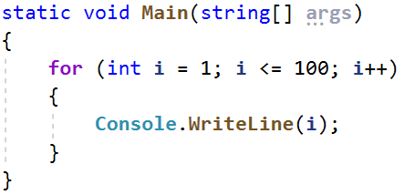
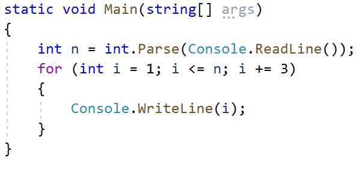
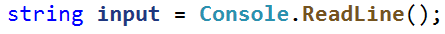
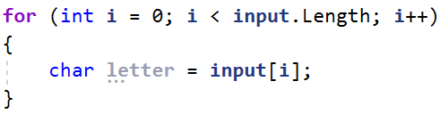
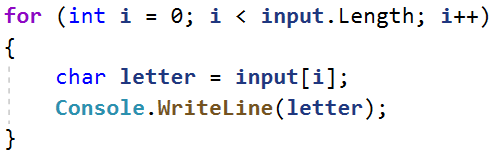

**Лаб: Повторения с цикли – For-цикъл**

Задачи за упражнение в клас и за домашно към курса "Основи на програмирането" \@
СофтУни.

Тествайте решенията си тук: <https://judge.softuni.bg/Contests/2380>

## Числа от 1 до 100

Напишете програма, която отпечатва числата от 1 до 100, всяко на нов ред.

### Примерен вход и изход

| **вход** | **изход**         |
|----------|-------------------|
| (няма)   | 1 2 3 … 98 99 100 |

### Насоки

1.  Създайте **нов проект с име** "**Numbers1To100**".

2.  Отидете в тялото на метода **Main(String[] args)** и напишете решението на
    задачата. Можете да си помогнете с кода от картинката по-долу:

    

## Числата от N до 1 в обратен ред

Напишете програма, която чете цяло положително число **n**, въведено от
потребителя, и печата **числата от n до 1 в обратен ред** (от най-голямото към
най-малкото).

### Примерен вход и изход

| **вход** | **изход** |   | **вход** | **изход** |   | **вход** | **изход** |
|----------|-----------|---|----------|-----------|---|----------|-----------|
| 2        | 2 1       |   | 3        | 3 2 1     |   | 5        | 5 4 3 2 1 |

### Насоки

1. Създайте **нов проект с име** "**NumbersNTo1**".

2.Отидете в тялото на метода **Main(String[] args)** и напишете решението на
задачата. Можете да си помогнете с кода от картинката по-долу и обърнете
внимание, че се използва цикъл с отрицателна стъпка:

## Числата от 1 до N през 3

Напишете програма, която чете число **n**, въведено от потребителя, и отпечатва
**числата от 1 до n през 3** (със стъпка 3).

### Примерен вход и изход

| **вход** | **изход** |   | **вход** | **изход** |   | **вход** | **изход**   |
|----------|-----------|---|----------|-----------|---|----------|-------------|
| 10       | 1 4 7 10  |   | 7        | 1 4 7     |   | 15       | 1 4 7 10 13 |

### Насоки

1.  Създайте **нов проект с име** "**Number1ToNWithStep3**".

2.  Отидете в тялото на метода **Main(String[] args)** и напишете решението на
    задачата. Можете да си помогнете с кода от картинката по-долу и обърнете
    внимание на цикала, че е със стъпка 3:

    

## Четни степени на 2

Да се напише програма, която чете число **n**, въведено от потребителя, и
**печата четните степени на 2 ≤ 2n**: **20**, **22**, **24**, **26**, …, **2n**.

### Примерен вход и изход

| **вход** | **изход** |   | **вход** | **изход** |   | **вход** | **изход** |   | **вход** | **изход** |   | **вход** | **изход** |
|----------|-----------|---|----------|-----------|---|----------|-----------|---|----------|-----------|---|----------|-----------|
| 3        | 1 4       |   | 4        | 1 4 16    |   | 5        | 1 4 16    |   | 6        | 1 4 16 64 |   | 7        | 1 4 16 64 |

## Поток от символи

Напишете програма, която чете текст(стринг), въведен от потребителя и печата
всеки символ от текста на отделен ред.

### Примерен вход и изход

| **вход** | **изход**     | **вход**  | **изход**       |
|----------|---------------|-----------|-----------------|
| softuni  | s o f t u n i | ice cream | i c e c r e a m |

### Насоки

1.  Прочетете входният текст:

    

2.  Направете **for** цикъл с начална стойност на контролната променлива от
    **0** до **input.Length** (дължината на текста). На всяка итерация взимайте
    буквата на позиция във въведената дума равна на стойността на контролната
    променлива **i**, чрез метода **charAt()**

    

3.  На всяка итерация принтирайте стойността на променливата **letter**:

    

## Сумиране на гласните букви

Да се напише програма, която чете **текст** (стринг), въведен от потребителя, и
изчислява и отпечатва **сумата от стойностите на гласните букви** според
таблицата по-долу:

| буква    | a | e | i | o | u |
|----------|---|---|---|---|---|
| стойност | 1 | 2 | 3 | 4 | 5 |

### Примерен вход и изход

| **вход** | **изход** | **коментар**              |
|----------|-----------|---------------------------|
| hello    | 6         | e + o = 2 + 4 = 6         |
| hi       | 3         | i = 3                     |
| bamboo   | 9         | a + o + o = 1 + 4 + 4 = 9 |
| beer     | 4         | e + e = 2 + 2 = 4         |

## Сумиране на числа

Да се напише програма, която **чете n-**на брой **цели числа**, въведени от
потребителя **и ги сумира**.

-   От първия ред на входа се въвежда броят числа **n**.

-   От следващите **n** реда се въвежда по едно цяло число.

Програмата трябва да прочете числата, да ги сумира и да отпечата сумата им.

### Примерен вход и изход

| **вход** | **изход** |   | **вход**      | **изход** |   | **вход**      | **изход** |   | **вход** | **изход** |   | **вход** | **изход** |
|----------|-----------|---|---------------|-----------|---|---------------|-----------|---|----------|-----------|---|----------|-----------|
| 2 10 20  | 30        |   | 3 -10 -20 -30 | \-60      |   | 4 45 -20 7 11 | 43        |   | 1 999    | 999       |   | 0        | 0         |

## Редица цели числа

Напишете програма, която чете **n на брой цели числа**. Принтирайте
**най-голямото** и **най-малкото** число сред въведените.

### Примерен вход и изход

| **вход**         | **изход**                     |   | **вход**             | **изход**                      |
|------------------|-------------------------------|---|----------------------|--------------------------------|
| 5 10 20 304 0 50 | Max number: 304 Min number: 0 |   | 6 250 5 2 0 100 1000 | Max number: 1000 Min number: 0 |

## Лява и дясна сума

Да се напише програма, която чете **2\*n-на брой** цели числа, подадени от
потребителя, и проверява дали **сумата на първите n числа** (лява сума) е равна
на **сумата на вторите n числа** (дясна сума). При равенство печата " **Yes, sum
=** " + **сумата**; иначе печата " **No, diff =** " + **разликата**. Разликата
се изчислява като положително число (по абсолютна стойност).

### Примерен вход и изход

| **вход**      | **изход**      | **коментар**        |   | **вход**     | **изход**    | **коментар**                             |
|---------------|----------------|---------------------|---|--------------|--------------|------------------------------------------|
| 2 10 90 60 40 | Yes, sum = 100 | 10+90 = 60+40 = 100 |   | 2 90 9 50 50 | No, diff = 1 | 90+9 ≠ 50+50 Difference = \|99-100\| = 1 |

## Четна / нечетна сума

Да се напише програма, която чете **n-на брой** цели числа, подадени от
потребителя, и проверява дали **сумата от числата на четни позиции** е равна на
**сумата на числата на нечетни позиции**. При равенство да се отпечатат два
реда: "**Yes**" и на нов ред "**Sum =** " + **сумата**; иначе да се отпечата
"**No**" и на нов ред "**Diff =** " + **разликата**. Разликата се изчислява по
абсолютна стойност.

### Примерен вход и изход

| **вход**      | **изход**    | **коментар**       |   | **вход**   | **изход**   | **коментар**                 |   | **вход** | **изход**   | **коментар**               |
|---------------|--------------|--------------------|---|------------|-------------|------------------------------|---|----------|-------------|----------------------------|
| 4 10 50 60 20 | Yes Sum = 70 | 10+60 = 50+20 = 70 |   | 4 3 5 1 -2 | No Diff = 1 | 3+1 ≠ 5-2 Diff = \|4-3\| = 1 |   | 3 5 8 1  | No Diff = 2 | 5+1 ≠ 8 Diff = \|6-8\| = 2 |

**Примерна изпитна задача**

## Умната Лили 

Лили вече е на **N години**. За всеки свой **рожден ден** тя получава подарък.
За **нечетните** рождени дни (**1, 3, 5...n**) получава **играчки**, а за всеки
**четен** (**2, 4, 6...n**) получава **пари**. За **втория рожден ден** получава
**10.00 лв**, като **сумата се увеличава с 10.00 лв., за всеки следващ четен
рожден ден** (**2 -\> 10**, **4 -\> 20**, **6 -\> 30**...и т.н.). През годините
Лили тайно е спестявала парите. **Братът** на Лили, **в годините**, които тя
**получава пари**, **взима по 1.00 лев** от тях. Лили **продала играчките**
получени през годините, **всяка за P лева** и **добавила** сумата **към
спестените пари**. С парите искала да си **купи пералня за X лева**. Напишете
програма, която да пресмята, **колко пари е събрала** и дали ѝ **стигат да си
купи пералня**.

### Вход

Програмата прочита **3 числа**, въведени от потребителя, на отделни редове:

-   **Възрастта** на Лили - **цяло число** в интервала **[1...77]**

-   **Цената на пералнята** – реално число

-   **Цена на играчки** – реално число

### Изход

Да се отпечата на конзолата един ред:

-   Ако парите на Лили са достатъчни:

    -   **“Yes! {N}”** - където **N** е остатъка пари след покупката

-   Ако парите не са достатъчни:

    -   **“No! {М}“** - където **M** е сумата, която не достига

-   Числата **N** и **M** трябва да за **форматирани до вторият знак след
    десетичната запетая**.

### Примерен вход и изход

| **вход**     | **изход**  | **Коментари**                                                                                                                                                                                                                                                                                                                                                                                                                                                                                                                                                               |
|--------------|------------|-----------------------------------------------------------------------------------------------------------------------------------------------------------------------------------------------------------------------------------------------------------------------------------------------------------------------------------------------------------------------------------------------------------------------------------------------------------------------------------------------------------------------------------------------------------------------------|
| 10 170.00 6  | Yes! 5.00  | **Първи рожден ден** получава **играчка**; **2ри -\> 10лв**; 3ти -\> играчка; **4ти** -\> 10 + 10 = **20лв**; **5ти** -\> играчка; **6ти** -\> 20 + 10 = **30лв**; **7ми** -\> играчка; **8ми** -\> 30 + 10 = **40лв**; **9ти** -\> играчка; **10ти** -\> 40 + 10 = **50лв**. **Спестила е** -\> 10 + 20 + 30 + 40 + 50 = **150лв**. Продала е **5 играчки по 6 лв.** = **30лв**. **Брат ѝ взел 5 пъти по 1 лев** = **5лв**. **Остават** -\> 150 + 30 – 5 = **175лв**. **175 \>= 170** (цената на пералнята) **успяла** е да я купи и са и **останали** 175-170 = **5 лв.** |
| 21 1570.98 3 | No! 997.98 | **Спестила е 550лв**. **Продала** е **11** играчки по **3 лв.** = **33лв**. Брат ѝ **взимал 10** години по **1 лев** = **10лв**. **Останали** 550 + 33 – 10 = **573лв 573 \< 1570.98** – **не е успяла** да купи пералня. **Не ѝ достигат** 1570.98–573 = **997.98лв**                                                                                                                                                                                                                                                                                                      |
