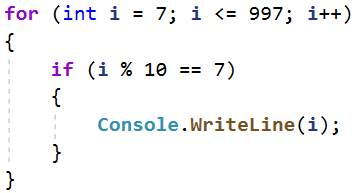
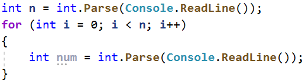
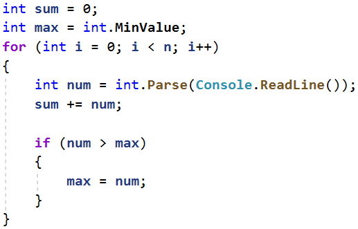
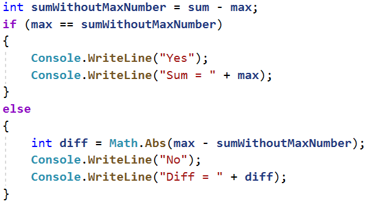

**Упражнениe: Повторения с цикли – For-цикъл**

Задачи за упражнение в клас и за домашно към курса ["Основи на програмирането"
\@ СофтУни](https://softuni.bg/courses/programming-basics).

Тествайте решенията си в Judge системата:
<https://judge.softuni.bg/Contests/2382>

## Числа до 1000, завършващи на 7

Напишете програма, която отпечатва числата в диапазона **[1…1000]**, които
**завършват на 7**.

| **вход** | **изход**     |
|----------|---------------|
| (няма)   | 7 17 27 … 997 |

### Насоки

1.  Направете **for цикъл** от 7 до 997 и проверете всяко число дали завършва на
    7. Едно число завършва на 7, когато резултатът от **модулното деление на
    числото и 10 е равен на 7**.

    

##  Елемент, равен на сумата на останалите

Да се напише програма, която чете **n-на брой** цели числа, въведени от
потребителя, и проверява дали сред тях съществува число, което е равно на сумата
на всички останали. Ако има такъв елемент, печата "**Yes**", "**Sum =** " +
**неговата стойност**; иначе печата "**No**", "**Diff =** " + **разликата между
най-големия елемент и сумата на останалите** (по абсолютна стойност).

### Примерен вход и изход

| **вход**             | **изход**    | **коментари**              |
|----------------------|--------------|----------------------------|
| 7 3 4 1 1 2 **12** 1 | Yes Sum = 12 | 3 + 4 + 1 + 2 + 1 + 1 = 12 |
| 4 **6** 1 2 3        | Yes Sum = 6  | 1 + 2 + 3 = 12             |
| 3 1 1 10             | No Diff = 8  | \|10 - (1 + 1)\| = 8       |
| 3 5 5 1              | No Diff = 1  | \|5 - (5 + 1)\| = 1        |
| 3 1 1 1              | No Diff = 1  |                            |

### Насоки

1.  Прочетете число **n** и завъртете цикъл до него, като на всеки нов ред
    четете число **num**.

    

2.  Създайте променливи **sum**, която ще държи сумата на **num** и **max**,
    която ще пази най-голямото число.

    

3.  Проверете дали сумата е равна на **max** и принтирайте съответният изход.

    

## Четни / нечетни позиции

Напишете програма, която чете **n-на брой числа**, въведени от потребителя, и
пресмята **сумата**, **минимума** и **максимума** на числата на **четни** и
**нечетни** позиции (броим от 1). Когато няма минимален / максимален елемент,
отпечатайте "**No**".

Изходът да се форматира в следния вид:

"**OddSum=**" + {**сума** на числата на **нечетни** позиции},

"**OddMin=**" + { **минимална** стойност на числата на **нечетни** позиции } /
{“**No**”},

"**OddMax=**" + { **максимална** стойност на числата на **нечетни** позиции } /
{“**No**”},

"**EvenSum=**" + { **сума** на числата на **четни** позиции },

"**EvenMin=**" + { **минимална** стойност на числата на **четни** позиции } /
{“**No**”},

"**EvenMax=**" + { **максимална** стойност на числата на **четни** позиции } /
{“**No**”}

**Всяко число трябва да е форматирано до втория знак след десетичната запетая.**

### Примерен вход и изход

| **вход**                   | **изход**                                                                          |   | **вход**                    | **изход**                                                                          |   | **вход** | **изход**                                                                      |   | **вход**           | **изход**                                                                             |
|----------------------------|------------------------------------------------------------------------------------|---|-----------------------------|------------------------------------------------------------------------------------|---|----------|--------------------------------------------------------------------------------|---|--------------------|---------------------------------------------------------------------------------------|
| 6 **2** 3 **5** 4 **2** 1  | OddSum=9.00, OddMin=2.00, OddMax=5.00, EvenSum=8.00, EvenMin=1.00, EvenMax=4.00    |   | 2 **1.5** -2.5              | OddSum=1.50, OddMin=1.50, OddMax=1.50, EvenSum=-2.50, EvenMin=-2.50, EvenMax=-2.50 |   | 1 **1**  | OddSum=1.00, OddMin=1.00, OddMax=1.00, EvenSum=0.00, EvenMin=No, EvenMax=No    |   | 0                  | OddSum=0.00, OddMin=No, OddMax=No, EvenSum=0.00, EvenMin=No, EvenMax=No               |
| **вход**                   | **Изход**                                                                          |   | **вход**                    | **изход**                                                                          |   | **вход** | **изход**                                                                      |   | **вход**           | **изход**                                                                             |
| 5 **3** -2 **8** 11 **-3** | OddSum=8.00, OddMin=-3.00, OddMax=8.00, EvenSum=9.00, EvenMin=-2.00, EvenMax=11.00 |   | 4 1.5 **1.75** 1.5 **1.75** | OddSum=3.00, OddMin=1.50, OddMax=1.50, EvenSum=3.50, EvenMin=1.75, EvenMax=1.75    |   | 1 **-5** | OddSum=-5.00, OddMin=-5.00, OddMax=-5.00, EvenSum=0.00, EvenMin=No, EvenMax=No |   | 3 **-1** -2 **-3** | OddSum=-4.00, OddMin=-3.00, OddMax=-1.00, EvenSum=-2.00, EvenMin=-2.00, EvenMax=-2.00 |

Задача обединява няколко предходни задачи: намиране на **минимум**, намиране на
**максимум**, намиране на **сума** и обработка на елементите от **четни и
нечетни позиции**. Припомнете си ги.

### Насоки

1.  Работете с **реални числа** (не цели). Сумата, минимумът и максимумът също
    са реални числа.

2.  Използвайте **неутрална начална стойност** при намиране на минимум /
    максимум, например **1000000000.0** и **-1000000000.0**. Ако получите накрая
    неутралната стойност, печатайте “**No**”.

3.  Завъртете **for** цикъл до числото, което ви се въвежда като на всеки нов
    ред прочитате ново число **num**.

4.  Проверете дали **позицията на числото** е **четна** или **нечетна**, като
    променливата инициализирана в цикъла **i** отговаря на **позицията на
    числото**.

5.  Ако позицията на числото е **четно**, увеличете **сумата на четните числа**
    и проверете дали числото е  
    **по-голямо** от **най-голямото четно**, и му презапишете стойността. Също
    така проверете дали числото е **по-малко** от **най-малкото четно число** и
    му презапишете стойността.

6.  Аналогично направете същото и за **нечетните числа**.

# Примерни изпитни задачи

## Хистограма

Дадени са **n цели числа** в интервала [**1**…**1000**]. От тях някакъв процент
**p1** са под 200, друг процент **p2** са от 200 до 399, друг процент **p3** са
от 400 до 599, друг процент **p4** са от 600 до 799 и останалите **p5** процента
са от 800 нагоре. Да се напише програма, която изчислява и отпечатва процентите
**p1**, **p2**, **p3**, **p4** и **p5**.

**Пример**: имаме n = **20** числа: 53, 7, 56, 180, 450, 920, 12, 7, 150, 250,
680, 2, 600, 200, 800, 799, 199, 46, 128, 65. Получаваме следното разпределение
и визуализация:

| **Диапазон** | **Числа в диапазона**                           | **Брой числа** | **Процент**                      |
|--------------|-------------------------------------------------|----------------|----------------------------------|
| \< 200       | 53, 7, 56, 180, 12, 7, 150, 2, 199, 46, 128, 65 | 12             | p1 = 12 / 20 \* 100 = **60.00**% |
| 200 … 399    | 250, 200                                        | 2              | p2 = 2 / 20 \* 100 = **10.00**%  |
| 400 … 599    | 450                                             | 1              | p3 = 1 / 20 \* 100 = **5.00**%   |
| 600 … 799    | 680, 600, 799                                   | 3              | p4 = 3 / 20 \* 100 = **15.00**%  |
| ≥ 800        | 920, 800                                        | 2              | p5 = 2 / 20 \* 100 = **10.00**%  |

### Вход

На първия ред от входа стои цялото число **n** (1 ≤ **n** ≤ 1000) – брой числа.
На следващите **n реда** стои **по едно цяло число** в интервала
[**1**…**1000**] – числата върху които да бъде изчислена хистограмата.

### Изход

Да се отпечата на конзолата **хистограмата** – **5 реда**, всеки от които
съдържа число между 0% и 100%, с точност две цифри след десетичната точка,
например 25.00%, 66.67%, 57.14%.

### Примерен вход и изход

| **Вход**      | **Изход**                       |   | **Вход**          | **Изход**                       |   | **Вход**                          | **Изход**                          |   | **Вход**                               | **Изход**                          |   | **Вход**                                              | **Изход**                        |
|---------------|---------------------------------|---|-------------------|---------------------------------|---|-----------------------------------|------------------------------------|---|----------------------------------------|------------------------------------|---|-------------------------------------------------------|----------------------------------|
| **3** 1 2 999 | 66.67% 0.00% 0.00% 0.00% 33.33% |   | **4** 53 7 56 999 | 75.00% 0.00% 0.00% 0.00% 25.00% |   | **7** 800 801 250 199 399 599 799 | 14.29% 28.57% 14.29% 14.29% 28.57% |   | **9** 367 99 200 799 999 333 555 111 9 | 33.33% 33.33% 11.11% 11.11% 11.11% |   | **14** 53 7 56 180 450 920 12 7 150 250 680 2 600 200 | 57.14% 14.29% 7.14% 14.29% 7.14% |

## Деление без остатък

Дадени са **n-на брой цели числа** в интервала [**1**…**1000**]. От тях някакъв
**процент p1 се делят без остатък на 2**, друг **процент p2** се **делят без
остатък на 3**, друг **процент p3** се **делят без остатък на 4**. Да се напише
програма, която изчислява и отпечатва процентите **p1**, **p2** и **p3**.

**Пример**: имаме n = **10** числа: 680, 2, 600, 200, 800, 799, 199, 46, 128,
65. Получаваме следното разпределение и визуализация:

| **Деление без остатък на:** | **Числа в диапазона**          | **Брой числа** | **Процент**                       |
|-----------------------------|--------------------------------|----------------|-----------------------------------|
| 2                           | 680, 2, 600, 200, 800, 46, 128 | 7              | p1 = 7.0 / 10 \* 100 = **70.00**% |
| 3                           | 600                            | 1              | p2 = 1 / 10 \* 100 = **10.00**%   |
| 4                           | 680, 600, 200, 800, 128        | 5              | p3 = 5 / 10 \* 100 = **50.00**%   |

### Вход

На първия ред от входа стои цялото число **n** (1 ≤ **n** ≤ 1000) - брой числа.
На следващите **n реда** стои **по едно цяло число** в интервала
[**1**…**1000**] - числата които да бъдат проверени на колко се делят.

### Изход

Да се отпечатат на конзолата **3 реда**, всеки от които съдържа процент между 0%
и 100%, с точност две цифри след десетичната точка, например 25.00%, 66.67%,
57.14%.

-   На **първият ред** - процентът на числата които **се делят на 2**

-   На **вторият ред** - процентът на числата които **се делят на 3**

-   На **третият ред** - процентът на числата които **се делят на 4**

### Примерен вход и изход

| **Вход**                                   | **Изход**            |   | **Вход**    | **Изход**            |
|--------------------------------------------|----------------------|---|-------------|----------------------|
| **10** 680 2 600 200 800 799 199 46 128 65 | 70.00% 10.00% 50.00% |   | **3** 3 6 9 | 33.33% 100.00% 0.00% |

## Заплата

**Шеф на компания забелязва че все повече служители прекарват време в сайтове,
които ги разсейват.**

**За да предотврати това, той въвежда изненадващи проверки на отворените табове
на браузъра на служителите си. Според сайта се налагат различни глоби:**

-   **"Facebook" -\> 150 лв.**

-   **"Instagram" -\> 100 лв.**

-   **"Reddit" -\> 50 лв.**

**От конзолата се четат два реда:**

-   **Брой отворени табове в браузъра n - цяло число в интервала [1...10]**

-   **Заплата - число в интервала [700...1500]**

**След това n – на брой пъти се чете име на уебсайт – текст**

**Ако по време на проверката заплатата стане по-малка или равна на 0 лева, на
конзолата се изписва**  
**"You have lost your salary." и програмата приключва. В противен случай след
проверката на конзолата се изписва остатъкът от заплатата (да се изпише като
цяло число).**

### Примерен вход и изход

| **Вход**                                                           | **Изход**                  | **Обяснения**                                                                                                                                                                                                                                                                                                                                                                                                                                                                                                                                |           |
|--------------------------------------------------------------------|----------------------------|----------------------------------------------------------------------------------------------------------------------------------------------------------------------------------------------------------------------------------------------------------------------------------------------------------------------------------------------------------------------------------------------------------------------------------------------------------------------------------------------------------------------------------------------|-----------|
| 10 750 Facebook Dev.bg Instagram Facebook Reddit Facebook Facebook | You have lost your salary. | Има 10 отворени таба в браузъра. Заплатата е 750  За първия таб -\> Facebook глоба 150 лв.(750 – 150 = 600) За втория таб -\> Dev.bg  не глобяват За третия таб -\> Instagram глоба 100 лв.(600 – 100 = 500) За четвъртия таб -\> Facebook глоба 150 лв.(500 – 150 = 350) За петия таб -\> Reddit глоба 50 лв. (350 – 50 = 300)  За шестия таб -\> Facebook глоба 150 лв.(300 – 150 = 150) За седмия таб -\> Facebook глоба 150 лв.(150 – 150 = 0) Заплатата е равна на 0, следователно се изписва съответният изход и програмата приключва. |           |
| **Вход**                                                           | **Изход**                  | **Вход**                                                                                                                                                                                                                                                                                                                                                                                                                                                                                                                                     | **Изход** |
| 3 500 Github.com Stackoverflow.com softuni.bg                      | 500                        | 3 500 Facebook Stackoverflow.com softuni.bg                                                                                                                                                                                                                                                                                                                                                                                                                                                                                                  | 350       |
