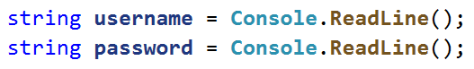
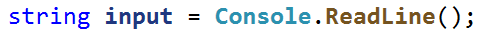
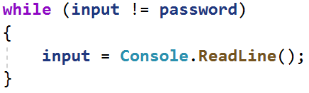
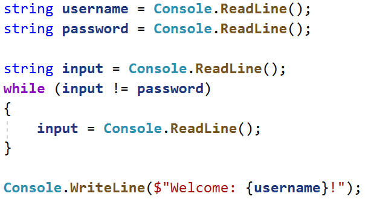
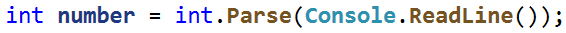
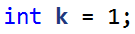
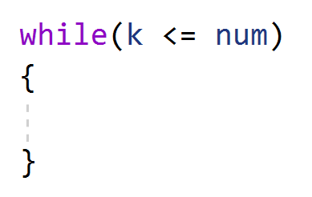
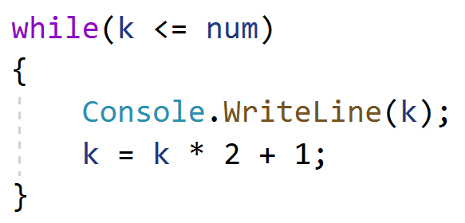

**Лаб: Повторения с цикли – While-цикъл**

Задачи за упражнение и домашно към курса ["Основи на програмирането" в
СофтУни](https://softuni.bg/courses/programming-basics).

**Тествайте** решението си в **judge системата**:
<https://judge.softuni.bg/Contests/2383>

## Четене на думи

Напишете програма, която чете текст от конзолата(стринг) и го принтира, докато
не получи командата "**Stop**".  
**Примерен вход и изход**

| **вход**                                                               | **изход**                             |   | **вход**                                                      | **изход**                                      |
|------------------------------------------------------------------------|---------------------------------------|---|---------------------------------------------------------------|------------------------------------------------|
| Nakov SoftUni Sofia Bulgaria SomeText Stop AfterStop Europe HelloWorld | Nakov SoftUni Sofia Bulgaria SomeText |   | Sofia Berlin Moscow Athens Madrid London Paris Stop AfterStop | Sofia Berlin Moscow Athens Madrid London Paris |

## Парола

Напишете програма, която първоначално прочита име и парола на потребителски
профил. След това чете парола за вход, при въвеждане на грешна парола,
потребителя да се подкани да въведе нова парола.

### Примерен вход и изход

| **вход**                  | **изход**      |   | **вход**            | **изход**      |
|---------------------------|----------------|---|---------------------|----------------|
| Nakov 1234 pass 1324 1234 | Welcome Nakov! |   | Gosho secret secret | Welcome Gosho! |

### Насоки

1.  Инициализирайте две променливи **username и password**, които ще съдържат
    потребителското име и паролата:

1.  Инициализирайте променлива **input**, която ще държи въведената от
    потребителя парола за вход:

1.  В **while** цикъл, до въвеждане на валидна парола, четете нова:

1.  Когато се въведе **валидна парола принтирайте съобщението за успешен вход**:

## Сума от числа

Напишете програма, която чете цяло число от конзолата и на всеки следващ ред
цели числа, докато тяхната сума стане по-голяма или равна на първоначалното
число.. След приключване да се отпечата **сумата на въведените числа**.

**Примерен вход и изход**

| **вход**        | **изход** |   | **вход**       | **изход** |
|-----------------|-----------|---|----------------|-----------|
| 100 10 20 30 40 | 100       |   | 20 1 2 3 4 5 6 | 21        |

## Редица числа 2K+1

Напишете програма, която чете число **n**, въведено от потребителя, и отпечатва
**всички числа ≤ n от редицата**: 1, 3, 7, 15, 31, …. Всяко следващо число се
изчислява като умножим **предишното** с **2** и добавим **1**.

### Примерен вход и изход

| **вход** | **изход** |   | **вход** | **изход** |   | **вход** | **изход** |   | **вход** | **изход**   |
|----------|-----------|---|----------|-----------|---|----------|-----------|---|----------|-------------|
| 3        | 1 3       |   | 8        | 1 3 7     |   | 17       | 1 3 7 15  |   | 31       | 1 3 7 15 31 |

### Насоки

1.  Прочетете от конзолата цяло число.

1.  **Създайте** променлива от тип **цяло число**, която ще е брояч и има
    **първоначална стойност 1**.

1.  **Създайте while** цикъл, който се повтаря докато **брояча е по-малък** или
    равен на числото, което сте прочели от конзолата.

1.  При всяко повторение на цикъла **принтирайте стойността на брояча** и му
    **прибавяйте дадената стойност**.

## Баланс по сметка

Напишете програма, която пресмята колко общо пари има в сметката, след като
направите определен брой вноски. На всеки ред ще получавате сумата, която трябва
да внесете в сметката, **до получаване на команда "NoMoreMoney"** . При всяка
получена сума на конзолата трябва да се извежда **"Increase: "** + сумата и тя
да се **прибавя в сметката**. Ако получите число **по-малко от 0** на конзолата
трябва да се изведе **"Invalid operation!"** и **програмата да приключи**.
Когато програмата приключи трябва да се принтира **"Total: "** + общата сума в
сметката закръглена до втория знак след десетичната запетая.

### Примерен вход и изход

| **вход**                   | **изход**                                                  |   | **вход**       | **изход**                                                      |
|----------------------------|------------------------------------------------------------|---|----------------|----------------------------------------------------------------|
| 5.51 69.42 100 NoMoreMoney | Increase: 5.51 Increase: 69.42 Increase: 100 Total: 174.93 |   | 120 45.55 -150 | Increase: 120 Increase: 45.55 Invalid operation! Total: 165.55 |

## Най-голямо число

Напишете програма, която до получаване на **командата "Stop",** чете **цели
числа**, въведени от потребителя, и намира **най-голямото** измежду тях. Въвежда
се по едно число на ред.

### Примерен вход и изход

| **вход**          | **изход** |   | **вход**         | **изход** |   | **вход**         | **изход** |   | **вход** | **изход** |   | **вход**    | **изход** |
|-------------------|-----------|---|------------------|-----------|---|------------------|-----------|---|----------|-----------|---|-------------|-----------|
| 100 99 80 70 Stop | 100       |   | \-10 20 -30 Stop | 20        |   | 45 -20 7 99 Stop | 99        |   | 999 Stop | 999       |   | \-1 -2 Stop | \-1       |

## Най-малко число

Напишете програма, която до получаване на **командата "Stop",** чете **цели
числа**, въведени от потребителя, и намира **най-малкото** измежду тях. Въвежда
се по едно число на ред.

### Примерен вход и изход

| **вход**          | **изход** |   | **вход**         | **изход** |   | **вход**         | **изход** |   | **вход** | **изход** |   | **вход**    | **изход** |
|-------------------|-----------|---|------------------|-----------|---|------------------|-----------|---|----------|-----------|---|-------------|-----------|
| 100 99 80 70 Stop | 70        |   | \-10 20 -30 Stop | \-30      |   | 45 -20 7 99 Stop | \-20      |   | 999 Stop | 999       |   | \-1 -2 Stop | \-2       |

**8. Завършване – част 2**

Напишете програма, която изчислява **средната оценка** на ученик от цялото му
обучение. На първия ред ще получите **името на ученика**, а на всеки следващ ред
неговите годишни оценки. Ученикът преминава в следващия клас, **ако годишната му
оценка е по-голяма или равна на 4.00**. **Ако ученикът бъде скъсан повече от
един път, то той бива изключен и програмата приключва,** като се отпечатва
**името на ученика и в кой клас бива изключен**.

При успешно завършване на **12-ти** клас да се отпечата :

"**{име на ученика} graduated. Average grade: {средната оценка от цялото
обучение}**"

**В случай, че ученикът е изключен от училище, да се отпечата:**

"**{име на ученика} has been excluded at {класа, в който е бил изключен}
grade**"

**Стойността трябва да бъде форматирана до втория знак** след десетичната
запетая.

### Примерен вход и изход

| **вход**                                   | **изход**                            |   | **вход**               | **изход**                         |
|--------------------------------------------|--------------------------------------|---|------------------------|-----------------------------------|
| Gosho 5 5.5 6 5.43 5.5 6 5.55 5 6 6 5.43 5 | Gosho graduated. Average grade: 5.53 |   | Mimi 5 6 5 6 5 6 6 2 3 | Mimi has been excluded at 8 grade |

# Примерна изпитна задача 

## \*Преместване

На осемнадесетия си рожден ден на Хосе взел решение, че ще се изнесе да живее на
квартира. Опаковал багажа си в **кашони** и намерил подходяща обява за
апартамент под наем. Той започва да пренася своя багаж **на части**, защото не
може да пренесе целия наведнъж. Има ограничено **свободно пространство** в
новото си жилище, където може да разположи вещите, така че мястото да бъде
подходящо за живеене.

Напишете **програма, която изчислява свободния обем от жилището на Хосе, който
остава след като пренесе багажа си.**

**Бележка: Един кашон е с точни размери: 1m. x 1m. x 1m.**

### Вход

Потребителят въвежда следните данни на отделни редове:

1.  **Широчина на свободното пространство - цяло число в интервала [1...1000]**

2.  **Дължина на свободното пространство - цяло число в интервала [1...1000]**

3.  **Височина на свободното пространство - цяло число в интервала [1...1000]**

4.  На следващите редове **(до получаване на команда "Done") - брой кашони,
    които се пренасят в квартирата - цели числа в интервала [1...10000];**

**Програмата трябва да приключи прочитането на данни при команда "Done" или ако
свободното място свърши.**

### Изход

Да се **отпечата** на конзолата **един** от следните редове:

-   Ако стигнете до командата **"Done"** и има още свободно място:

    **"{брой свободни куб. метри} Cubic meters left."**

-   Ако свободното място свърши преди да е дошла команда **"Done":**

    **"No more free space! You need {брой недостигащи куб. метри} Cubic meters
    more."**

**Примерен вход и изход**

| **Вход**                | **Изход**                                         | **Обяснение**                                                                                                                       |
|-------------------------|---------------------------------------------------|-------------------------------------------------------------------------------------------------------------------------------------|
| 10 10 2 20 20 20 20 122 | No more free space! You need 2 Cubic meters more. | 10 \* 10 \* 2 = **200 кубични метра.** 20 + 20 + 20 + 20 + 122 = **202 кубични метра.** 200 - 202 = **2 недостигащи** кубични метра |
| 10 1 2 4 6 **Done**     | 10 Cubic meters left.                             | 10 \* 1 \* 2 = **20 кубични метра.** 4 + 6 = **10 кубични метра.** 20 - 10 = **10 кубични метра.**                                  |
