# Упражнения: Вложени цикли

Задачи за упражнение в клас и за домашно към курса ["Основи на програмирането"
\@ СофтУни](https://softuni.bg/courses/programming-basics).

**Тествайте** решението си в **judge системата**:
<https://judge.softuni.bg/Contests/2386>

## Пирамида от числа

Напишете програма, която чете цяло число **n**, въведено от потребителя, и
отпечатва **пирамида от числа** като в примерите:

| **вход** | **изход**     |   | **вход** | **изход**            |   | **вход** | **изход**                  |   | **вход** | **изход**                           |
|----------|---------------|---|----------|----------------------|---|----------|----------------------------|---|----------|-------------------------------------|
| 7        | 1 2 3 4 5 6 7 |   | 10       | 1 2 3 4 5 6 7 8 9 10 |   | 12       | 1 2 3 4 5 6 7 8 9 10 11 12 |   | 15       | 1 2 3 4 5 6 7 8 9 10 11 12 13 14 15 |

### Насоки

1.  **Прочетете** едно **цяло число от конзолата**:  
    

    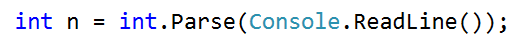

2.  **Направете два вложени for цикъла,** с които да печатате пирамидата от
    числа, като външният цикъл ще определя **колко реда** да се отпечатат, а
    вътрешният – **колко числа** се принтират на съответния **ред**:  
    

    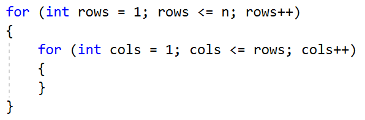

3.  В отделен **брояч** пазете колко числа сте отпечатали **до момента** (и кое
    е текущото число). Когато стигнете **n**, излезте от двата вложени цикъла с
    **break. За да излезем и от двата цикъла трябва да използваме оператора
    break и в двата. За целта ще направим булева променлива, която да проверява
    дали сме излезнали от вътрешния. Отидете в началото на програмата и
    инициализирайте следните две променливи:**  
    

    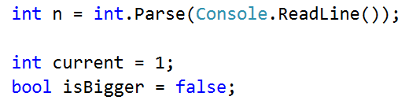

4.  **Във вътрешния for цикъл направете проверка дали променливата current е
    станала по-голяма от n. Ако е, променете стойността на булевата променлива и
    излезте от вътрешния цикъл:**  
    

    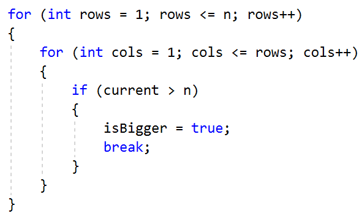

5.  **След проверката, принтирайте променливата current в желания формат и я
    увеличете с 1. Ако сте излезнали от цикъла няма да се стигне до
    принтиране!**  
    

    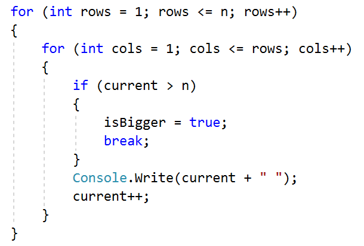

6.  **В тялото на външния цикъл, направете проверка дали трябва да излезем и от
    него. След това отпечатйте един празен ред, за да може следващите числа да
    са на нов ред. Ако сме излязли от външния цикъл няма да се стигне до
    изпълнение на командата Console.WriteLine()**! **Програмата ви трябва да
    изглежда по следния начин:**  
    

    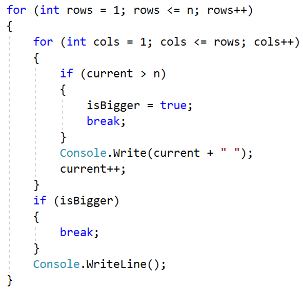

## Еднакви суми на четни и нечетни позиции

Напишете програма, която чете от конзолата **две шестцифрени цели числа** в
диапазона от 100000 до 300000. Винаги **първото** въведено число ще бъде **по
малко от второто**. На конзолата да се отпечатат на **1 ред разделени с
интервал** всички числа, които се намират **между двете**, прочетени от
конзолата числа и отговарят на следното **условие**:

-   **сумата** от цифрите на **четни** и **нечетни** позиции да са **равни**.
    Ако няма числа, отговарящи на условието на конзолата не се извежда резултат.

### Примерен вход и изход 

| **Вход**      | **Изход**                                                                                                                                                                                                  | **Обяснения**                                                                                                                                                                                                                                                                                                                                                                                                                                                                                                                                                                         |                      |               |              |
|---------------|------------------------------------------------------------------------------------------------------------------------------------------------------------------------------------------------------------|---------------------------------------------------------------------------------------------------------------------------------------------------------------------------------------------------------------------------------------------------------------------------------------------------------------------------------------------------------------------------------------------------------------------------------------------------------------------------------------------------------------------------------------------------------------------------------------|----------------------|---------------|--------------|
| 100000 100050 | 100001 100012 100023 100034 100045                                                                                                                                                                         | Първото число, което генерираме е числото 100000. Сумата от цифрите на четни позиции (жълто) е 0+0+0=0. Сумата от цифрите на нечетни позиции (зелено) е 0+0+1=1. Тъй като двете суми са различни числото не се отпечатва.  Следващото, число е 100001. Сумата на четни позиции е 1+0+0=1, а на нечетни 0+0+1=1. Двете суми са равни и числото се отпечатва.  Следващото число за проверка е 100002. То не отговаря на условието и не се отпечатва.  …… При числото 100045 сумата от четните позиции е 5+0+0=5, а на нечетни 4+0+1=5. Двете суми са равни числото се отпечатва. И т.н. |                      |               |              |
| **Вход**      | **Изход**                                                                                                                                                                                                  | **Вход**                                                                                                                                                                                                                                                                                                                                                                                                                                                                                                                                                                              | **Изход**            | **Вход**      | **Изход**    |
| 123456 124000 | 123464 123475 123486 123497 123530 123541 123552 123563 123574 123585 123596 123640 123651 123662 123673 123684 123695 123750 123761 123772 123783 123794 123860 123871 123882 123893 123970 123981 123992 | 299900 300000                                                                                                                                                                                                                                                                                                                                                                                                                                                                                                                                                                         | 299970 299981 299992 | 100115 100120 | *Няма изход* |

### Насоки

1.  Прочетете входните данни от потребителя:

    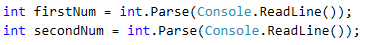

2.  За да преминете през всички числа от интервала, направете **for** цикъл.
    След като сте прочели входните числа, задайте първото число за начална
    стойност на контролната променлива**.** Итерирайте до достигане на **второто
    число** като **увеличавате** стойността на контролната променлива с **1**:

    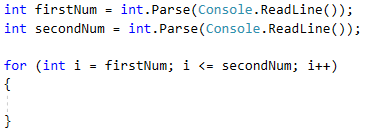

3.  Вземете числото на текущата позиция **като текст, като използвате метода
    .ToString()**:

    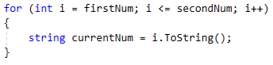

4.  За да обходите всяка цифра от числото, направете **for** цикъл. След като е
    взето като текст, вземете неговата дължина с **.Length**. Итерирайте до
    достигане на **дължината на числото** като **увеличавате** стойността на
    контролната променлива с **1**:

    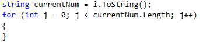

5.  Продължете към дописване на логиката за намиране на сумата на четна и
    нечетна позиция за всяко число. Декларирайте по една променлива за четната и
    нечетна сума. За да получите точната числова стойност на цифрите използвайте
    метода **int.Parse()**.

    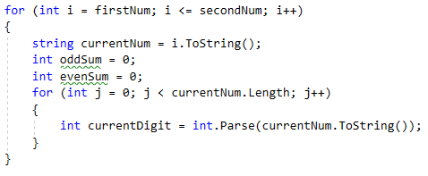

6.  За да намерите цифрите, които се намират на четна позиция, използвайте
    условна **if** конструкция, проверите дали индекса му е четно число като го
    разделите модулно на 2(**index % 2**), ако е четно, добавете го към сумата
    на четните, ако не е, към сумата на нечетните.

    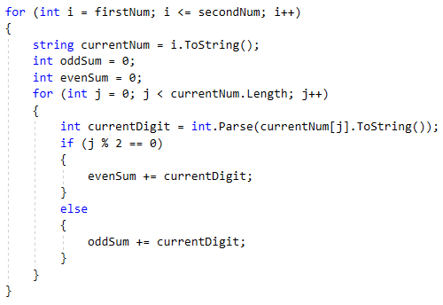

7.  След като сте намерили сумата на цифрите на четни и нечетни позиции,
    проверете дали са равни, ако са, принтирайте числото. **Програмата ви трябва
    да изглежда по следния начин:**

    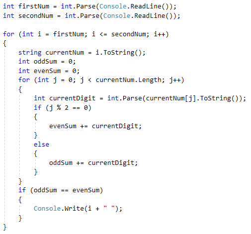

## Суми прости и непрости числа

Напишете програма, която чете от конзолата цели числа в диапазона от
**-2,147,483,648** до **2,147,483,647**, докато не се получи команда "**stop"**.
Да се намери **сумата** на всички въведени **прости** и сумата на всички
въведени **непрости** числа. Тъй като по дефиниция от математиката отрицателните
числа не могат да бъдат прости, ако на входа се подаде **отрицателно** число да
се изведе следното съобщение "**Number is negative.**". В този случай въведено
число се игнорира и не се прибавя към нито една от двете суми, а програмата
продължава своето изпълнение, очаквайки въвеждане на следващо число.

На **изхода** да се отпечатат на два реда **двете намерени суми** в следния
формат:

"Sum of all prime numbers is: {prime numbers sum}"

"Sum of all non prime numbers is: {nonprime numbers sum}"

### Примерен вход и изход 

| **Вход**            | **Изход**                                                                               | **Обяснения**                                                                                                                                                                                                                                                                                                                                                                                                                                                                                                                                                                    |                                                                                       |
|---------------------|-----------------------------------------------------------------------------------------|----------------------------------------------------------------------------------------------------------------------------------------------------------------------------------------------------------------------------------------------------------------------------------------------------------------------------------------------------------------------------------------------------------------------------------------------------------------------------------------------------------------------------------------------------------------------------------|---------------------------------------------------------------------------------------|
| 3 9 0 7 19 4 stop   | Sum of all prime numbers is: 29 Sum of all non prime numbers is: 13                     | Първото въведено число е 3. То е просто и го прибавяме съм сумата на простите числа. Следващото число е 9. То не е просто и го прибавяме към сумата на непростите числа.  Числото 0 не е просто число и го прибавяме към сумата на непростите числа. Сумата става 9+0=9. Следващите две числа са 7 и 19. Те са прости и всяко едно от тях го прибавяме към сумата на простите числа. 3+7=10 и 10+19=29. Следва числото 4, което не е просто и го прибавяме към съответната сума 9+4=13. Получаваме команда stop. Програмата прекъсва своето изпълнение и отпечатваме двете суми. |                                                                                       |
| **Вход**            | **Изход**                                                                               | **Вход**                                                                                                                                                                                                                                                                                                                                                                                                                                                                                                                                                                         | **Изход**                                                                             |
| 30 83 33 -1 20 stop | Number is negative. Sum of all prime numbers is: 83 Sum of all non prime numbers is: 83 | 0 -9 0 stop                                                                                                                                                                                                                                                                                                                                                                                                                                                                                                                                                                      | Number is negative. Sum of all prime numbers is: 0 Sum of all non prime numbers is: 0 |

1.  **Train the Trainers**

Курсът **"**Train the trainers**"** е към края си и финалното оценяване
наближава. Вашата задача е да помогнете на журито което ще оценява
презентациите, като напишете програма в която да изчислява **средната оценка**
от представянето на **всяка една презентация** от даден студент, а накрая
**средният успех от всички тях**.

От конзолата на първият ред се прочита броят на хората в журито **n** - **цяло
число в интервала [1…20]**

След това на отделен ред се прочита името на презентацията - **текст**

За всяка една презентация на нов ред се четат **n - на брой оценки - реално
число в интервала [2.00…6.00]**

**След изчисляване на средната оценка за конкретна презентация,** на конзолата
се печата

**"{името на презентацията} - {средна оценка}."**

След получаване на команда **"Finish"** на конзолата се печата **"Student's
final assessment is {среден успех от всички презентации}."** и програмата
приключва.

Всички оценки трябва да бъдат форматирани до **втория знак** след десетичната
запетая.

### Примерен вход и изход

| **Вход**                                            | **Изход**                                                               | **Обяснения**                                                                                                                                                                 |                                                                                                    |
|-----------------------------------------------------|-------------------------------------------------------------------------|-------------------------------------------------------------------------------------------------------------------------------------------------------------------------------|----------------------------------------------------------------------------------------------------|
| 2 While-Loop 6.00 5.50 For-Loop 5.84 5.66 Finish    | While-Loop - 5.75. For-Loop - 5.75. Student's final assessment is 5.75. | 2 – броят на хората в журито следователно ще получаваме по 2 оценки на презентация. (6.00 + 5.50) / 2 = 5.75 (5.84 + 5.66) / 2 = 5.75 (6.00 + 5.50 + 5.84 + 5.66) / 4 = 5.75  |                                                                                                    |
| **Вход**                                            | **Изход**                                                               | **Вход**                                                                                                                                                                      | **Изход**                                                                                          |
| 3 Arrays 4.53 5.23 5.00 Lists 5.83 6.00 5.42 Finish | Arrays - 4.92. Lists - 5.75. Student's final assessment is 5.34.        | 2 Objects and Classes 5.77 4.23 Dictionaries 4.62 5.02 RegEx 2.88 3.42 Finish                                                                                                 | Objects and Classes - 5.00. Dictionaries - 4.82. RegEx - 3.15. Student's final assessment is 4.32. |

# Примерни изпитни задачи

## Генератор за пароли

Да се напише програма, която чете две цели числа **n** и **l**, въведени от
потребителя, и генерира по азбучен ред всички възможни  **пароли**, които се
състоят от следните **5 символа**:

-   Символ 1: цифра от **1** до **n**.

-   Символ 2: цифра от **1** до **n**.

-   Символ 3: малка буква измежду първите **l** букви на латинската азбука.

-   Символ 4: малка буква измежду първите **l** букви на латинската азбука.

-   Символ 5: цифра от 1 до **n**, по-голяма от първите 2 цифри.

### Вход

Входът се чете от конзолата и се състои от две **цели числа n** и **l** в
интервала [**1**…**9**], по едно на ред.

### Изход

На конзолата трябва да се отпечатат **всички пароли** по **азбучен ред**,
разделени с **интервал**.

### Примерен вход и изход

| **вход** | **изход**                                                                                                                                                                                                                                                                                                                                       |
|----------|-------------------------------------------------------------------------------------------------------------------------------------------------------------------------------------------------------------------------------------------------------------------------------------------------------------------------------------------------|
| 2 4      | 11aa2 11ab2 11ac2 11ad2 11ba2 11bb2 11bc2 11bd2 11ca2 11cb2 11cc2 11cd2 11da2 11db2 11dc2 11dd2                                                                                                                                                                                                                                                 |
| 3 1      | 11aa2 11aa3 12aa3 21aa3 22aa3                                                                                                                                                                                                                                                                                                                   |
| 3 2      | 11aa2 11aa3 11ab2 11ab3 11ba2 11ba3 11bb2 11bb3 12aa3 12ab3 12ba3 12bb3 21aa3 21ab3 21ba3 21bb3 22aa3 22ab3 22ba3 22bb3                                                                                                                                                                                                                         |
| 4 2      | 11aa2 11aa3 11aa4 11ab2 11ab3 11ab4 11ba2 11ba3 11ba4 11bb2 11bb3 11bb4 12aa3 12aa4 12ab3 12ab4 12ba3 12ba4 12bb3 12bb4 13aa4 13ab4 13ba4 13bb4 21aa3 21aa4 21ab3 21ab4 21ba3 21ba4 21bb3 21bb4 22aa3 22aa4 22ab3 22ab4 22ba3 22ba4 22bb3 22bb4 23aa4 23ab4 23ba4 23bb4 31aa4 31ab4 31ba4 31bb4 32aa4 32ab4 32ba4 32bb4 33aa4 33ab4 33ba4 33bb4 |

## Специални числа

Да се напише програма, която **чете едно цяло число N**, въведено от
потребителя, и генерира всички възможни **“специални” числа** от **1111** до
**9999**. За да бъде **“специалнo”** едно число, то трябва да отговаря на
**следното условие**:

-   **N да се дели на всяка една от неговите цифри без остатък.**

**Пример:** при **N = 16**, **2418** е специално число:

-   **16 / 2** = 8 **без остатък**

-   **16 / 4** = 4 **без остатък**

-   **16 / 1** = 16 **без остатък**

-   **16 / 8** = 2 **без остатък**

### Вход

Входът се чете от конзолата и се състои от **едно цяло число** в интервала
[**1**…**600000**]

### Изход

На конзолата трябва да се отпечатат **всички “специални” числа**, разделени с
**интервал**

### Примерен вход и изход

| **вход** | **изход**                                                                                                                                                                                                                                                                                                                                                                                                                                                                                                                                                                                                                                                                                                                                                                                                                                                                                                                                                                                                                                                                                                                                                                                                                                                                                                                       | **коментари**                                                                           |
|----------|---------------------------------------------------------------------------------------------------------------------------------------------------------------------------------------------------------------------------------------------------------------------------------------------------------------------------------------------------------------------------------------------------------------------------------------------------------------------------------------------------------------------------------------------------------------------------------------------------------------------------------------------------------------------------------------------------------------------------------------------------------------------------------------------------------------------------------------------------------------------------------------------------------------------------------------------------------------------------------------------------------------------------------------------------------------------------------------------------------------------------------------------------------------------------------------------------------------------------------------------------------------------------------------------------------------------------------|-----------------------------------------------------------------------------------------|
| 3        | 1111 1113 1131 1133 1311 1313 1331 1333 3111 3113 3131 3133 3311 3313 3331 3333                                                                                                                                                                                                                                                                                                                                                                                                                                                                                                                                                                                                                                                                                                                                                                                                                                                                                                                                                                                                                                                                                                                                                                                                                                                 | 3 / 1 = 3 без остатък 3 / 3 = 1 без остатък 3 / 3 = 1 без остатък 3 / 3 = 1 без остатък |
| 11       | 1111                                                                                                                                                                                                                                                                                                                                                                                                                                                                                                                                                                                                                                                                                                                                                                                                                                                                                                                                                                                                                                                                                                                                                                                                                                                                                                                            |                                                                                         |
| 16       | 1111 1112 1114 1118 1121 1122 1124 1128 1141 1142 1144 1148 1181 1182 1184 1188 1211 1212 1214 1218 1221 1222 1224 1228 1241 1242 1244 1248 1281 1282 1284 1288 1411 1412 1414 1418 1421 1422 1424 1428 1441 1442 1444 1448 1481 1482 1484 1488 1811 1812 1814 1818 1821 1822 1824 1828 1841 1842 1844 1848 1881 1882 1884 1888 2111 2112 2114 2118 2121 2122 2124 2128 2141 2142 2144 2148 2181 2182 2184 2188 2211 2212 2214 2218 2221 2222 2224 2228 2241 2242 2244 2248 2281 2282 2284 2288 2411 2412 2414 2418 2421 2422 2424 2428 2441 2442 2444 2448 2481 2482 2484 2488 2811 2812 2814 2818 2821 2822 2824 2828 2841 2842 2844 2848 2881 2882 2884 2888 4111 4112 4114 4118 4121 4122 4124 4128 4141 4142 4144 4148 4181 4182 4184 4188 4211 4212 4214 4218 4221 4222 4224 4228 4241 4242 4244 4248 4281 4282 4284 4288 4411 4412 4414 4418 4421 4422 4424 4428 4441 4442 4444 4448 4481 4482 4484 4488 4811 4812 4814 4818 4821 4822 4824 4828 4841 4842 4844 4848 4881 4882 4884 4888 8111 8112 8114 8118 8121 8122 8124 8128 8141 8142 8144 8148 8181 8182 8184 8188 8211 8212 8214 8218 8221 8222 8224 8228 8241 8242 8244 8248 8281 8282 8284 8288 8411 8412 8414 8418 8421 8422 8424 8428 8441 8442 8444 8448 8481 8482 8484 8488 8811 8812 8814 8818 8821 8822 8824 8828 8841 8842 8844 8848 8881 8882 8884 8888 |                                                                                         |
