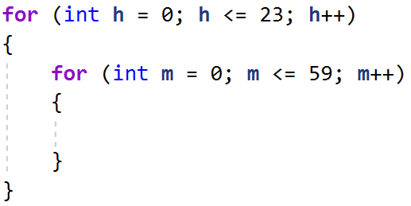
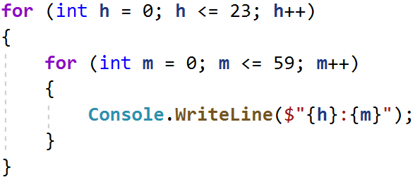
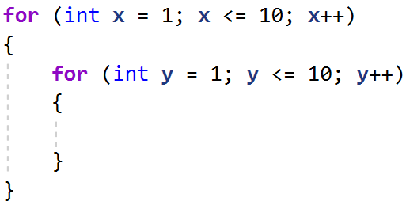
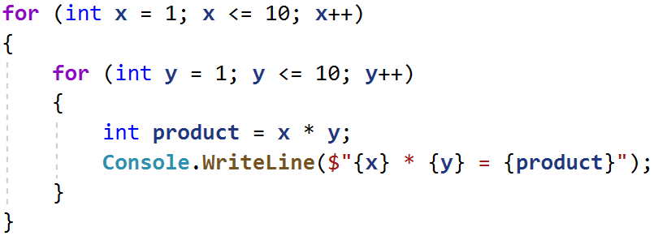
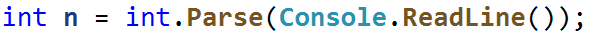
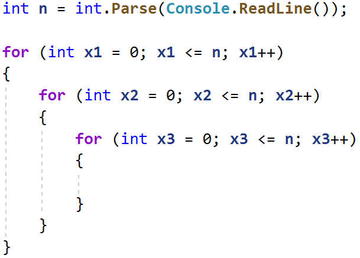
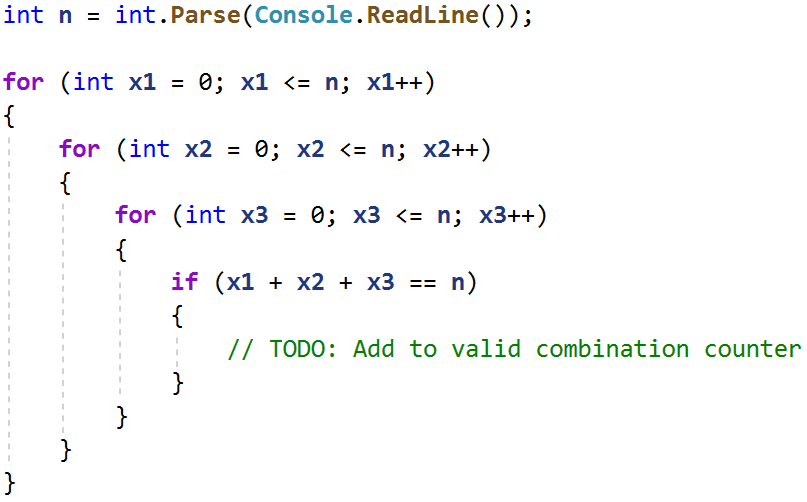

# Лаб: Вложени цикли

Задачи за упражнение в клас и за домашно към курса ["Основи на програмирането"
\@ СофтУни](https://softuni.bg/courses/programming-basics).

**Тествайте** решенията си в **Judge системата**:
<https://judge.softuni.bg/Contests/2385>

## Часовник

Напишете програма, която отпечатва **часовете в денонощието от 0:0 до 23:59**,
всеки на отделен ред. Часовете трябва да се изписват във формат
**"{час}:{минути}"**.

### Примерен вход и изход

| **Вход**      | **Изход**                                                                                                    |
|---------------|--------------------------------------------------------------------------------------------------------------|
| *(няма вход)* | 0:0 0:1 0:2 0:3 0:4 0:5 0:6 0:7 0:8 0:9 0:10 ... 23:50 23:51 23:52 23:53 23:54 23:55 23:56 23:57 23:58 23:59 |

### Насоки

1.  Създайте 2 вложени for-цикъла, с които да итерирате през всяка една минута и
    час от денонощието:

    

2.  Отпечатайте резултата:

    

## Таблица за умножение

Отпечатайте на конзолата таблицата за умножение за числата от 1 до 10 във
формат:  
**"{първи множител} \* {втори множител} = {резултат}"**.

### Примерен вход и изход

| **Вход**      | **Изход**                                                                                                                                                                                                                                               |
|---------------|---------------------------------------------------------------------------------------------------------------------------------------------------------------------------------------------------------------------------------------------------------|
| *(няма вход)* | 1 \* 1 = 1 1 \* 2 = 2 1 \* 3 = 3 1 \* 4 = 4 1 \* 5 = 5 1 \* 6 = 6 1 \* 7 = 7 1 \* 8 = 8 1 \* 9 = 9 1 \* 10 = 10 ... 10 \* 1 = 10 10 \* 2 = 20 10 \* 3 = 30 10 \* 4 = 40 10 \* 5 = 50 10 \* 6 = 60 10 \* 7 = 70 10 \* 8 = 80 10 \* 9 = 90 10 \* 10 = 100 |

### Насоки

1.  Създайте 2 вложени for-цикъла, с които да итерирате всяка възможна стойност
    на двата множителя от 1 до 10:

1.  Намерете произведението на двата множителя и отпечатайте резултата:

    

## Комбинации

Напишете програма, която изчислява **колко решения в естествените числа**
(включително и нулата) има уравнението:

**x1 + x2 + x3 = n**

**Числото n е цяло число и се въвежда от конзолата.**

### Примерен вход и изход

| **Вход** | **Изход** | **Обяснения**                                                                                                                                                                                                                                                                                                                                                                                        | **Вход** | **Изход** | **Вход** | **Изход** |
|----------|-----------|------------------------------------------------------------------------------------------------------------------------------------------------------------------------------------------------------------------------------------------------------------------------------------------------------------------------------------------------------------------------------------------------------|----------|-----------|----------|-----------|
| 25       | 351       | Генерираме всички комбинации от 3 числа, като първата е: 0+0+0=0, но понеже не е равна на 25, продължаваме: 0+0+1=1 – също не е 25 и т.н. Стигаме до първата валидна комбинация: 0 + 0 + 25 = 25, увеличаваме броя на валидни комбинации с 1,втората валидна комбинация е: 0 + 1 + 24 = 25 Третата: 0 + 2 + 23 = 25 и т.н.  След генериране на всички възможни комбинации, броят на валидните е 351. | 20       | 231       | 5        | 21        |

### Насоки

1.  Прочетете входните данни – едно цяло число, въведено от потребителя и го
    запаметете в променлива:

    

2.  Създайте 3 вложени for-цикъла, с които да итерирате всяка възможна стойност
    на едно от 3те числа в уравнението:

    

3.  Направете проверка в най-вътрешния вложен цикъл за стойностите на **x1**,
    **x2**, **x3** във всяка една итерация. За да бъде валидно уравнението,
    техният сбор трябва да е равен на **n**. Създайте променлива
    **validCombinationsCount**, която да пази броя на валидните комбинации и
    добавяйте към нея всеки път, когато генерирате такава:

    

4.  Накрая принтирайте броя на валидните комбинации
    (**validCombinationsCount**).

## Сума от две числа

Напишете програма която проверява **всички възможни комбинации от двойка числа в
интервала от две дадени числа**. На изхода се отпечатва, **коя поред е
комбинацията** чиито **сбор от числата е равен** на дадено **магическо число**.
Ако няма **нито една комбинация** отговаряща на условието се отпечатва
**съобщение, че не е намерено**.

### Вход

Входът се чете от конзолата и се състои от **три реда**:

-   **Първи ред** – **начало на интервала** – **цяло число** в интервала
    **[1...999]**

-   **Втори ред** – **край на интервала** – **цяло число** в интервала
    **[по-голямо от първото число...1000]**

-   **Трети ред – магическото число – цяло число** в интервала **[1...10000]**

### Изход

На конзолата трябва да се отпечата **един ред,** според резултата:

-   Ако **е намерена комбинация** чиито **сбор на числата е равен на магическото
    число**

    -   "Combination N:{пореден номер} ({първото число} + {второ число} =
        {магическото число})"

-   Ако **не е намерена** комбинация отговаряща на условието

    -   "{броят на всички комбинации} combinations - neither equals {магическото
        число}"

### Примерен вход и изход

| **Вход** | **Изход**                          | **Обяснения**                                                                                                                                                                                                                   | **Вход**    | **Изход**                                 |
|----------|------------------------------------|---------------------------------------------------------------------------------------------------------------------------------------------------------------------------------------------------------------------------------|-------------|-------------------------------------------|
| 1 10 5   | Combination N:4 (1 + 4 = 5)        | Всички комбинации от две числа между 1 и 10 са: 1 1, 1 2, 1 3, **1 4**, 1 5, ... 2 1, 2 2, ... 4 9, 4 10, 5 1 ... 10 9, 10 10 Първата комбинация, чиито сбор на числата е равен на магическото число 5 е **четвъртата (1 и 4)** | 88 888 1000 | Combination N:20025 (112 + 888 = 1000)    |
| **Вход** | **Изход**                          | **Обяснения**                                                                                                                                                                                                                   | **Вход**    | **Изход**                                 |
| 23 24 20 | 4 combinations - neither equals 20 | Всички комбинации от две числа между 23 и 24 са: 23 23, 23 24, 24 23, 24 24 (общо 4) Няма двойки числа, чиито сбор е равен на магическото 20                                                                                    | 88 888 2000 | 641601 combinations - neither equals 2000 |

## Пътуване

Ани обича да пътува и иска тази година да посети **няколко** различни
дестинации. Като си избере дестинация, ще прецени **колко пари ще й трябват**,
за да отиде до там и ще започне да **спестява**. Когато е спестила
**достатъчно**, ще може да пътува.

От **конзолата всеки път ще се четат първо дестинацията и минималния бюджет**,
който ще е нужен за пътуването.

След това ще се четат **няколко суми**, които Ани спестява като работи и
**когато успее да събере достатъчно за пътуването, ще заминава, като на
конзолата трябва да се изпише:**

**"Going to {дестинацията}!"**

Когато е посетила всички дестинации, които иска, **вместо дестинация ще въведе
"End"** и програмата ще приключи.

### Примерен вход и изход

| **Вход**                                                           | **Изход**                        | **Вход**                                                                                                  | **Изход**                                           |
|--------------------------------------------------------------------|----------------------------------|-----------------------------------------------------------------------------------------------------------|-----------------------------------------------------|
| Greece 1000 200 200 300 100 150 240 Spain 1200 300 500 193 423 End | Going to Greece! Going to Spain! | France 2000 300 300 200 400 190 258 360 Portugal 1450 400 400 200 300 300 Egypt 1900 1000 280 300 500 End | Going to France! Going to Portugal! Going to Egypt! |

## Сграда

Напишете програма, която извежда на конзолата номерата на стаите в една сграда
(в низходящ ред), като са изпълнени следните условия:

-   На **всеки четен етаж има само офиси**

-   На **всеки нечетен етаж има само апартаменти**

-   Всеки **апартамент** се означава по следния начин : **А**{**номер на
    етажа**}{**номер на апартамента**}, **номерата на апартаментите започват от
    0.**

-   Всеки **офис** се означава по следния начин : **О**{**номер на
    етажа**}{**номер на офиса**}, **номерата на офисите също започват от 0.**

-   **На последният етаж винаги има апартаменти** и те са по-големи от
    останалите, за това **пред номера им пише 'L', вместо 'А'. Ако има само един
    етаж, то има само големи апартаменти!**

От конзолата се прочитат две **цели числа - броят на етажите и броят на стаите
за един етаж.**

### Примерен вход и изход

| **Вход** | **Изход**                                                                                                                                                                           | **Обяснения**                                                                                         |                                                                 |
|----------|-------------------------------------------------------------------------------------------------------------------------------------------------------------------------------------|-------------------------------------------------------------------------------------------------------|-----------------------------------------------------------------|
| 6 4      | L60 L61 L62 L63 A50 A51 A52 A53 O40 O41 O42 O43 A30 A31 A32 A33 O20 O21 O22 O23 A10 A11 A12 A13                                                                                     | Имаме общо 6 етажа, с по 4 стаи на етаж. Нечетните етажи имат само апартаменти, а четните само офиси. |                                                                 |
| **Вход** | **Изход**                                                                                                                                                                           | **Вход**                                                                                              | **Изход**                                                       |
| 9 5      | L90 L91 L92 L93 L94 O80 O81 O82 O83 O84 A70 A71 A72 A73 A74 O60 O61 O62 O63 O64 A50 A51 A52 A53 A54 O40 O41 O42 O43 O44 A30 A31 A32 A33 A34 O20 O21 O22 O23 O24 A10 A11 A12 A13 A14 | 4 4                                                                                                   | L40 L41 L42 L43 A30 A31 A32 A33 O20 O21 O22 O23 A10 A11 A12 A13 |

# Примерна изпитна задача

## \*Билети за кино

Вашата задача е да **напишете програма**, която да изчислява **процента на
билетите за всеки тип от продадените билети**: студентски(**student**),
стандартен(**standard**) и детски(**kid**), за всички прожекции. Трябва да
изчислите и **колко процента от залата е запълнен**а за **всяка една
прожекция.**

### Вход

Входът е поредица от **цели числа** и **текст**:

-   На първия ред до получаване на командата "**Finish**" - име на филма –
    **текст**

-   На втори ред – свободните места в салона за всяка прожекция – **цяло число
    [1 … 100]**

-   За всеки филм, се чете по един ред до изчерпване на свободните места в
    залата или до получаване на командата "**End**":

    -   Типа на закупения билет - текст ("**student", "standard", "kid"**)

### Изход

На конзолата трябва да се печатат **следните редове**:

-   След всеки филм да се отпечата, колко процента от кино залата е пълна

    **"{името на филма} - {процент запълненост на залата}% full."**

-   При получаване на командата "Finish" да се отпечатат четири реда:

    -   **"Total tickets: {общият брой закупени билети за всички филми}"**

    -   **"{процент на студентските билети}% student tickets."**

    -   **"{процент на стандартните билети}% standard tickets."**

    -   **"{процент на детските билети}% kids tickets."**

### Примерен вход и изход

| **Вход**                                                                                                                                                                                         | **Изход**                                                                                                                                                               | **Обяснения**                                                                                                                                                                                                                                                                                                                                                                                                                                                                                                                                                                                                                                                                                                                                                                                            |
|--------------------------------------------------------------------------------------------------------------------------------------------------------------------------------------------------|-------------------------------------------------------------------------------------------------------------------------------------------------------------------------|----------------------------------------------------------------------------------------------------------------------------------------------------------------------------------------------------------------------------------------------------------------------------------------------------------------------------------------------------------------------------------------------------------------------------------------------------------------------------------------------------------------------------------------------------------------------------------------------------------------------------------------------------------------------------------------------------------------------------------------------------------------------------------------------------------|
| Taxi 10 standard kid student student standard standard End Scary Movie 6 student student student student student student Finish                                                                  | Taxi - 60.00% full. Scary Movie - 100.00% full. Total tickets: 12 66.67% student tickets. 25.00% standard tickets. 8.33% kids tickets.                                  | Първи филм – Taxi, местата в залата са 10 Купуват се 3 стандарти, 2 студентски, 1 детски билет и получаваме командата End. Общо 6 билета от 10 места -\> 60% от залата е заета. Втори филм – Scary Movie, места в залата са 6 Купуват се 6 студентски билета и местата в залата свършват. Общо 6 билета от 6 места -\> 100% от залата е заета. Получаваме командата Finish Общо закупените билети за всички филми са 12. За всички филми са закупени общо: 8 студентски билета. 8 билета от общо 12 е 66.67% 3 стандартни билета. 3 билета от общо 12 е 25% 1 детски билет. 1 билет от общо 12 е 8.33%                                                                                                                                                                                                   |
| **Вход**                                                                                                                                                                                         | **Изход**                                                                                                                                                               | **Обяснения**                                                                                                                                                                                                                                                                                                                                                                                                                                                                                                                                                                                                                                                                                                                                                                                            |
| The Matrix 20 student standard kid kid student student standard student End The Green Mile 17 student standard standard student standard student End Amadeus 3 standard standard standard Finish | The Matrix - 40.00% full. The Green Mile - 35.29% full. Amadeus - 100.00% full. Total tickets: 17 41.18% student tickets. 47.06% standard tickets. 11.76% kids tickets. | Първи филм – The Matrix, местата в залата са 20 Купуват се 2 стандартни, 4 студентски, 2 детски билета и получаваме командата End. Общо 8 билета от 20 места -\> 41.18% от залата е заета Втори филм - The Green Mile, местата в залата са 17 Купуват се 3 стандартни, 3 студентски билета и получаваме командата End. Общо 6 билета от 17 места -\> 47.06% от залата е заета Трети филм – Amadeus, местата в залата са 3 Купуват се 3 стандартни билета и местата в залата свършват. Общо 3 билета от 3 места -\> 100% от залата е заета. Получаваме командата Finish Общо закупените билети за всички филми са 17. За всички филми са закупени общо: 7 студентски билета. 7 билета от общо 17 е 41.18% 8 стандартни билета. 8 билета от общо 17 е 47.06% 2 детски билета. 2 билета от общо 17 е 11.76% |
