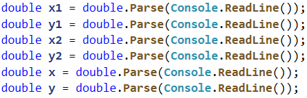
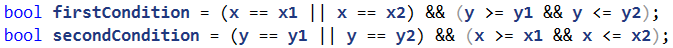

# Вложени проверки – допълнително упражнение

Задачи за допълнително упражнение към курса ["Основи на програмирането" \@
СофтУни](https://softuni.bg/courses/programming-basics).

**Тествайте** решенията си в **judge системата**:
<https://judge.softuni.bg/Contests/Practice/Index/1663#0>

## Билети за мач

Когато пуснали **билетите за Евро 2016**, **група** запалянковци **решили да си
закупят**. **Билетите** имат **две категории с различни цени**:

-   **VIP** – **499.99** лева.

-   **Normal** – **249.99** лева.

Запалянковците **имат определен бюджет, а броят на хората** в групата **определя
какъв процент от бюджета** трябва **да се задели за транспорт**:

-   **От 1 до 4** – **75% от бюджета**.

-   **От 5** до **9** – **60% от бюджета**.

-   **От 10 до 24** – **50% от бюджета**.

-   **От 25 до 49** – **40% от бюджета**.

-   **50 или повече** – **25% от бюджета**.

**Напишете програма**, която да **пресмята дали с останалите пари от бюджета**
могат да си **купят билети за избраната категория**. И **колко пари** ще им
**останат или ще са им нужни**.

### Вход

Входът се чете от **конзолата** и съдържа **точно 3 реда**:

-   На **първия** ред е **бюджетът** – **реално число в интервала [1 000.00 ...
    1 000 000.00]**

-   На **втория** ред е **категорията** – "**VIP**" или "**Normal**"

-   На **третия** ред е **броят на хората в групата** – **цяло число в интервала
    [1 ... 200]**

### Изход

Да се **отпечата** на конзолата **един ред**:

-   Ако **бюджетът е достатъчен**:

    -   "**Yes! You have {останалите пари на групата} leva left.**"

-   Ако **бюджетът НЕ Е достатъчен**:

    -   "**Not enough money! You need {сумата, която не достига} leva.**"

**Сумите** трябва да са **форматирани с точност до два знака след десетичната
запетая**.

### Примерен вход и изход

| **Вход**                                                                                                                                                                                         | **Изход**                                                                                                                                                                                                                  | **Вход**     | **Изход**                                |
|--------------------------------------------------------------------------------------------------------------------------------------------------------------------------------------------------|----------------------------------------------------------------------------------------------------------------------------------------------------------------------------------------------------------------------------|--------------|------------------------------------------|
| 1000 Normal 1                                                                                                                                                                                    | Yes! You have 0.01 leva left.                                                                                                                                                                                              | 30000 VIP 49 | Not enough money! You need 6499.51 leva. |
| **Обяснения**                                                                                                                                                                                    | **Обяснения**                                                                                                                                                                                                              |              |                                          |
| **1 човек**: **75% от бюджета** отиват **за транспорт Остават:** 1000 – 750 **= 250** Категория **Normal**: билетът **струва 249.99 \* 1 249.99 \< 250**: **остават** му 250 – 249.99 = **0.01** | **49 човек**: **40% от бюджета** отиват **за транспорт Остават:** 30000 – 12000 **= 18000** Категория VIP: билетът **струва 499.99 \* 49 24499.510000000002 \< 18000 Не стигат** 24499.510000000002 - 18000 = **6499.51**  |              |                                          |

## Вело състезание

Предстои Вело състезание за благотворителност в което **участниците са
разпределени в младша("juniors") и старша("seniors") група**. Парите се набавят
от **таксата за участие на велосипедистите**. **Според възрастовата група и вида
на трасето** на което ще се провежда състезанието, **таксата е различна**.

| **Група**   | **trail** | **cross-country** | **downhill** | **road** |
|-------------|-----------|-------------------|--------------|----------|
| **juniors** | 5.50      | 8                 | 12.25        | 20       |
| **seniors** | 7         | 9.50              | 13.75        | 21.50    |

**Ако в "cross-country"** състезанието **се съберат 50 или повече
участника**(**общо** младши и старши), **таксата**  **намалява с 25%**.
**Организаторите отделят 5% процента от събраната сума за разходи.**

### Вход

От конзолата се четат **2 числа** и **един стринг**, всяко на отделен ред:

-   **Първият ред** – **броят младши велосипедисти**. **Цяло число в интервала
    [1…100]**

-   **Вторият ред** – **броят старши велосипедисти**. **Цяло число в интервала
    [1… 100]**

-   **Третият ред – вид трасе – "trail", "cross-country", "downhill"** или
    **"road"**

### Изход

Да се **отпечата** на конзолата **едно число:**

**"{дарената сума}"** - **форматирана с точност до 2 знака след десетичната
запетая**.

### Примерен вход и изход

| **Вход**            | **Изход** | **Обяснения**                                                                                                                             |           |                |           |           |           |
|---------------------|-----------|-------------------------------------------------------------------------------------------------------------------------------------------|-----------|----------------|-----------|-----------|-----------|
| 10 20 trail         | 185.25    | Trail такса за juniors = 5.5 и за seniors = 7 Събрана сума = 10\*5.5 + 20\*7 = 55 + 140 = 195 Разходи = 5% от 195 = 9.75 Остават = 185.25 |           |                |           |           |           |
| **Вход**            | **Изход** | **Вход**                                                                                                                                  | **Изход** | **Вход**       | **Изход** | **Вход**  | **Изход** |
| 20 25 cross-country | 377.63    | 30 25 cross-country                                                                                                                       | 340.22    | 10 10 downhill | 247.00    | 3 40 road | 874.00    |

## Магазин за цветя

Магазин за цветя предлага **3 вида цветя**: **хризантеми**, **рози** и
**лалета**. **Цените зависят от сезона**.

| **Сезон**         | **Хризантеми**   | **Рози**         | **Лалета**       |
|-------------------|------------------|------------------|------------------|
| **Пролет / Лято** | **2.00** лв./бр. | **4.10** лв./бр. | **2.50** лв./бр. |
| **Есен / Зима**   | **3.75** лв./бр. | **4.50** лв./бр. | **4.15** лв./бр. |

В празнични дни цените на всички цветя се **увеличават с 15%.** Предлагат се
следните **отстъпки**:

-   За закупени **повече от 7 лалета през пролетта** – **5% от цената на целият
    букет**.

-   За закупени **10 или повече** рози **през зимата** – **10% от цената на
    целият букет**.

-   За закупени **повече от 20** цветя **общо през всички сезони** – **20% от
    цената на целият букет**.

**Отстъпките се правят по така написания ред и могат да се наслагват! Всички
отстъпки важат след оскъпяването за празничен ден!**

Цената за аранжиране на букета **винаги** е **2лв.** Напишете програма, която
изчислява **цената за един букет.**

### Вход

Входът се чете от **конзолата** и съдържа **точно 5 реда**:

-   На **първия** ред е **броят на закупените хризантеми** – **цяло число в
    интервала [0 ... 200]**

-   На **втория** ред е **броят на закупените рози** – **цяло число в интервала
    [0 ... 200]**

-   На **третия** ред е **броят на закупените лалета** – **цяло число в
    интервала [0 ... 200]**

-   На **четвъртия** ред е посочен **сезона** – **[Spring, Summer, Аutumn,
    Winter]**

-   На **петия** ред е посочено **дали денят е празник** – **[Y – да / N - не]**

### Изход

Да се **отпечата** на конзолата **1 число – цената на цветята**, **форматирана
до вторият знак след десетичната запетая**.

### Примерен вход и изход

| **Вход**        | **Изход** | **Обяснения**                                                                                                                                                                                                                                                              |                   |           |
|-----------------|-----------|----------------------------------------------------------------------------------------------------------------------------------------------------------------------------------------------------------------------------------------------------------------------------|-------------------|-----------|
| 2 4 8 Spring Y  | 46.14     | **Цена: 2\*2.00 + 4\*4.10 + 8\*2.50 = 40.40 лв.**  **Празничен ден**  40.40 **+ 15%** = 46.46 лв. **5% намаление за повече от 7 лалета през пролетта –** 44.14.  Общо цветята са 20 или по-малко – **няма намаление 44.14 + 2 за аранжиране = 46.14 лв**.                  |                   |           |
| **Вход**        | **Изход** | **Обяснения**                                                                                                                                                                                                                                                              | **Вход**          | **Изход** |
| 3 10 9 Winter N | 69.39     | **Цена:** 3\*3.75 + 10\*4.50 + 9\*4.15 **= 93.60 лв.**  **Не е** празничен ден – **няма увеличение 10 %** намаление за **10 или повече рози** през **зимата – 84.24**. Общо цветята са повече от 20 – 20% намаление = **67.392 67.392 + 2** за аранжиране **= 69.392 лв**. | 10 10 10 Autumn N | 101.20    |

## Кола под наем

Напишете програма, която **спрямо даден бюджет и сезон** да пресмята **цената,
типа и класа на кола** под наем.

Сезоните са лято и зима – "**Summer**" и "**Winter**". Типа коли са кабрио и
джип – "**Cabrio**" и "**Jeep**".

-   При **бюджет по-малък или равен** от **100лв.**:

    -   Класът ще е - **"Economy class"**

    -   **Според сезона колата и цената** ще са:

        -   **Лято** – **Кабрио** – **35% от бюджета**

        -   **Зима** – **Джип** – **65% от бюджета**

-   При бюджет **по-голям от 100лв**. и **по-малък или равен** от **500лв**.:

    -   Класът ще е - **"Compact class"**

    -   **Според сезона колата и цената** ще са:

        -   **Лято** – **Кабрио** – **45% от бюджета**

        -   **Зима** – **Джип** – **80% от бюджета**

-   При бюджет **по-голям от 500лв**.:

    -   Класът ще е – **"Luxury class"**

    -   **За всеки сезон колата ще е джип** и цената ще е:

        -   **90% от бюджета**

### Вход

Входът се чете от конзолата и се състои от **два реда**:

-   **Първи ред** – **Бюджет** – **реално число** в интервала
    **[10.00...10000.00]**

-   **Втори ред** – **Сезон** – **текст** "**Summer**" или "**Winter**"

### Изход

На конзолата трябва да се отпечатат **два реда**.

-   **Първи ред** – **"{Вид на класа}"**

    -   **"Economy class"**, **"Compact class"** или **"Luxury class"**

-   **Втори ред** – **"{Вид на колата}** - **{цена на колата}"**

    -   **Видът на колата** – "**Cabrio**" или "**Jeep**"

    -   **Цената** трябва да е **форматирана до втория знак след запетаята**

### Примерен вход и изход

| **Вход**    | **Изход**                     | **Обяснения**                                                                                                                                  |                              |              |                            |
|-------------|-------------------------------|------------------------------------------------------------------------------------------------------------------------------------------------|------------------------------|--------------|----------------------------|
| 450 Summer  | Compact class Cabrio - 202.50 | **100 \< 450 \<= 500 лв**. –\> клас **"Compact class"** Сезонът е **лято** –\> цената = **45%** от **450 = 202.5**; типа кола –\> "**Cabrio**" |                              |              |                            |
| **Вход**    | **Изход**                     | **Вход**                                                                                                                                       | **Изход**                    | **Вход**     | **Изход**                  |
| 450 Winter  | Compact class Jeep - 360.00   | 99.99 Summer                                                                                                                                   | Economy class Cabrio - 35.00 | 70.50 Winter | Economy class Jeep - 45.83 |
| **Вход**    | **Изход**                     | **Вход**                                                                                                                                       | **Изход**                    |              |                            |
| 1010 Summer | Luxury class Jeep - 909.00    | 1010 Winter                                                                                                                                    | Luxury class Jeep - 909.00   |              |                            |

## Ваканция

Напишете програма, която **спрямо даден бюджет и сезон** да пресмята **цената,
локацията и мястото на настаняване** за ваканция. Сезоните са лято и зима –
"**Summer**" и "**Winter**". Локациите са – "**Alaska**" и "**Morocco**".
Възможните места за настаняване – "**Hotel**", "**Hut**" или "**Camp**".

-   При **бюджет по-малък или равен** от **1000лв.**:

    -   Настаняване в **"Camp"**

    -   **Според сезона локацията** ще е една от следните и ще **струва
        определен процент от бюджета**:

        -   **Лято** – **Аляска** – **65% от бюджета**

        -   **Зима** – **Мароко** – **45% от бюджета**

-   При бюджет **по-голям от 1000лв**. и **по-малък или равен** от **3000лв**.:

    -   Настаняване в **"Hut"**

    -   **Според сезона локацията** ще е една от следните и ще **струва
        определен процент от бюджета**:

        -   **Лято** – **Аляска** – **80% от бюджета**

        -   **Зима** – **Мароко** – **60% от бюджета**

-   При бюджет **по-голям от 3000лв**.:

    -   Настаняване в **"Hotel"**

    -   **Според сезона локацията** ще е една от следните и ще **струва 90% от
        бюджета**:

        -   **Лято** – **Аляска**

        -   **Зима** – **Мароко**

### Вход

Входът се чете от конзолата и се състои от **два реда**:

-   **Първи ред** – **Бюджет** – **реално число** в интервала
    **[10.00...10000.00]**

-   **Втори ред** – **Сезон** – **текст** "**Summer**" или "**Winter**"

### Изход

На конзолата трябва да се отпечатат **един ред**.

**"{локацията} – {мястото за настаняване} – {цената}"**

**Цената трябва да е форматирана до вторият знак след десетичната запетая.**

### Примерен вход и изход

| **Вход**      | **Изход**                | **Обяснения**                                                                                                  |                           |                |                         |
|---------------|--------------------------|----------------------------------------------------------------------------------------------------------------|---------------------------|----------------|-------------------------|
| 800 Summer    | Alaska - Camp - 520.00   | **800 \<= 1000 лв**. настаняване **"Camp"** Сезонът е **лято** "**Alaska**"; Цената е **65%** от **800 = 520** |                           |                |                         |
| **Вход**      | **Изход**                | **Вход**                                                                                                       | **Изход**                 | **Вход**       | **Изход**               |
| 799.50 Winter | Morocco - Camp - 359.78  | 1100 Summer                                                                                                    | Alaska - Hut - 880.00     | 2543.99 Winter | Morocco - Hut - 1526.39 |
| **Вход**      | **Изход**                | **Вход**                                                                                                       | **Изход**                 |                |                         |
| 3460 Summer   | Alaska - Hotel - 3114.00 | 5000 Winter                                                                                                    | Morocco - Hotel - 4500.00 |                |                         |

## Шофьор на ТИР

Напишете програма която пресмята **колко пари ще изкара шофьор** на ТИР **за
един сезон**. **На входа** програмата получава през **кой сезон ще работи**
шофьора, както и **колко километра на месец** ще кара. **Един сезон е 4
месеца**. Според **зависи сезона и броя километри на месец** ще му **се заплаща
различна сума на километър**:

|                                        | **Пролет/Есен**                         | **Лято**        | **Зима**        |
|----------------------------------------|-----------------------------------------|-----------------|-----------------|
| км на месец **\<= 5000**               | **0.75 лв./км**                         | **0.90 лв./км** | **1.05 лв./км** |
| **5000 \<** км на месец **\<= 10000**  | **0.95 лв./км**                         | **1.10 лв./км** | **1.25 лв./км** |
| **10000 \<** км на месец **\<= 20000** | **1.45 лв./км – за който и да е сезон** |                 |                 |

След като са **извадени 10% за данъци** се **отпечатват останалите пари**.

### Вход

Входът се чете от конзолата и се състои от **два реда**:

-   **Първи ред** – **Сезон** – **текст** "**Spring**", "**Summer**",
    "**Autumn**" или "**Winter**"

-   **Втори ред** – **Километри на месец** – **реално число** в интервала
    **[10.00...20000.00]**

### Изход

На конзолата трябва да се отпечатат **едно число:**

-   **Заплатата на шофьора след данъците, форматирана до втория знак след
    десетичната запетая.**

### Примерен вход и изход

| **Вход**    | **Изход** | **Обяснения**                                                                                                                                                          |           |              |           |
|-------------|-----------|------------------------------------------------------------------------------------------------------------------------------------------------------------------------|-----------|--------------|-----------|
| Summer 3455 | 11194.20  | **3455** \<= 5000 влиза във **първият интервал** Сезонът е **лято** получава **0.90 лв./км Заплата:** 3455 \* 0.90 = 3109.5 \* **4 месеца - 10% данъци** = **11194.2** |           |              |           |
| **Вход**    | **Изход** | **Вход**                                                                                                                                                               | **Изход** | **Вход**     | **Изход** |
| Winter 4350 | 16443.00  | Winter 5678                                                                                                                                                            | 25551.00  | Winter 16042 | 83739.24  |
| **Вход**    | **Изход** | **Вход**                                                                                                                                                               | **Изход** | **Вход**     | **Изход** |
| Spring 1600 | 4320.00   | Autumn 8600                                                                                                                                                            | 29412.00  | Spring 16942 | 88437.24  |

## Ученически лагер

Частно училище организира лагери за учениците по време на ваканциите. **В
зависимост от вида на ваканцията (пролетна, лятна или зимна) и вида на групата
(момчета/момичета или смесена) цената на нощувката в хотела е различна, както и
спортът, който ще практикуват учениците**.

|                      | **Зимна ваканция** | **Пролетна ваканция** | **Лятна ваканция** |
|----------------------|--------------------|-----------------------|--------------------|
| **момчета/момичета** | 9.60               | 7.20                  | 15                 |
| **смесена група**    | 10                 | 9.50                  | 20                 |

Училището получава **отстъпка от крайната цена**, **в зависимост от броя** на
настанените в хотела ученици:

-   Ако броят на учениците е **50 или повече**, училището получава **50%
    отстъпка**

-   Ако броят на учениците е **20 или повече и в същото време по-малък от 50**,
    училището получава **15% отстъпка**

-   Ако броят на учениците е **10 или повече и в същото време по-малък от 20**,
    училището получава **5% отстъпка**

**В таблицата по-долу са дадени спортовете, които ще се практикуват в зависимост
от вида на ваканцията и групата:**

|                   | **Зимна ваканция** | **Пролетна ваканция** | **Лятна ваканция** |
|-------------------|--------------------|-----------------------|--------------------|
| **момичета**      | Gymnastics         | Athletics             | Volleyball         |
| **момчета**       | Judo               | Tennis                | Football           |
| **смесена група** | Ski                | Cycling               | Swimming           |

**Да се напише програма, която пресмята цената, която ще заплати училището за
нощувките и принтира спорта, който ще се практикува от учениците.**

### Вход

От конзолата се четат **4 реда**:

1.  **Сезонът** – **текст** - **“Winter”**, **“Spring”** или **“Summer”**;

2.  **Видът на групата** – **текст** - **“boys”**, **“girls”** или **“mixed”**;

3.  **Брой на учениците** – **цяло число в интервала [1 … 10000]**;

4.  **Брой на нощувките** – **цяло число в интервала [1 … 100]**.

### Изход

На конзолата се отпечатва **1 ред**:

-   **Спортът**, който са практикували учениците и **цената за нощувките**,
    която е заплатило училището, **форматирана до втория знак след десетичната
    запетая**, в следния формат:

**"{спортът} {цената} lv.“**

### Примерен вход и изход

| **Вход**           | **Изход**            | **Обяснения**                                                                                                                                                                                                  |
|--------------------|----------------------|----------------------------------------------------------------------------------------------------------------------------------------------------------------------------------------------------------------|
| Spring girls 20 7  | Athletics 856.80 lv. | Пролетна ваканция, група от момичета =\> спортът е **Athletics**. **Цена на нощувките**: 20 \* 7.20 \* 7 = **1008** лв. Учениците са 20 =\> **15% отстъпка Крайна цена**: 1008 – (15% от 1008) = **856.8** лв. |
| **Вход**           | **Изход**            |                                                                                                                                                                                                                |
| Winter mixed 9 15  | Ski 1350.00 lv.      |                                                                                                                                                                                                                |
| **Вход**           | **Изход**            |                                                                                                                                                                                                                |
| Summer boys 60 7   | Football 3150.00 lv. |                                                                                                                                                                                                                |
| **Вход**           | **Изход**            |                                                                                                                                                                                                                |
| Spring mixed 17 14 | Cycling 2147.95 lv.  |                                                                                                                                                                                                                |

## Точка върху страната на правоъгълник

Напишете програма, която проверява дали **точка {x, y}** се намира **върху някоя
от страните на правоъгълник {x1, y1} – {x2, y2}**. Входните данни се четат от
конзолата и се състоят от 6 реда въведени от потребителя: десетичните числа
**x1**, **y1**, **x2**, **y2**, **x** и **y** (като се гарантира, че **x1 \<
x2** и **y1 \< y2**). Да се отпечата "**Border**" (точката лежи на някоя от
страните) или "**Inside / Outside**" (в противен случай).

### Примерен вход и изход

| **вход**       | **изход**        | **визуализация**                                                                         |   | **вход**        | **изход** | **визуализация**                                                                         |
|----------------|------------------|------------------------------------------------------------------------------------------|---|-----------------|-----------|------------------------------------------------------------------------------------------|
| 2 -3 12 3 8 -1 | Inside / Outside | [media/1b46d158d3fe88c2bc2eb6e39688c93f.png](media/1b46d158d3fe88c2bc2eb6e39688c93f.png) |   | 2 -3 12 3 12 -1 | Border    | [media/03a3133b88bbd2d512a8c2c12c5b7997.png](media/03a3133b88bbd2d512a8c2c12c5b7997.png) |

\* **Подсказка**: използвайте една или няколко условни **if** проверки с
логически операции. Точка **{x, y}** лежи върху някоя от страните на
правоъгълник **{x1, y1} – {x2, y2}**, ако е изпълнено едно от следните условия:

-   **x** съвпада с **x1** или **x2** и същевременно **y** е между **y1** и
    **y2**

-   **y** съвпада с **y1** или **y2** и същевременно **x** е между **x1** и
    **x2**

Можете да проверите горните условия с една по-сложна **if**-**else** конструкция
или с няколко по-прости проверки или с **вложени if**-**else** проверки.

### Насоки

1.  Прочетете входните данни от конзолата.

    

2.  Инициализирайте две булеви променливи, "**firstCondition** и
    **secondCondition**" в, които да проверите условията посочени в "**\*
    Подсказката**", използвайки логическия оператор "**или**" – "**\|\|**".

    

3.  В една **if – else** проверка използвайки булевите променливи
    "**firstCondition"** и **"secondCondition**" проверете условията и
    отпечатайте на конзолата, съответно при булев резултат **true** -
    "**Border**", при **false – "Inside / Outside"**.

    

# Задачи за шампиони

## Числа от 1 до 10

Напишете програма, която отпечатва числата от 1 до 10, по едно на ред.

### Примерен вход и изход

| **вход** | **изход**  |
|----------|------------|
| (няма)   | 1 2 3 … 10 |

**Насоки:** потърсете информация за **while** цикъл.

## Умножение по 2

Напишете програма, която да **умножава положителни числа по 2**. От конзолата се
четат **поредица от реални числа, всяко на нов ред, докато не се въведе
отрицателно.** След всяко умножено число на нов ред да се отпечата **"Result:
{резултата от умножението}"**. Резултата от умножението да бъде форматиран до
втория знак след десетичния разделител. При получаване на негативно число, на
конзолата да се отпечата **"Negative number!"** и програмата да приключи
изпълнение.

### Примерен вход и изход

| **Вход**                           | **Изход**                                                                                             |
|------------------------------------|-------------------------------------------------------------------------------------------------------|
| 12 43.2144 12.3 543.23 -20         | Result: 24.00 Result: 86.43 Result: 24.60 Result: 1086.46 Negative number!                            |
| 23.43 12.3245 0 65.23432 23 65 -12 | Result: 46.86 Result: 24.65 Result: 0.00 Result: 130.47 Result: 46.00 Result: 130.00 Negative number! |
| \-123                              | Negative number!                                                                                      |
