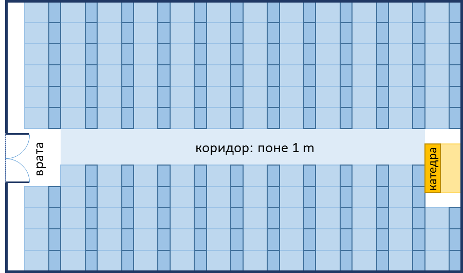

# Прости операции – допълнително упражнение

Задачи за допълнително упражнение към курса ["Основи на програмирането" \@
СофтУни](https://softuni.bg/courses/programming-basics).

**Тествайте** решенията си в **judge системата**:
<https://judge.softuni.bg/Contests/1642/Simple-Operations-and-Calculations-More-Exercises>

## Лице на трапец

Напишете програма, която чете от конзолата три числа **b1**, **b2** и **h** и
**пресмята лицето на трапец** с основи **b1** и **b2** и височина **h**.
**Формулата за лице на трапец** е **(b1 + b2) \* h / 2**.

На фигурата по-долу е показан трапец със страни 8 и 13 и височина 7. Той има
лице (8 + 13) \* 7 / 2 = 73.5.

Отговорът трябва да е форматиран до втората цифра след десетичния знак.

### [media/e46417c97e26600dd199da578672382f.png](media/e46417c97e26600dd199da578672382f.png)

  
Примерен вход и изход

| **вход** | **изход** |
|----------|-----------|
| 8 13 7   | 73.50     |

## Лице на триъгълник

Напишете програма, която чете от конзолата **страна** и **височина** на
**триъгълник** и пресмята неговото лице. Използвайте **формулата** за лице на
триъгълник: **area = a \* h / 2**. **Форматирате изхода до втория знак** след
десетичната запетая.

### Примерен вход и изход

| **вход**        | **изход** |
|-----------------|-----------|
| 20 30           | 300.00    |
| 15 35           | 262.50    |
| 7.75 8.45       | 32.74     |
| 1.23456 4.56789 | 2.82      |

## Конзолен конвертор: от градуси °C към градуси °F

Напишете програма, която чете **градуси по скалата на Целзий** (°C) и ги
преобразува до **градуси по скалата на Фаренхайт** (°F). Потърсете в Интернет
подходяща
[формула](https://www.google.bg/search?q=%D1%84%D0%BE%D1%80%D0%BC%D1%83%D0%BB%D0%B0+%D1%86%D0%B5%D0%BB%D0%B7%D0%B8%D0%B9+%D1%84%D0%B0%D1%80%D0%B5%D0%BD%D1%85%D0%B0%D0%B9%D1%82&gws_rd=cr&dcr=0&ei=cm7mWaqGJ8ana6i-kcgH),
с която да извършите изчисленията. **Форматирате изхода до втория знак** след
десетичната запетая.

### Примерен вход и изход

| **вход** | **изход** |   | **вход** | **изход** |   | **вход** | **изход** |   | **вход** | **изход** |
|----------|-----------|---|----------|-----------|---|----------|-----------|---|----------|-----------|
| 25       | 77.00     |   | 0        | 32.00     |   | \-5.5    | 22.10     |   | 32.3     | 90.14     |

## Зеленчукова борса

Градинар продавал реколтата от градината си на зеленчуковата борса. Продава
**зеленчуци за N лева на килограм** и **плодове за M лева за килограм**.
Напишете програма, която да **пресмята приходите от реколтата в евро** ( ако
приемем, че **едно евро** е равно на **1.94лв**).

### Вход

От конзолата се четат **4 числа**, по едно на ред:

-   **Първи ред – Цена за килограм зеленчуци – реално число[0.00… 1000.00]**

-   **Втори ред – Цена за килограм плодове – реално число[0.00… 1000.00]**

-   **Трети ред – Общо килограми на зеленчуците – цяло число[0… 1000]**

-   **Четвърти ред – Общо килограми на плодовете – цяло число[0… 1000]**

### Изход

Да се отпечата на конзолата **едно число**: **приходите от всички плодове и
зеленчуци в евро**.

**Резултата да се форматира до втория знак след десетичния разделител.**

### Примерен вход и изход

| **Вход**         | **Изход** | **Обяснения**                                                                                                              |
|------------------|-----------|----------------------------------------------------------------------------------------------------------------------------|
| 0.194 19.4 10 10 | 101.00    | Зеленчуците струват – 0.194лв. \* 10кг. = 1.94лв. Плодовете струват – 19.4лв. \* 10кг. = 194лв. Общо – 195.94лв. = 101евро |
| 1.5 2.5 10 10    | 20.62     |                                                                                                                            |

## Учебна зала

**Учебна зала** има правоъгълен размер **w** на **h** метра, без колони във
вътрешността си. Залата е разделена на две части – лява и дясна, с коридор
приблизително по средата. В лявата и в дясната част има **редици с бюра**. В
задната част на залата има голяма **входна врата**. В предната част на залата
има **катедра** с подиум за преподавателя. Едно **работно място** заема **70 на
120 cm** (маса с размер 70 на 40 cm + място за стол и преминаване с размер 70 на
80 cm). **Коридорът** е широк поне **100 cm**. Изчислено е, че заради **входната
врата** (която е с отвор 160 cm) се губи точно **1 работно място**, а заради
**катедрата** (която е с размер 160 на 120 cm) се губят точно **2 работни
места**. Напишете програма, която въвежда размери на учебната зала и изчислява
**броя работни места в нея** при описаното разположение (вж. фигурата).

### Вход

От конзолата се четат 2 **числа**, по едно на ред: **w** (дължина в метри) и
**h** (широчина в метри).

Ограничения: **3** ≤ **h** ≤ **w** ≤ **100**.

### Изход

Да се отпечата на конзолата едно цяло число: **броят места** в учебната зала.

### Примерен вход и изход

| **Вход** | **Изход** | **Чертеж**                                                                               | **Обяснения**                                                                                                                                                                                                                                                                                                                                                                                                             |
|----------|-----------|------------------------------------------------------------------------------------------|---------------------------------------------------------------------------------------------------------------------------------------------------------------------------------------------------------------------------------------------------------------------------------------------------------------------------------------------------------------------------------------------------------------------------|
| 15 8.9   | 129       | [media/ee106a8bc9a280b1976a21b47b97e95f.png](media/ee106a8bc9a280b1976a21b47b97e95f.png) | Залата е широка 890 cm. От тях 100 cm отиват за коридора в средата. В останалите 790 cm могат да се разположат по **11 бюра на ред** (11 \* 70 cm = 770 cm + 20 cm остатък). Залата е дълга 1500 cm. В тях могат да бъдат разположени **12 реда** (12 \* 120 cm = 1440 + 60 cm остатък). **Брой места** = **12 \* 11 - 3** = 132 - 3 = **129** (имаме 12 реда по 11 места = 132 минус 3 места за катедра и входна врата). |
| 8.4 5.2  | 39        | [media/d9fe5ef452110996cdc37b3952c280cb.png](media/d9fe5ef452110996cdc37b3952c280cb.png) | Залата е широка 520 cm. От тях 100 cm отиват за коридора в средата. В останалите 420 cm могат да се разположат по **6 бюра на ред** (6 \* 70 cm = 420 cm, без остатък). Залата е дълга 840 cm. В тях могат да бъдат разположени **7 реда** (7 \* 120 cm = 840, без остатък). **Брой места** = **7 \* 6 - 3** = 42 - 3 = **39** (имаме 7 реда по 6 места = 42 минус 3 места за катедра и входна врата).                    |

## Рибна борса

Георги ще има гости вечерта и решава да ги нагости с **паламуд, сафрид и миди.**
Затова отива на рибната борса, за да си **купи по няколко килограма**. Oт
**конзолата се въвеждат цените** в лева на **скумрията и цацата.** Също
**количеството** на **паламуд, сафрид и миди в килограми**. **Колко пари ще са
му необходими**, за да **плати сметката** си, ако **цените на борсата** са:

-   **Паламуд – 60% по-скъп от скумрията**

-   **Сафрид – 80% по-скъп от цацата**

-   **Миди – 7.50 лв. за килограм**

### Вход

От конзолата се четат **5 числа**:

-   **Първи ред** – **цена на скумрията на килограм**. **Реално число в
    интервала [0.00…40.00]**

-   **Втори ред** – **цена на цацата на килограм**. **Реално число в интервала
    [0.00…30.00]**

-   **Трети ред** – **килограма паламуд**. **Реално число в интервала
    [0.00…50.00]**

-   **Четвърти ред** – **килограма сафрид**. **Реално число в интервала [0.00…
    70.00]**

-   **Пети ред** – **килограма миди. Цяло число в интервала [0 ... 100]**

### Изход

Да се отпечата на конзолата **едно число с плаваща запетая**: **колко пари ще са
нужни на Георги, за да си плати сметката**. **Закръглено до вторият знак след
десетичната запетая (1.2457 -\> 1.25).**

### Примерен вход и изход

| **Вход**            | **Изход** | **Обяснения**                                                                                                                                                                                                                                                         |           |
|---------------------|-----------|-----------------------------------------------------------------------------------------------------------------------------------------------------------------------------------------------------------------------------------------------------------------------|-----------|
| 6.90 4.20 1.5 2.5 1 | 42.96     | Цена на паламуда = 6.90 + 6.90 \* 0.60 = 11.04 лв. за килограм Сума паламуд = 1.5 \* 11.04 = 16.56 Цена на сафрид = 4.20 + 4.20 \* 0.80 = 7.56 лв. за килограм Сума сафрид = 2.5 \* 7.56 = 18.90  Сума миди = 1 \* 7.50 = 7.50  Сметка = 16.56 + 18.90 + 7.50 = 42.96 |           |
| **Вход**            | **Изход** | **Вход**                                                                                                                                                                                                                                                              | **Изход** |
| 5.55 3.57 4.3 3.6 7 | 113.82    | 7.79 5.35 9.3 0 0                                                                                                                                                                                                                                                     | 115.92    |

## Боядисване на къща

Напишете програма, която да пресмята **колко литра боя е нужна** за боядисването
на къщa. Като **за стените** се използва **зелена боя**, а за **покрива –
червена**. **Разхода** на **зелената боя е 1 литър за 3.4 м2**, а на **червената
– 1 литър за 4.3 м2**.

**Стените имат следните размери**:

-   **Предната и задната** стена са **квадрати със страна „x“**

    -   на предната стена има **правоъгълна врата с широчина 1.2м и височина
        2м**

**Страничните** стени са **правоъгълници със страни „x“ и „y“**

-   **и на двете** странични стени има по **един квадратен прозорец със страна
    1.5м**

**Покривът има следните размери**:

-   **Два правоъгълника със страни „x“ и „y“**

-   **Два равностранни триъгълника със страна „x“ и височина „h“**

Трябва да пресметнете **площта на всички страни** и **площта на покрива**, за да

намерите **колко литра от всяка боя ще са нужни**.

### Вход

От конзолата се четат **3 реда**:

1.  **x – височината на къщата – реално число в интервала [2...100]**

2.  **y – дължината на страничната стена – реално число в интервала [2...100]**

3.  **h – височината на триъгълната стена на прокрива – реално число в интервала
    [2...100]**

### Изход

Да се отпечатат на конзолата **две числа** всяко на нов ред:

-   **Литрите зелена боя**

-   **Литритe червена боя**

**Форматирани до вторият знак след десетичната запетая.**

### Примерен вход и изход

| **Вход** | **Изход**   | **Обяснения**                                                                                                                                                                                                                                                                                                                                                                                                                                                                                                                       | **Вход**         | **Изход**    |
|----------|-------------|-------------------------------------------------------------------------------------------------------------------------------------------------------------------------------------------------------------------------------------------------------------------------------------------------------------------------------------------------------------------------------------------------------------------------------------------------------------------------------------------------------------------------------------|------------------|--------------|
| 6 10 5.2 | 54.44 35.16 | **СТЕНИ** Страничната стена е с площ – 6\*10 = 60; Прозорецът е с площ = 1.5\*1.5 = 2.25; Двете страници са общо – 2\*60 - 2\*2.25 = 115.5; Задната стена – 6\*6 = 36; Вход: 1.2\*2 = 2.4 Общо предна и задна – 2\*36 - 2.4 = 69.6 **ОБЩА ПЛОЩ**: 115.5 + 69.6 = **185.1 м2 Зелена боя** = 185.1 / 3.4 = **54.44 литра ПОКРИВ** Двата правоъгълника на покрива – 2 \* (6\*10) = 120 Двата триъгълниците – 2 \* (6\*5.2 / 2) = 2 \* 15.6 = 31.2 **ОБЩА ПЛОЩ**: 120 + 31.2 = 151.2 **м2 Червена боя** = 151.2 / 4.3 = **35.16 литра** | 10.25 15.45 8.88 | 152.93 94.82 |

## Периметър и лице на кръг

Напишете програма, която чете от конзолата **число r** и пресмята и отпечатва
**лицето** и **периметъра на кръг** / **окръжност** с радиус **r**, като
форматирате изхода в следния вид: **"\<calculated area\>"**  
**"\<calculated parameter\>"**. Форматирайте изходните данни **до втория знак
след десетичната запетая.**

### Примерен вход и изход

| **вход** | **изход**   |
|----------|-------------|
| 3        | 28.27 18.85 |
| 4.5      | 63.62 28.27 |

# Задачи за шампиони

## Прогноза за времето

Напишете програма, която познава дали е топло или студено навън. От конзолата се
чете **един ред** – **текст**, който подсказва какво е времето. **При въвеждане
на** "sunny" **трябва да се отпечата** "It's warm outside!". **Във всички
останали случаи** трябва да се отпечата "It's cold outside!".

### Примерен вход и изход

| **Вход** | **Изход**          |
|----------|--------------------|
| sunny    | It's warm outside! |
| cloudy   | It's cold outside! |
| snowy    | It's cold outside! |

**Насоки:** потърсете информация за **if-else** конструкцията.

## Прогноза за времето – част 2

Напишете програма, която при въведени градуси (реално число) принтира какво е
времето, като имате предвид следната таблица:

| **Градуси**   | **Време** |
|---------------|-----------|
| 26.00 - 35.00 | Hot       |
| 20.1 - 25.9   | Warm      |
| 15.00 - 20.00 | Mild      |
| 12.00 - 14.9  | Cool      |
| 5.00 - 11.9   | Cold      |

Ако се въведат градуси, **различни от посочените в таблицата**, да се отпечата
"unknown".

### Примерен вход и изход

| **Вход** | **Изход** |
|----------|-----------|
| 16.5     | Mild      |
| 8        | Cold      |
| 22.4     | Warm      |
| 26       | Hot       |
| 0        | unknown   |

**Насоки:** потърсете информация за **серии от проверки**.
